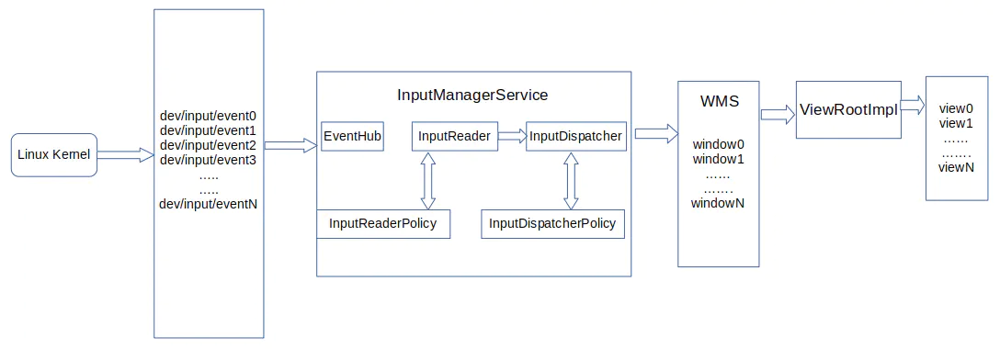

1. Linux内核
接受输入设备的中断，并将原始事件的输入写入设备节点中；
2. 设备节点
作为内核和IMS的桥梁，将原始事件的数据暴露给用户空间，以便IMS可以从中读取事件；
3. InputManagerService
Android系统服务，它分为java层和native层两部分；java层负责与WMS通信，
native层则是InputReader和InputDispatcher两个输入系统关键组件的运行容器；
4. EventHub
直接访问所有的设备节点。它通过一个名为getEvent()的函数将所有输入系统相关的待处理的底层事件返回给使用者。
这些事件包括原始输入事件、设备节点的增删等；
5. InputReader
IMS中的关键组件之一，它运行于一个独立的线程中，负责管理输入设备的列表与配置，
以及进行输入事件的加工处理。它通过其线程循环不断地通过getEvents()函数从EventHub中将事件取出并进行处理。
对于设备节点的增删事件，它会更新输入设备列表与配置。对于原始输入事件，
InputReader对其进行翻译、组装、封装为包含更多信息、更具可读性的输入事件，然后交给InputDispatcher进行派发；
6. InputReaderPolicy
它为InputReader的事件加工处理提供一些策略配置，例如键盘布局信息等；
7. InputDispatcher
IMS中的另一个关键组件，它也运行于一个独立的线程中。
InputDispatcher中保管了来自WMS的所有窗口的信息，其收到来自InputReader的输入事件后，
会在其保管的窗口中寻找合适的窗口，并将事件派发给此窗口；
8. InputDispatcherPolicy
它为InputDispatcher的派发过程提供策略控制。例如截取某些特定的输入事件用作特殊用途，或者阻止将某些事件派发给目标窗口。
一个典型的例子就是HOME键被InputDispatcherPolicy截取到PhoneWindowManager中进行处理，并阻止窗口收到HOME键按下的事件；
9. WMS
不是输入系统的一员，但它对InputDispatcher的正常工作起到重要作用。
当新建窗口时，WMS为新窗口和IMS创建了事件传递所用的通道。
另外，WMS还将所有窗口的信息，包括窗口的可点击区域，焦点窗口等信息，实时的更新到IMS的InputDispatcher中，
使得InputDispatcher可以正确地将事件派发到指定的窗口；
10. ViewRootImpl
对某些窗口，如壁纸窗口、SurfaceView的窗口来说，窗口就是输入事件派发的终点。
而对其他的activity、对话框等使用了Android控件系统的窗口来说，输入事件的终点是控件View。
ViewRootImpl将窗口所接收的输入事件沿着控件树将事件派发给感兴趣的控件；

### 总结
内核将原始事件写入设备节点中，InputReader不断地通过EventHub将原始事件取出来并翻译加工成Android输入事件，
然后交给InputDispatcher。InputDispatcher根据WMS提供的窗口信息将事件交给合适的窗口。
窗口的ViewRootImpl对象再沿着控件树将事件派发给感兴趣的控件。
控件对其收到的事件做出响应，更新自己的画面、执行特定的动作。所有这些参与者以IMS为核心，构建Android输入体系。
