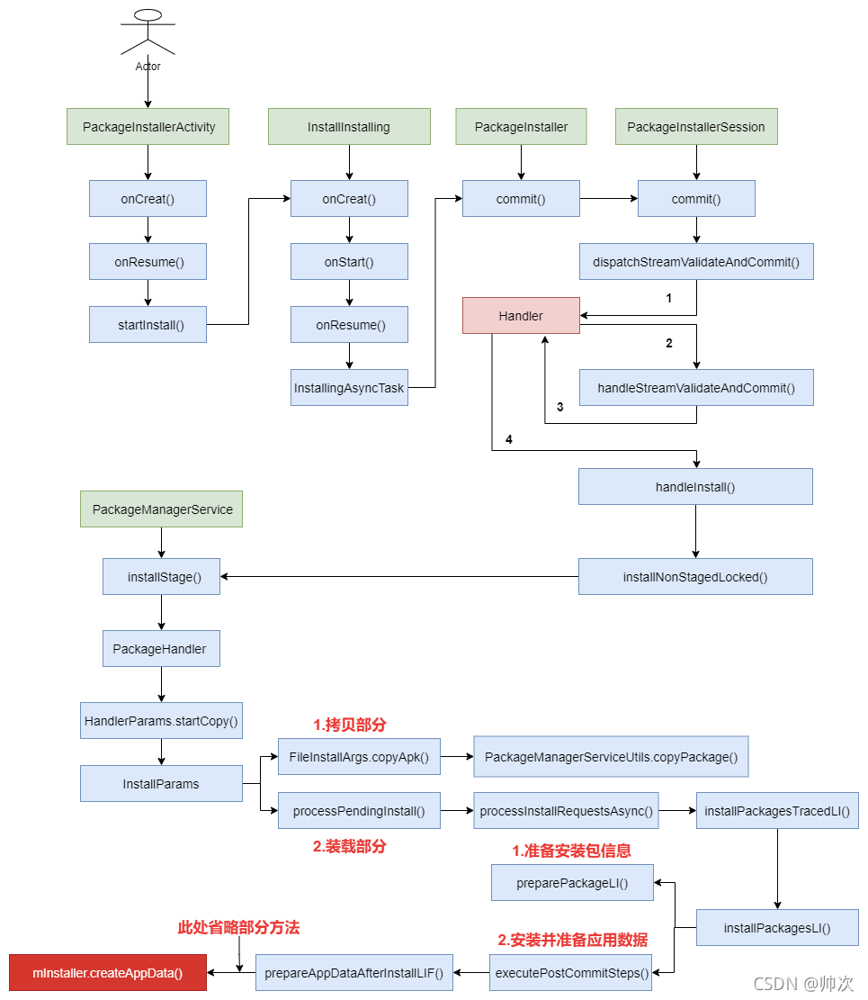

介绍PackageInstaller安装方式，其他方式大同小异，adb方式等
这部分源码，android进阶指北与android11对比变化较大，不过核心流程一样，
以网上文章为准https://blog.csdn.net/g984160547/article/details/120457806

InstallStart是PackageInstaller 的入口Activity

1. uri协议解析，获取APK的PackageInfo
2. 各种权限限制判断
3. 将信息写入PackageInstaller.SessionInfo，跨进程进入FWK
4. 调用PMS的installStage，MultiPackageInstallParams，MutilPackageInstallParams用于负责批量安装（GMS可能在用），
InstallParams则负责单一安装，可以认为都是单一安装
5. 拷贝安装包，最终安装包在 data/app 目录下以 base.apk 的方式保存。例：/data/app/com.example/base.apk
6. 检查APK，解析APK，最后调用Installer服务完成安装
7. 安装后收尾处理

#### Installer服务
\frameworks\base\services\core\java\com\android\server\pm\Installer.java
继承自com.android.server.SystemService，同时持有installd守护进程对应Binder服务的代理对象，
本质上就是通过Binder调用去与Linux底层installd守护进程通信完成真正的完成Apk文件格式的优化和转换、
建立相关的数据目录、删除文件、安装应用等工作。因此在其他系统核心服务启动前首先被启动，

