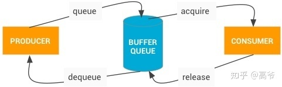

# BufferQueue

上图主要是 dequeue、queue、acquire、release ，在这个例子里面，
App 是**「生产者」**，负责填充显示缓冲区（Buffer）；SurfaceFlinger 是**「消费者」**，将各个进程的显示缓冲区做合成操作

1. dequeue(生产者发起) ： 当生产者需要缓冲区时，它会通过调用 dequeueBuffer() 从 BufferQueue 请求一个可用的缓冲区，
并指定缓冲区的宽度、高度、像素格式和使用标记。
2. queue(生产者发起)：生产者填充缓冲区并通过调用 queueBuffer() 将缓冲区返回到队列。
3. acquire(消费者发起) ：消费者通过 acquireBuffer() 获取该缓冲区并使用该缓冲区的内容
4. release(消费者发起) ：当消费者操作完成后，它会通过调用 releaseBuffer() 将该缓冲区返回到队列