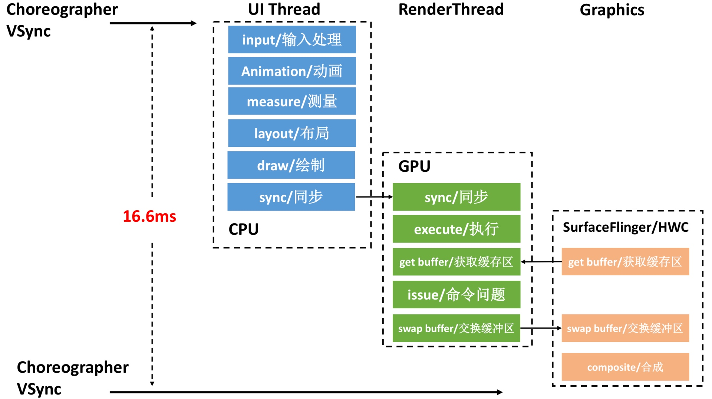

# Choreographer
## 引入 Choreographer
Choreographer 的引入，主要是配合 Vsync ，给上层 App 的渲染提供一个稳定的 Message 处理的时机，
也就是 Vsync 到来的时候 ，系统通过对 Vsync 信号周期的调整，来控制每一帧绘制操作的时机. 
至于为什么 Vsync 周期选择是 16.6ms (60 fps) ，是因为目前大部分手机的屏幕都是 60Hz 的刷新率，
也就是 16.6ms 刷新一次，系统为了配合屏幕的刷新频率，将 Vsync 的周期也设置为 16.6 ms，每隔 16.6 ms ，
Vsync 信号到来唤醒 Choreographer 来做 App 的绘制操作 ，如果每个 Vsync 周期应用都能渲染完成，
那么应用的 fps 就是 60 ，给用户的感觉就是非常流畅，这就是引入 Choreographer 的主要作用。

# Choreographer 简介
Choreographer 扮演 Android 渲染链路中承上启下的角色

1. **承上**：负责接收和处理 App 的各种更新消息和回调，等到 Vsync 到来的时候统一处理。
比如集中处理 Input(主要是 Input 事件的处理) 、Animation(动画相关)、Traversal(包括 measure、layout、draw 等操作) ，
判断卡顿掉帧情况，记录 CallBack 耗时等
2. **启下**：负责请求和接收 Vsync 信号。接收 Vsync 事件回调(通过 FrameDisplayEventReceiver.onVsync )；
请求 Vsync(FrameDisplayEventReceiver.scheduleVsync)

从上面可以看出来， Choreographer 担任的是一个工具人的角色，他之所以重要，
是因为通过 **Choreographer + SurfaceFlinger + Vsync + TripleBuffer** 这一套从上到下的机制，
保证了 Android App 可以以一个稳定的帧率运行(20fps、90fps 或者 60fps)，减少帧率波动带来的不适感。