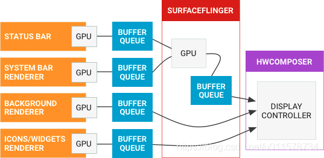

这里直接上官方对于 SurfaceFlinger 流程的定义
(https://source.android.google.cn/docs/core/graphics/surfaceflinger-windowmanager?hl=de)

1. 大多数应用在屏幕上一次显示三个层：屏幕顶部的状态栏、底部或侧面的导航栏以及应用界面。
有些应用会拥有更多或更少的层（例如，默认主屏幕应用有一个单独的壁纸层，而全屏游戏可能会隐藏状态栏）。
每个层都可以单独更新。状态栏和导航栏由系统进程渲染，而应用层由应用渲染，两者之间不进行协调。
2. 设备显示会按一定速率刷新，在手机和平板电脑上通常为 60 fps。
如果显示内容在刷新期间更新，则会出现撕裂现象；因此，请务必只在周期之间更新内容。
在可以安全更新内容时，系统便会收到来自显示设备的信号。由于历史原因，我们将该信号称为 VSYNC 信号。
3. 刷新率可能会随时间而变化，例如，一些移动设备的帧率范围在 58 fps 到 62 fps 之间，具体要视当前条件而定。
对于连接了 HDMI 的电视，刷新率在理论上可以下降到 24 Hz 或 48 Hz，以便与视频相匹配。
由于每个刷新周期只能更新屏幕一次，因此以 200 fps 的帧率为显示设备提交缓冲区就是一种资源浪费，因为大多数帧会被舍弃掉。
SurfaceFlinger 不会在应用每次提交缓冲区时都执行操作，而是在显示设备准备好接收新的缓冲区时才会唤醒。
4. 当 VSYNC 信号到达时，SurfaceFlinger 会遍历它的层列表，以寻找新的缓冲区。
如果找到新的缓冲区，它会获取该缓冲区；否则，它会继续使用以前获取的缓冲区。
SurfaceFlinger 必须始终显示内容，因此它会保留一个缓冲区。如果在某个层上没有提交缓冲区，则该层会被忽略。
5. SurfaceFlinger 在收集可见层的所有缓冲区之后，便会询问 Hardware Composer 应如何进行合成。」

   下面是上述流程所对应的流程图， 简单地说， SurfaceFlinger 最主要的功能:
「SurfaceFlinger 接受来自多个来源的数据缓冲区，对它们进行合成，然后发送到显示设备。」
   
