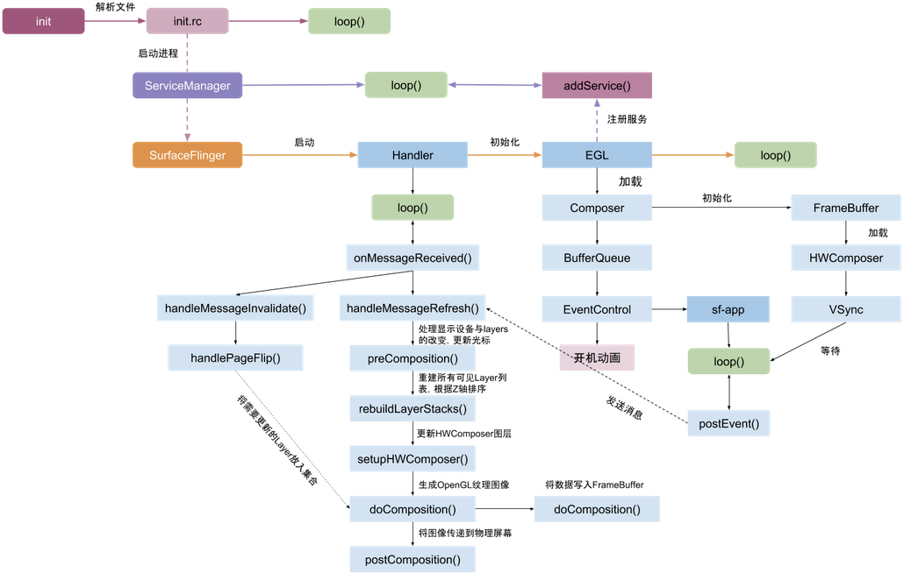
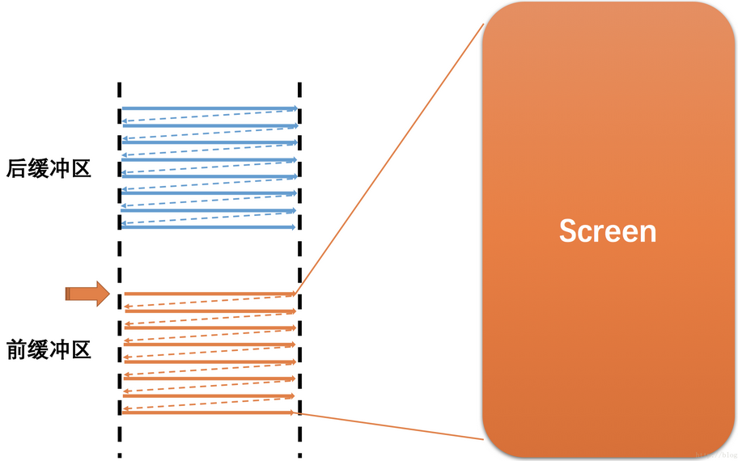

# SurfaceFlinger启动
[参考 https://www.cnblogs.com/blogs-of-lxl/p/11272756.html](https://www.cnblogs.com/blogs-of-lxl/p/11272756.html)

开机显示桌面、从桌面点击 App 图标到 Activity显示在屏幕上的过程又是怎样的呢？下面介绍Android系统中的“画家” - SurfaceFlinger.

##### SurfaceFlinger 启动过程


SurfaceFlinger可执行二进制文件surfaceflinger由main\_surfaceflinger.cpp文件独立编译而成，主要负责搭建进程启动环境：

```
int main(int, char ) {
    signal(SIGPIPE, SIG_IGN);

    // 从8.0开始，Android提供了hidl机制，将原先直接由JNI->Native->HAL的接口调用形式，统一规范成hidl service/client交互形式。
    // 该方式从一方面规范和统一了Android Framework和HAL的调用机制，但实际从项目维度，这种调用方式对性能上开销，将比直接调用的方式要花费更多的时间。
    hardware::configureRpcThreadpool(1 /* maxThreads */,
            false /* callerWillJoin */);

    startGraphicsAllocatorService();

    // When SF is launched in its own process, limit the number of
    // binder threads to 4.
    ProcessState::self()->setThreadPoolMaxThreadCount(4);

    // start the thread pool
    sp<ProcessState> ps(ProcessState::self());
    ps->startThreadPool();

    // 创建SurfaceFlinger对象，由强指针指向。
    // SurfaceFlinger继承RefBase类，所以此处一旦new出对象赋给sp指针后，将立刻出发SurfaceFlinger类的onFirstRef方法的调用。
    // instantiate surfaceflinger
    sp<SurfaceFlinger> flinger = surfaceflinger::createSurfaceFlinger();

    setpriority(PRIO_PROCESS, 0, PRIORITY_URGENT_DISPLAY);

    set_sched_policy(0, SP_FOREGROUND);

    // Put most SurfaceFlinger threads in the system-background cpuset
    // Keeps us from unnecessarily using big cores
    // Do this after the binder thread pool init
    if (cpusets_enabled()) set_cpuset_policy(0, SP_SYSTEM);

    // SurfaceFlinger类正式初始化
    // initialize before clients can connect
    flinger->init();

    // SurfaceFlinger向ServiceManager注册Binder服务，
    // 这样在其他进程中可以通过getService+SERVICE_NAME来获取SurfaceFlinger服务，继而可以和SurfaceFlinger类进行Binder通信。
    // publish surface flinger
    sp<IServiceManager> sm(defaultServiceManager());
    sm->addService(String16(SurfaceFlinger::getServiceName()), flinger, false,
                   IServiceManager::DUMP_FLAG_PRIORITY_CRITICAL | IServiceManager::DUMP_FLAG_PROTO);

    //里面的new DisplayService()方法调用HIDL定义接口 Return<sp<IDisplayEventReceiver >> getEventReceiver() override;
    startDisplayService(); // dependency on SF getting registered above

    if (SurfaceFlinger::setSchedFifo(true) != NO_ERROR) {
        ALOGW("Couldn't set to SCHED_FIFO: %s", strerror(errno));
    }

    // SurfaceFlinger类进入主循环（此处注意SurfaceFlinger类未继承Threads类，不遵循Threads类的接口执行顺序）
    // run surface flinger in this thread
    flinger->run();

    return 0;
}
```
执行到 SurfaceFlinger::init()，该方法主要功能是：

* 初始化 EGL
* 创建 HWComposer
* 初始化非虚拟显示屏
* 启动 EventThread 线程
* 启动开机动画

 相关问题： 

　　① 屏幕刷新速率比系统帧速率快:
　　　　此时，在前缓冲区内容全部映射到屏幕上之后，后缓冲区尚未准备好下一帧，
       屏幕将无法读取下一帧，所以只能继续显示当前一帧的图形，造成一帧显示多次，也就是卡顿。 
　　② 系统帧速率比屏幕刷新率快 
　　　　此时，屏幕未完全把前缓冲区的一帧映射到屏幕，而系统已经在后缓冲区准备好了下一帧，
       并要求读取下一帧到屏幕，将会导致屏幕上半部分是上一帧的图形，而下半部分是下一帧的图形，
       造成屏幕上显示多帧，也就是屏幕撕裂。

　　为了解决上述问题，Android显示系统一般会有多级缓冲，即在屏幕刷新的同时在另外一个buffer准备下一帧数据，以此提高性能：

　　



前缓冲区：用来显示内容到屏幕的帧缓冲区 
　　 后缓冲区： 用于后台合成下一帧图形的帧缓冲区

　　 垂直同步（VSync）： 当屏幕从缓冲区扫描完一帧到屏幕上之后，开始扫描下一帧之前，
    发出的一个同步信号，该信号用来切换前缓冲区和后缓冲区。

　　 屏幕刷新率（HZ）： 代表屏幕在一秒内刷新屏幕的次数，Android手机一般为60HZ（也就是1秒刷新60帧，大约16.67毫秒刷新1帧） 
　　 系统帧速率（FPS）： 代表了系统在一秒内合成的帧数，该值的大小由系统算法和硬件决定。