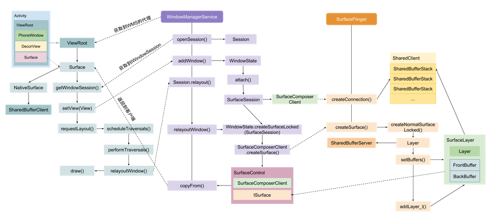

# Surface创建过程

Surface 创建的过程就是 Activity 显示的过程，在 ActivityThread.handleResumeActivity() 中调用了 Activity.makeVisible()具体实现：

代码调用过程十分复杂

**Surface 显示过程总结：**

　　在 App 进程中创建 PhoneWindow 后会创建 ViewRoot。ViewRoot 的创建会创建一个 Surface，
这个 Surface 其实是空的，通过与 WindowManagerService 通信 copyFrom() 一个NativeSurface 与 SurfaceFlinger 通信时。

