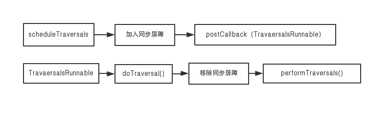
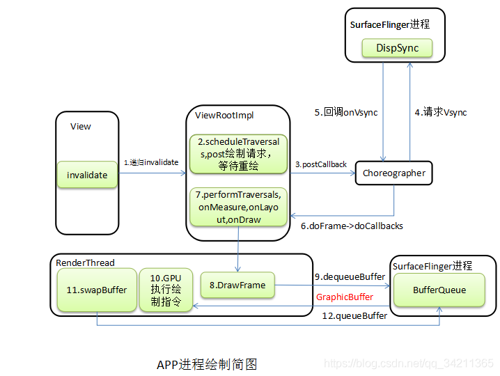
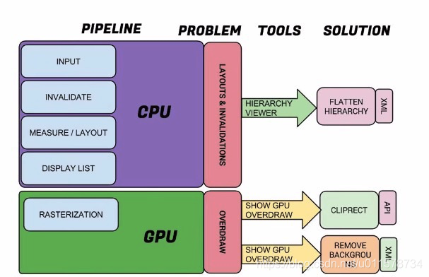
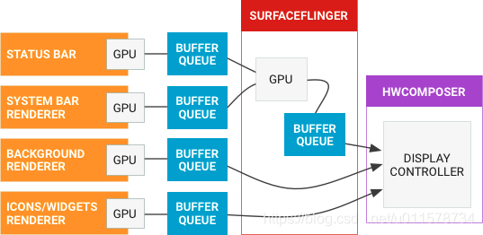
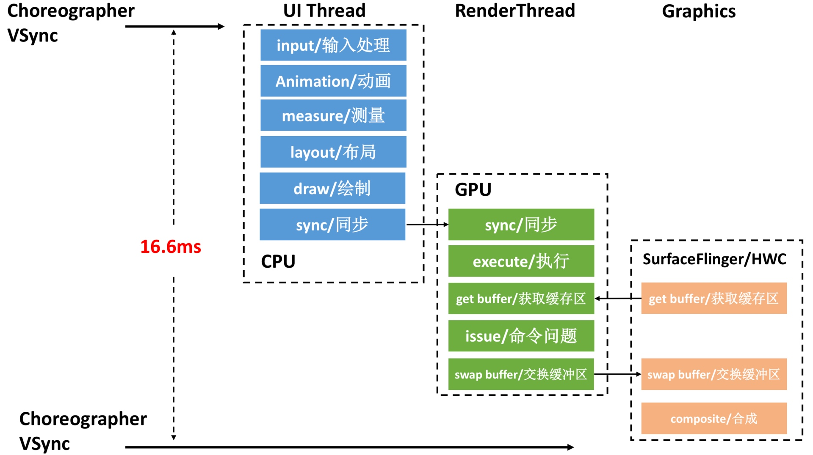

这篇文章是总体汇总，如果看不明白，可以先看关于各个概念的介绍，再看这个。
# Android渲染机制
Android 应用程序调用 SurfaceFlinger 服务把经过测量、布局和绘制后的 Surface 渲染到显示屏幕上。

##### Choreographer

Choreographer 翻译为编舞者，负责从显示系统接收脉冲信号，编排渲染下一帧的绘制工作，负责获取Vsync同步信号并控制UI线程完成图像绘制的类。

怎么理解这一句话呢？

一次完整的绘制，是需要CPU、GPU和显示设备的配合，但是三者是一个并行运作的状态，那怎么相互协调呢？
所以引进了VSync信号机制：每16ms，硬件（或者软件）会发出一个VSync信号，CPU接收到这个信号，开始了一次绘制流程。
再下一次VSync信号到来之时，Display就可以直接显示第一帧，CPU也开始绘制第二帧。就这样循环下去。

也就是说CPU和GPU必须要在这一次的VSync信号发生和下一次VSync信号到来之前要准备好这一帧的数据，否则就发生了掉帧的现象了。

### **应用侧绘制**
一个 Android 应用程序窗口里面包含了很多 UI 元素，它们是以树形结构来组织的，父视图包含子视图，
一个窗口的根视图是 DecorView 对象，ViewRootImpl 负责与系统进程进行通信。

在绘制一个 Android 应用程序窗口的 UI 之前，我们首先要确定它里面的各个子 UI 元素在父 UI 元素里面的大小以及位置。
确定各个子 UI 元素在父 UI 元素里面的大小以及位置的过程又称为测量过程和布局过程。
因此，Android 应用程序窗口的 UI 渲染过程可以分为测量、布局和绘制三个阶段，最后生成 Display List。

如下图所示：

    测量：递归（深度优先）确定所有视图的大小（高、宽）

    布局：递归（深度优先）确定所有视图的位置（左上角坐标）

    绘制：在画布 canvas 上绘制应用程序窗口所有的视图

    生成 Display List 数据。

测量、布局负责确定每个视图组件的大小和位置信息，接下来就是绘制了。

*Display List 就是缓冲区

Android 需要把 XML 布局文件转换成 GPU 能够识别并绘制的对象。这个操作是在 DisplayList 的帮助下完成的。
Display List 持有所有将要交给 GPU 绘制到屏幕上的数据信息。

### 系统侧渲染
##### 1\. Display List 数据交由 GPU 进行渲染处理
Android 需要把 XML 布局文件转换成 GPU 能够识别并绘制的对象。这个操作是在 DisplayList 的帮助下完成的。
Display List 持有所有将要交给 GPU 绘制到屏幕上的数据信息。

Display List 是一个缓存绘制命令的 Buffer，Display List 的本质是一个缓冲区，它里面记录了即将要执行的绘制命令序列。
渲染 Display List，发生在应用程序进程的 Render Thread 中。
增加 Render Thread 线程，也是为了避免 UI 线程任务过重，用于提高渲染性能。

这些绘制命令最终会转化为 Open GL 命令由 GPU 执行。这意味着我们在调用 Canvas API 绘制 UI 时，
实际上只是将 Canvas API 调用及其参数记录在 Display List 中，然后等到下一个 VSYNC 信号到来时，
记录在 Display List 里面的绘制命令才会转化为 Open GL 命令由 GPU 执行。

##### 2\. GPU 渲染处理
Android 使用 OpenGL ES (GLES) API 渲染图形。GPU 将视图栅格化后，生成 Surface。
GPU 作为图像流生产方将显示内容，最终发送给图像流的消耗方 SurfaceFlinger。

大多数客户端使用 OpenGL ES 或 Vulkan 渲染到 Surface 上（硬件加速，使用了 GPU 渲染）。
但是，有些客户端使用画布渲染到 Surface 上（未使用硬件加速）。

##### 3\. 生成 Surface 并存储到 BufferQueue
Surface 对象使应用能够渲染要在屏幕上显示的图像。通过 SurfaceHolder 接口，
应用可以编辑和控制 Surface。Surface 是一个接口，供生产方与使用方交换缓冲区。

SurfaceHolder 是系统用于与应用共享 Surface 所有权的接口。
与 Surface 配合使用的一些客户端需要 SurfaceHolder，因为用于获取和设置 Surface 参数的 API 是通过 SurfaceHolder 实现的。
一个 SurfaceView 包含一个 SurfaceHolder。与 View 交互的大多数组件都涉及到 SurfaceHolder。
如果你开发的是相机相关的应用，会涉及到相关 API 的使用。

通常 SurfaceFlinger 使用的缓冲区队列是由 Surface 生成的，当渲染到 Surface 上时，
结果最终将出现在传送给消费者的缓冲区中。Canvas API 提供一种软件实现方法（支持硬件加速），
用于直接在 Surface 上绘图（OpenGL ES 的低级别替代方案）。
与视图有关的任何内容均涉及到 SurfaceHolder，其 API 可用于获取和设置 Surface 参数（如大小和格式）。

BufferQueue 是 SurfaceFlinger 使用的缓冲区队列，而 Surface 是 BufferQueue 的生产方。
BufferQueue 类将可生成图形数据缓冲区的组件（生产方）连接到接受数据以便进行显示或进一步处理的组件（使用方，例如 SurfaceFlinger）。
几乎所有在系统中移动图形数据缓冲区的内容都依赖于 BufferQueue。

用于显示 Surface 的 BufferQueue 通常配置为三重缓冲。缓冲区是按需分配的，
因此，如果生产方足够缓慢地生成缓冲区（例如在 60 fps 的显示屏上以 30 fps 的速度进行缓冲），
队列中可能只有两个分配的缓冲区。按需分配缓冲区有助于最大限度地减少内存消耗。

数据处理过程：

上图描述了图形管道的流程。左侧为图形生产者，右侧为图形消费者，中间通过 BufferQueues 连接。
图中，主屏幕、状态栏和系统界面通过 GPU 渲染生成图形缓冲区，做为生产者传递给 BufferQueues。
SurfaceFlinger 做为消费者，接收到 BufferQueues 的通知后，取出可用的图形缓冲区，送给显示端。
例图中将状态栏和系统界面的图形缓冲送给 GPU 合成，生成新的图形缓冲后再通过 BufferQueues 发送到硬件混合渲染器。

注意：SurfaceFlinger 创建并拥有 BufferQueue 数据结构，并且可存在于与其生产方不同的进程中。

##### 4\. SurfaceFlinger 将显示数据发送给显示屏

SurfaceFlinger 接受来自多个源的数据缓冲区，然后将它们进行合成并发送到显示屏。
WindowManager 为 SurfaceFlinger 提供缓冲区和窗口元数据，而 SurfaceFlinger 可使用这些信息将 Surface 合成到屏幕。

### 来看 SurfaceFlinger 和 WMS 之间的交互过程：
SurfaceFlinger 接受缓冲区的一种方式是通过 BufferQueue 和 SurfaceControl。当应用进入前台时，
它会从 WindowManager 请求缓冲区。然后，WindowManager 会从 SurfaceFlinger 请求层。
请求层是 surface（包含 BufferQueue）和 SurfaceControl（包含屏幕框架等层元数据）的组合。
SurfaceFlinger 创建层并将其发送至 WindowManager。
然后，WindowManager 将 Surface 发送至应用，但会保留 SurfaceControl 来操控应用在屏幕上的外观。

在屏幕处于两次刷新之间时，屏幕会向 SurfaceFlinger 发送 VSYNC 信号。
VSYNC 信号表明可对屏幕进行刷新而不会产生撕裂。当 SurfaceFlinger 接收到 VSYNC 信号后，
SurfaceFlinger 会遍历其层列表，以查找新的缓冲区。
如果 SurfaceFlinger 找到新的缓冲区，SurfaceFlinger 会获取缓冲区；
否则，SurfaceFlinger 会继续使用上一次获取的那个缓冲区。
SurfaceFlinger 必须始终显示内容，因此它会保留一个缓冲区。如果在某个层上没有提交缓冲区，则该层会被忽略。

SurfaceFlinger 在收集可见层的所有缓冲区之后，便会询问硬件混合渲染器 (HWC) 应如何进行合成。
如果 HWC 将层合成类型标记为客户端合成，则 SurfaceFlinger 将合成这些层。然后，SurfaceFlinger 会将输出缓冲区传递给 HWC。

###### **小结一下**
* 我们知道一个 View 发起刷新的操作时，最终是走到了 ViewRootImpl 的 scheduleTraversals() 里去，
然后这个方法会将遍历绘制 View 树的操作 performTraversals() 封装到 Runnable 里，传给 Choreographer，
以当前的时间戳放进一个 mCallbackQueue 队列里，然后调用了 native 层的方法向底层注册监听下一个屏幕刷新信号事件。

当下一个屏幕刷新信号发出的时候，如果我们 app 有对这个事件进行监听，那么底层它就会回调我们 app 层的 onVsync() 方法来通知。当 onVsync() 被回调时，会发一个 Message 到主线程，将后续的工作切到主线程来执行。

* 切到主线程的工作就是去 mCallbackQueue 队列里根据时间戳将之前放进去的 Runnable 取出来执行，
而这些 Runnable 有一个就是遍历绘制 View 树的操作 performTraversals()。在这次的遍历操作中，就会去绘制那些需要刷新的 View。

所以说，当我们调用了 invalidate()，requestLayout()，等之类刷新界面的操作时，并不是马上就会执行这些刷新的操作，
而是通过 ViewRootImpl 的 scheduleTraversals() 先向底层注册监听下一个屏幕刷新信号事件，
然后等下一个屏幕刷新信号来的时候，才会去通过 performTraversals() 遍历绘制 View 树来执行这些刷新操作。

**如图，操作完成后，由GPU完成渲染，存入bufferqueue**

