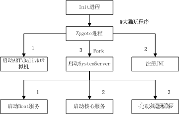
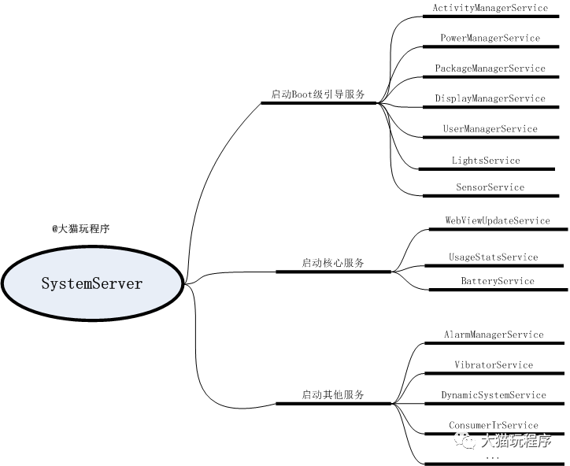

# SystemServer启动流程
目录aosp\frameworks\base\services\java\com\android\server

```
SystemServer和其他所有Dalivik虚拟机进程都是由Zygotefork而来。
Zygote fork的第一个进程就是SystemServer，其在手机中的进程名为 system_server。
```

```
system_server 进程承载着整个framework的核心服务，例如创建 ActivityManagerService、PowerManagerService、
DisplayManagerService、PackageManagerService、WindowManagerService、LauncherAppsService等80多个核心系统服务。
这些服务以不同的线程方式存在于system_server这个进程中。
```




```
startBootstrapServices(); // 启动引导服务 ActivityManagerService、DisplayManagerService、PackageManagerService
startCoreServices(); // 启动核心服务 BatteryService、UsageStatsService、WebViewUpdateService
startOtherServices(); // 启动其他服务WindowManagerService、PowerManagerService、VibratorService
、NetworkManagementService
Phase480
```
在SystemServer启动过程，从阶段0到阶段1000，一共8个阶段。（eg，Phase600）

##### 总结
```
Zygote启动后fork的第一个进程为SystemServer,在手机中的进程 别名为"system_server".
Zygote fork后，进入SystemServer的main() 
SystemServer在启动过程中，先初始化一些系统变量，加载类库， 创建Context对象，创建SystemServiceManager对象等候再启动 
服务启动的服务分为 引导服务(Boot Service)、核心服务(Core Service)和其他服务(Other Service)三大类，共90多个服务 
SystemServer在启动服务前，会尝试与Zygote建立Socket通信， 通信成功后才去启动服务
启动的服务都单独运行在SystemServer的各自线程中，同属于 SystemServer进程
```
