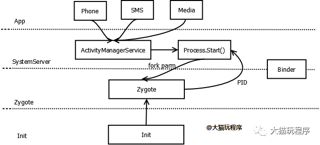
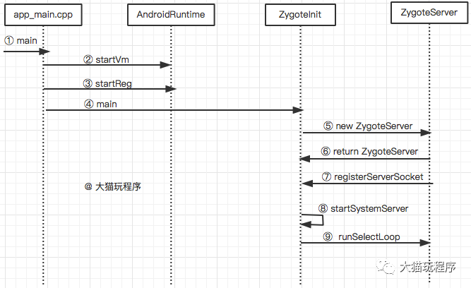

# zygote启动流程
```
Init进程启动后，最重要的一个进程就是Zygote进程,Zygote是所有应用的鼻祖。
SystemServer和其他所有Dalivik虚拟机进程都是由Zygote fork而来。

Zygote进程由app_process启动，Zygote是一个C/S模型，Zygote进程作为服务端，
其他进程作为客户端向它发出“孵化-fork”请求，而Zygote接收到这个请求后就“孵化-fork”出一个新的进程。
由于Zygote进程在启动时会创建Java虚拟机，因此通过fork而创建的应用程序进程和SystemServer进程可以在内部获取一个Java虚拟机的实例拷贝
```



```
Init进程启动后，会解析init.rc文件，然后创建和加载service字段指定的进程。
zygote进程就是以这种方式，被init进程加载的。
在 /system/core/rootdir/init.rc中，通过如下引用来load Zygote的rc：
import /init.${ro.zygote}.rc
```
##### Zygote 启动后做了什么


##### 为什么SystemServer和Zygote之间通信要采用
Socket
```
进程间通信我们常用的是binder，为什么这里要采用socket呢。主要是为了解决fork的问题：

主要原因：害怕父进程binder线程有锁，然后子进程的主线程一直在等其子线程(从父进程拷贝过来的子进程)的资源，
但是其实父进程的子进程并没有被拷贝过来，造成死锁。所以fork不允许存在多线程。
而非常巧的是Binder通讯偏偏就是多线程，所以干脆父进程（Zygote）这个时候就不使用binder线程
```


```
解析init.zygote64_32.rc，创建AppRuntime并调用其start方法，启动Zygote进程。
创建JavaVM并为JavaVM注册JNI.
通过JNI调用ZygoteInit的main函数进入Zygote的Java框架层。
通过ZygoteServer创建服务端Socket，预加载类和资源，并通过runSelectLoop函数等待如ActivityManagerService等的请求。
启动SystemServer进程。
```


##### 什么是Zygote资源预加载
```
预加载是指在zygote进程启动的时候就加载，这样系统只在zygote执行一次加载操作，
所有APP用到该资源不需要再重新加载，减少资源加载时间，加快了应用启动速度，一般情况下，系统中App共享的资源会被列为预加载资源。
zygote fork子进程时，根据fork的copy-on-write机制可知，有些
类如果不做改变，甚至都不用复制，子进程可以和父进程共享这
部分数据，从而省去不少内存的占用。
```

Zygote为什么要预加载
```
应用程序都从Zygote孵化出来，应用程序都会继承Zygote的所有内容。
如果在Zygote启动的时候加载这些类和资源，这些孵化的应用程序就继承Zygote的类和资源，
这样启动引用程序的时候就不需要加载类和资源了，启动的速度就会快很多。
开机的次数不多，但是启动应用程序的次数非常多.
```

无论是system_server进程，还是app进程，都是在进程fork完成后，便会在新进程中执行onZygoteInit()的过程中，启动binder线程池。

