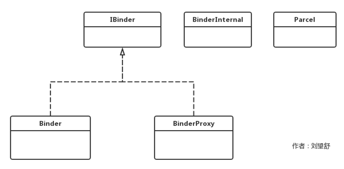

# Java Binder

* Binder和BinderProxy实现了IBinder接口，Binder是服务端的代表，而BinderProxy是客户端的代表。
* BinderInternal只是在Binder框架中被使用，其内部类GcWatcher用于处理和Binder的垃圾回收。
* Parcel是一个数据包装器，它可以在进程间进行传递，Parcel既可以传递基本数据类型也可以传递Binder对象，
Binder通信就是通过Parcel来进行客户端与服务端数据交互。Parcel的实现既有Java部分，也有Native部分，具体实现在Native部分中。

##### Binder注册
frameworks/base/core/jni/android_util_Binder.cpp调用int_register_android_os_Binder函数来完成Binder类的注册

##### BinderInternal注册
frameworks/base/core/jni/android_util_Binder.cpp调用int_register_android_os_BinderInternal函数来完成BinderInternal类的注册

BinderProxy注册过程类似