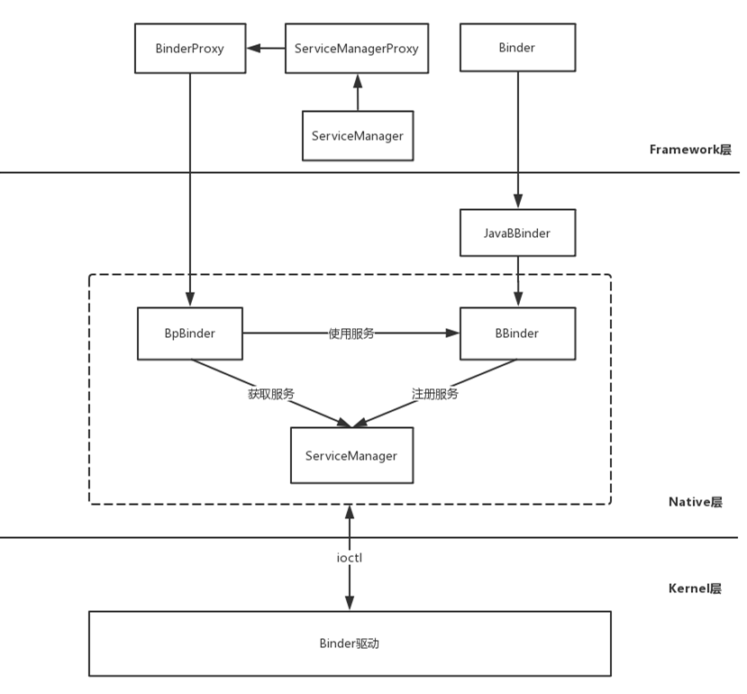

# Java Binder系统服务注册
已经积累了几个点需要分析，分别是：

* BinderInternal.getContextObject()
* ServiceManagerNative.asInterface()
* getIServiceManager().addService()

Native Binder的部分在此前的文章已经讲过，这里主要来说说Java Binder部分，从图中可以看到：

1. Binder是服务端的代表，JavaBBinder继承BBinder，JavaBBinder通过mObject变量指向Binder。
2. BinderProxy是客户端的代表，ServiceManager的addService等方法会交由ServiceManagerProxy处理。
3. ServiceManagerProxy的成员变量mRemote指向BinderProxy对象，所以ServiceManagerProxy的addService等方法会交由BinderProxy来处理。
4. BinderProxy的成员变量mObject指向BpBinder对象，因此BinderProxy可以通过BpBinder和Binder驱动发送数据。