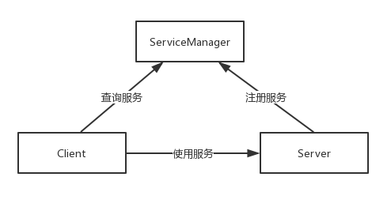
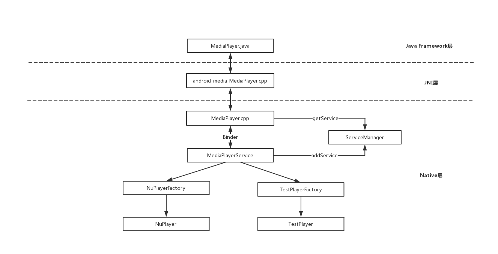
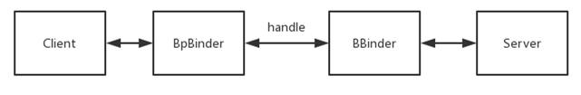
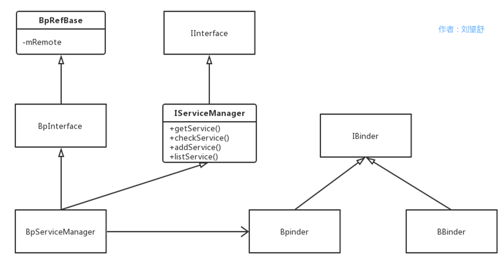
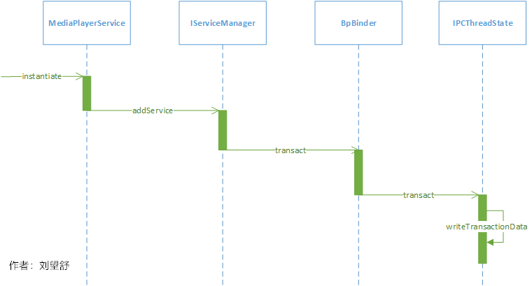
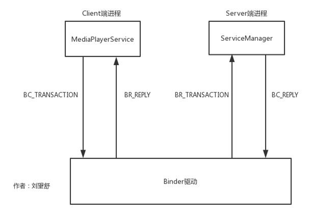

# ServiceManager中的binder

Client、Server、ServiceManager三者的交互都是基于Binder通信的，
那么任意两者的交互都可以说明Binder的通信的原理，可以说Native Binder的原理的核心就是ServiceManager的原理，
为了更好的了解ServiceManager，这里拿MediaPlayer框架来举例，它也是学习多媒体时必须要掌握的知识点。

##### BpBinder和BBinder
说到BpBinder，不得不提到BBinder，它们是Binder通信的“双子星”，都继承了IBinder。
BpBinder是Client端与Server交互的代理类，而BBinder则代表了Server端。
BpBinder和BBinder是一一对应的，BpBinder会通过handle来找到对应的BBinder。

BpBinder-->BpServiceManager

BpBinder::transact ==== IPCThreadState::transact

##### 两个重要方法
writeTransactionData函数用于传输数据，其中第一个参数BC_TRANSACTION代表向Binder驱动发送命令协议，
向Binder设备发送的命令协议都以BC_开头，而Binder驱动返回的命令协议以BR_开头。这个命令协议我们先记住，后面会再次提到他。

waitForResponse函数

从调用链的角度来看，MediaPlayerService是如何注册的貌似并不复杂，因为这里只是简单的介绍了一个调用链分支，可以简单的总结为以下几个步骤：

1. addService函数将数据打包发送给BpBinder来进行处理。
2. BpBinder新建一个IPCThreadState对象，并将通信的任务交给IPCThreadState。
3. IPCThreadState的writeTransactionData函数用于将命令协议和数据写入到mOut中。
4. IPCThreadState的waitForResponse函数主要做了两件事，
一件事是通过ioctl函数操作mOut和mIn来与Binder驱动进行数据交互，另一件事是处理各种命令协议。

从图中看出是以C/S架构为基础，addService是在MediaPlayerService进行的，它是Client端，
用于请求添加系统服务。而Server端则是指的是ServiceManager，用于完成系统服务的添加。

Client端和Server端分别运行在两个进程中，通过向Binder来进行通信。更详细点描述，
就是两端通过向Binder驱动发送命令协议来完成系统服务的添加。这其中命令协议非常多，过程也比较复杂，
这里对命令协议进行了简化，只涉及到了四个命令协议，其中BC_TRANSACTION和BR_TRANSACTION过程是一个完整的事务，
BC_REPLY和BR_REPLY是一个完整的事务。

Client端和Server端向Binder驱动发送命令协议以BC开头，而Binder驱动向Client端和Server端返回的命令协议以BR_开头。

步骤如下所示：

1. Client端向Binder驱动发送BC_TRANSACTION命令。
2. Binder驱动接收到请求后生成BR_TRANSACTION命令，唤醒Server端的线程后将BR_TRANSACTION命令发送给ServiceManager。
3. Server端中的服务注册完成后，生成BC_REPLY命令发送给Binder驱动。
4. Binder驱动生成BR_REPLY命令，唤醒Client端的线程后将BR_REPLY命令发送个Client端。

通过这些协议命令来驱动并完成系统服务的注册。