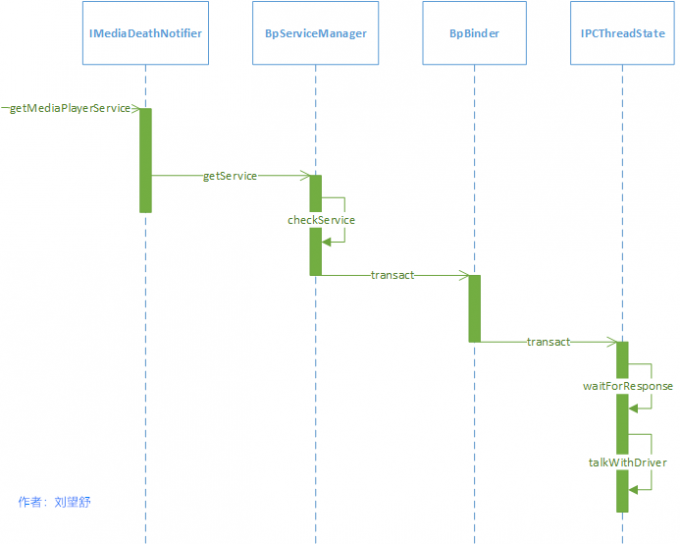
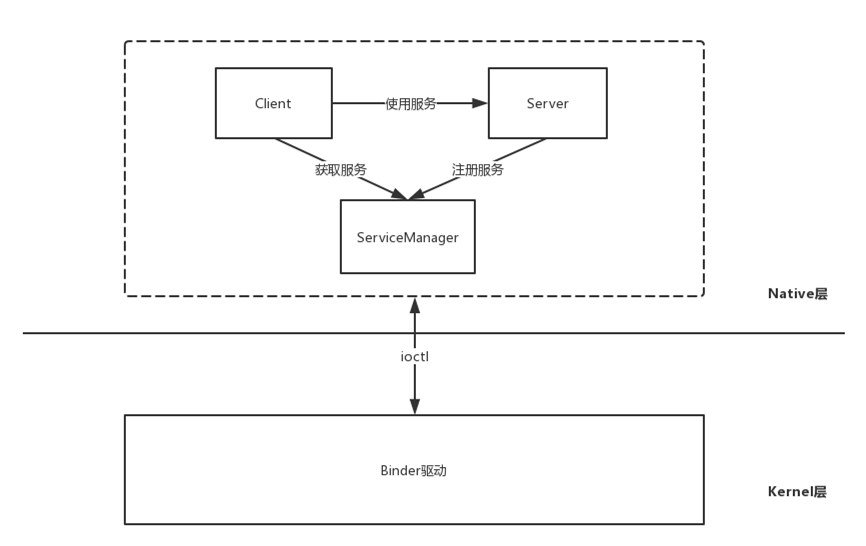
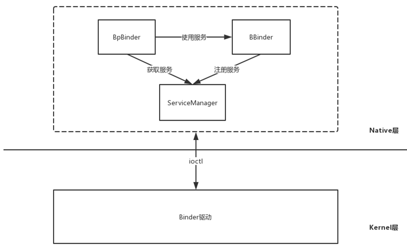

# ServiceManager中的binder2
ServiceManager是init进程负责启动的，具体是在解析init.rc配置文件时启动的

在Android 7.0中对init.rc文件进行了拆分，每个服务一个rc文件。ServiceManager的启动脚本在servicemanager.rc中：
frameworks/native/cmds/servicemanager/servicemanager.rc

```
service servicemanager /system/bin/servicemanager
    class core animation
    user system  //1
    group system readproc
    critical //2
    onrestart restart healthd  
    onrestart restart zygote
    onrestart restart audioserver
    onrestart restart media
    onrestart restart surfaceflinger
    onrestart restart inputflinger
    onrestart restart drm
    onrestart restart cameraserver
    onrestart restart keystore
    onrestart restart gatekeeperd
    writepid /dev/cpuset/system-background/tasks
    shutdown critical

```

service用于通知init进程创建名为servicemanager的进程，这个servicemanager进程执行程序的路径为/system/bin/servicemanager。

注释1的关键字user说明servicemanager是以用户system的身份运行的，注释2处的critical说明servicemanager是系统中的关键服务，
关键服务是不会退出的，如果退出了，系统就会重启，当系统重启时就会启动用onrestart关键字修饰的进程，比如zygote、media、surfaceflinger等等。

##### 注册成为Binder机制上下文管理
当一个进程在执行用户自己的代码时处于用户态，比如open函数，它运行在用户空间，当前的进程处于用户态。


当一个进程因为系统调用进入内核代码中执行时就处于内核态，比如open函数通过系统调用（__open()函数），
查找到了open函数在Kernel Binder对应的函数为binder_open，这时binder_open运行在内核空间，当前的进程由用户态切换到内核态。

##### **循环等待和处理client端发来的请求**
servicemanager成功注册成为Binder机制的上下文管理者后，servicemanager就是Binder机制的“总管”了，
它需要在系统运行期间处理client端的请求，由于client端的请求不确定何时发送，因此需要通过无限循环来实现，实现这一需求的函数就是binder_loop。


MediaPlayerService请求获取服务时序图



系统服务的注册流程中，在Kernel Binder中会调用do_add_service函数，
其内部会将包含服务名和handle值的svcinfo保存到svclist列表中。
同样的，在获取服务的流程中，find_svc函数中会遍历svclist列表，
根据服务名查找对应服务是否已经注册，如果已经注册就会返回对应的svcinfo，如果没有注册就返回NULL。







