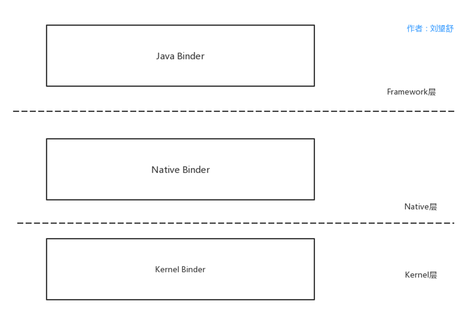

# 使用Binder的原因
Android是基于Linux内核的 ，Linux提供了很多IPC机制，而Android却自己设计了Binder来进行通信，主要是因为以下几点。

##### **性能方面**
性能方面主要影响的因素是拷贝次数，管道、消息队列、Socket的拷贝次书都是两次，性能不是很好，
共享内存不需要拷贝，性能最好，Binder的拷贝次书为1次，性能仅次于内存拷贝。

##### **稳定性方面**
Binder是基于C/S架构的，这个架构通常采用两层结构，在技术上已经很成熟了，稳定性是没有问题的。
共享内存没有分层，难以控制，并发同步访问临界资源时，可能还会产生死锁。从稳定性的角度讲，Binder是优于共享内存的。

##### **安全方面**

Android是一个开源的系统，并且拥有开放性的平台，市场上应用来源很广，因此安全性对于Android 平台而言极其重要。
传统的IPC接收方无法获得对方可靠的进程用户ID/进程ID（UID/PID），无法鉴别对方身份。
Android 为每个安装好的APP分配了自己的UID，通过进程的UID来鉴别进程身份。
另外，Android系统中的Server端会判断UID/PID是否满足访问权限，而对外只暴露Client端，加强了系统的安全性。

##### **语言方面**

Linux是基于C语言，C语言是面向过程的，Android应用层和Java Framework是基于Java语言，Java语言是面向对象的。
Binder本身符合面向对象的思想，因此作为Android的通信机制更合适不过。

从这四方面来看，Linux提供的大部分IPC机制根本无法和Binder相比较，而共享内存只在性能方面优于Binder，
其他方面都劣于Binder，这些就是为什么Android要使用Binder来进行进程间通信，
当然系统中并不是所有的进程通信都是采用了Binder，而是根据场景选择最合适的，比如Zygote进程与AMS通信使用的是Socket，Kill Process采用的是信号。

Binder机制是掌握系统底层原理的基石。根据Android系统的分层，Binder机制主要分为以下几个部分。

