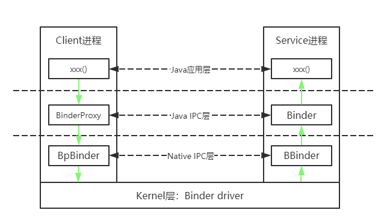

请求服务进程与服务进程不在同一进程(如这个服务获取)，返回的是BpBinder对象。
如果在同一进程，则不在创建新对象 只是引用加1，返回的是BBinder对象。

我们通过handle去获取远程端的Binder对象，如handle为0 就能获取到servicemanager的BpBinder对象，
通过查询到的某个服务的handle获取到对应服务的BpBinder对象(本地则是BBinder对象)。

在注册时data.writeStrongBinder(service);，通过ibinderForJavaObject()将service实体binder对象转换成BBinder，
然后传入binder驱动，完成服务注册到servicemanager。

#### 过程描述
1. BBinder和BpBinder都是native层的Binder对象。 BBinder是本地Binder(Native Binder)，BpBinder即远程端Binder。
2. BpBinder提供transact()方法来发送请求；BBinder提供了onTransact()接口来接收请求
3. BpBinder是客户端创建用于消息发送的代理；BBinder是服务端用于接收消息的。
4. 当通信时，Client端通过BinderProxy 经由Bpbinder的transact()方法最终发送请求到binder驱动。
binder驱动接收到经过处理，发送给目标进程JavaBBinder，最终经由服务实体的onTransact()接受处理。
5. 在注册过程，servicemanager中svcmgr_handler()相当于服务端Java层的onTransact()。

