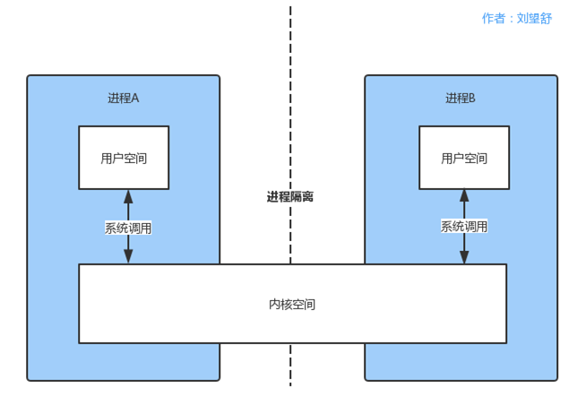
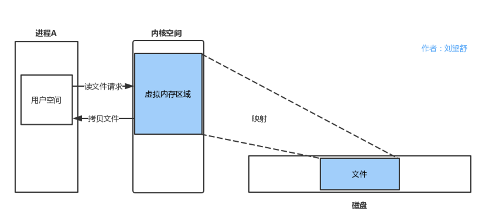
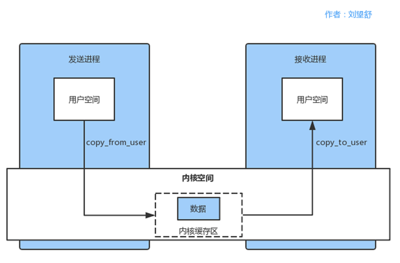

内核空间用户空间

#### 进程隔离
进程隔离指的是，一个进程不能直接操作或者访问另一个进程。也就是进程A不可以直接访问进程B的数据。

#### 系统调用
用户空间需要访问内核空间，就需要借助系统调用来实现。系统调用是用户空间访问内核空间的唯一方式，
保证了所有的资源访问都是在内核的控制下进行的，避免了用户程序对系统资源的越权访问，提升了系统安全性和稳定性。

进程A和进程B的用户空间可以通过如下系统函数和内核空间进行交互。

• copy_from_user：将用户空间的数据拷贝到内核空间。
• copy_to_user：将内核空间的数据拷贝到用户空间。

#### 内存映射
由于应用程序不能直接操作设备硬件地址，所以操作系统提供了一种机制：内存映射，把设备地址映射到进程虚拟内存区。

举个例子，如果用户空间需要读取磁盘的文件，如果不采用内存映射，那么就需要在内核空间建立一个页缓存，
页缓存去拷贝磁盘上的文件，然后用户空间拷贝页缓存的文件，这就需要两次拷贝。
采用内存映射，如下图所示。

由于新建了虚拟内存区域，那么磁盘文件和虚拟内存区域就可以直接映射，少了一次拷贝。

内存映射全名为Memory Map，在Linux中通过系统调用函数mmap来实现内存映射。
将用户空间的一块内存区域映射到内核空间。映射关系建立后，用户对这块内存区域的修改可以直接反应到内核空间，
反之亦然。内存映射能减少数据拷贝次数，实现用户空间和内核空间的高效互动。

### Linux的IPC通信原理
了解Liunx中的几个概念后，就可以学习Linux的IPC通信原理了，如下图所示。

内核程序在内核空间分配内存并开辟一块内核缓存区，发送进程通过copy_from_user函数将数据拷贝到到内核空间的缓冲区中。
同样的，接收进程在接收数据时在自己的用户空间开辟一块内存缓存区，
然后内核程序调用 copy_to_user() 函数将数据从内核缓存区拷贝到接收进程。
这样数据发送进程和数据接收进程完成了一次数据传输，也就是一次进程间通信。

Linux的IPC通信原理有两个问题：
1. 一次数据传递需要经历：用户空间 –> 内核缓存区 –> 用户空间，需要2次数据拷贝，这样效率不高。
2. 接收数据的缓存区由数据接收进程提供，但是接收进程并不知道需要多大的空间来存放将要传递过来的数据，
因此只能开辟尽可能大的内存空间或者先调用API接收消息头来获取消息体的大小，浪费了空间或者时间。

### Binder通信原理
Binder是基于开源的OpenBinder实现的，OpenBinder最早并不是由Google公司开发的，
而是Be Inc公司开发的，接着由Palm, Inc.公司负责开发。后来OpenBinder的作者Dianne Hackborn加入了Google公司，
并负责Android平台的开发工作，顺便把这项技术也带进了Android。

Binder是基于内存映射来实现的，在前面我们知道内存映射通常是用在有物理介质的文件系统上的，
Binder没有物理介质，它使用内存映射是为了跨进程传递数据。

Binder通信的步骤如下所示。

1. Binder驱动在内核空间创建一个数据接收缓存区。
2. 在内核空间开辟一块内核缓存区，建立内核缓存区和数据接收缓存区之间的映射关系，
以及数据接收缓存区和接收进程用户空间地址的映射关系。
3. 发送方进程通过copy_from_user()函数将数据拷贝 到内核中的内核缓存区，
由于内核缓存区和接收进程的用户空间存在内存映射，因此也就相当于把数据发送到了接收进程的用户空间，这样便完成了一次进程间的通信。

整个过程只使用了1次拷贝，不会因为不知道数据的大小而浪费空间或者时间，效率更高。