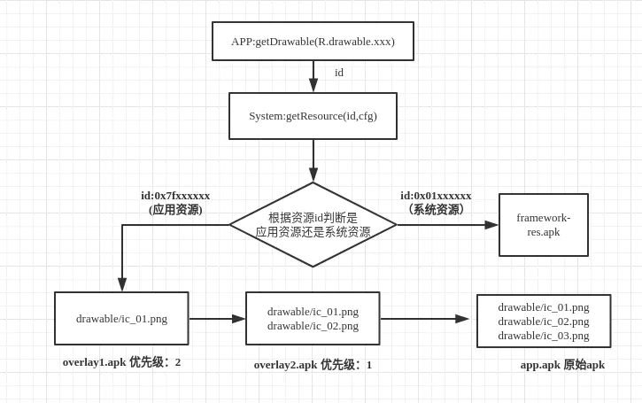

### 概述
android overlay是一种资源的动态替换机制，它的工作原理是将叠加层软件包中定义的资源映射到目标软件包中定义的资源。
当应用尝试解析目标软件包中资源的值时，系统转而会返回目标资源映射到的叠加层资源的值。
它也分为静态的(SRO , Static Resource Overlay)和动态的(RRO , Runtime Resource Overlay)两种，
静态的需要在源码编译阶段完成，比如SystemUI等系统应用，而RRO是通过安装Overlay的apk应用实现替换的。

#### 动态overlay
运行时Overlay，简称RRO，顾名思义，该机制的资源替换发生在运行时。

与SRO的区别
1. RRO能直接定制替换第三方APK的资源，而不需要其源码。SRO如上节所述，则需要对应APK的源码才能完成，一般而言，第三方是不会提供项目源码的。
2. RRO的编译结果会得到一个xxx_overlay.apk,加上原项目的apk，总共会有2个apk，
而SRO最终只会得到一个已经完成资源替换的apk。得到的overlay.apk可以视为一个正常的apk，
因为它能被安装，含有自己的AndroidManifest.xml文件，当然正常下，overlay.apk是不含有执行代码的。
3. RRO不能替换AndroidManifest.xml文件及reference resource 类型的文件，如layout、anim、xml目录中的xml文件。
虽然RRO具有自己的AndroidManifest.xml文件，但它却不能替换源项目中的AndroidManifest.xml文件。
关于layout目录中的xml文件，SRO是可以替换的。

直接将我们生成的overlay.apk直接push到/vendor/overlay目录下，来测试RRO机制。

部分厂商可能更改了路径，可通过adb shell pm path xxxx.overlay 查找到路径，前提是手机中已经安装了某个overlay的apk。

可以参考开机引导项目master分支，测试通过