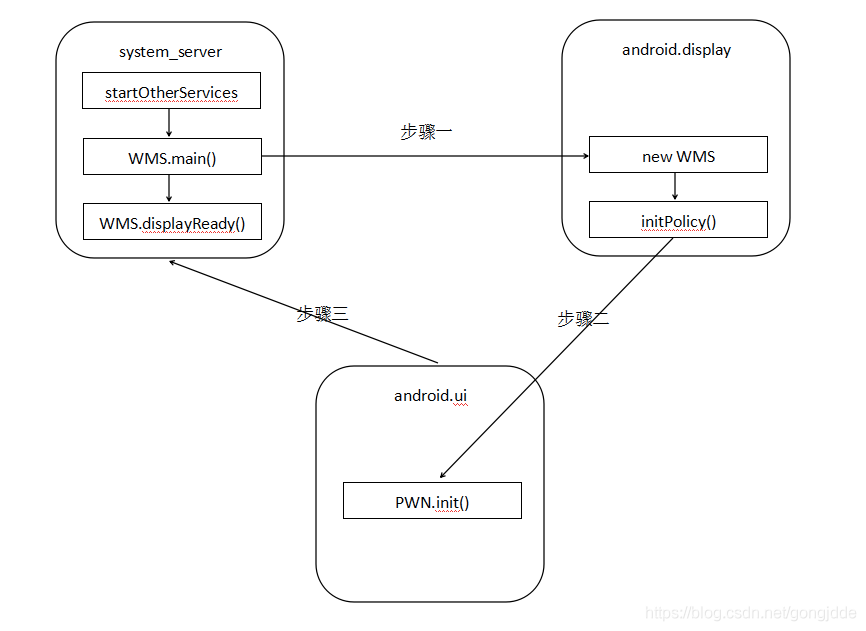

WMS 的职责有点类似 AMS，但我觉得比 AMS 更会复杂，不是说其自身功能很强大，
而是说它需要协助其他系统来完成很多事情，所处的位置很关键。主要的功能有，

- 窗口管理
  负责窗口的启动，添加，删除还有窗口属性调整。
- 窗口动画
  可以理解为在窗口与窗口间进行切换时，是通过动画做过渡的，从而不会显得单调死板。
- 输入系统的中转站
  用户交互产生的输入事件需要通过合适的窗口处理表现出来，不然用户会觉得有问题，那么这些输入事件就会由 IMS(InputManagerService) 交给 WMS 进行转接。
- Surface 管理
  窗口的绘制要交给 Surface，WMS 需要为窗口分配 Surface。

WindowState，用于表示WMS中的窗口

