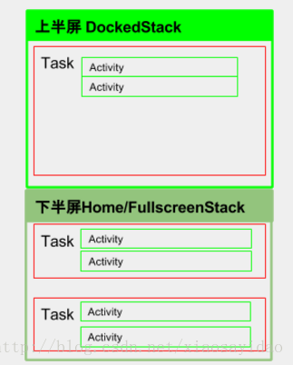

# 多窗口
**多窗口模式概念**

1. 自由窗口（Freeform Mod）：允许用户动态调整应用窗格大小，并在屏幕上显示两个以上的应用，这种模式类似于我们常见的桌面操作系统
2. 分屏（Split-Screen Mode）：是默认的多窗口模式实现，可为用户提供两个 Activity 窗格来放置应用。
3. 画中画 (PIP)（Picture In Picture Mode） ：允许 Android 设备在用户与其他应用互动时在小窗口中播放视频内容。

总结一句话：**多窗口框架的核心思想是分栈和设置栈边界**。


### 栈
既然提到了分栈，那我们首先要了解这个栈是什么？在Android系统中，启动一个Activity之后，
必定会将此Activity存放于某一个Stack，在Android N中，系统定义了5种Stack ID，系统所有Stack的ID属于这5种里面的一种。
不同的Activity可能归属于不同的Stack，但是具有相同的Stack ID。StackID如下图所示：

```Plain Text
        /** First static stack ID. */
        public static final int FIRST_STATIC_STACK_ID = 0;
 
        /** Home activity stack ID. */
        public static final int HOME_STACK_ID = FIRST_STATIC_STACK_ID;
 
        /** ID of stack where fullscreen activities are normally launched into. */
        public static final int FULLSCREEN_WORKSPACE_STACK_ID = 1;
 
        /** ID of stack where freeform/resized activities are normally launched into. */
        public static final int FREEFORM_WORKSPACE_STACK_ID = FULLSCREEN_WORKSPACE_STACK_ID + 1;
 
        /** ID of stack that occupies a dedicated region of the screen. */
        public static final int DOCKED_STACK_ID = FREEFORM_WORKSPACE_STACK_ID + 1;
 
        /** ID of stack that always on top (always visible) when it exist. */
        public static final int PINNED_STACK_ID = DOCKED_STACK_ID + 1;
```


正常情况下，
Launcher和SystemUI进程里面的Activity所在的Stack的id是HOME_STACK_ID， 
普通的Activity所在的Stack的id是FULLSCREEN_WORKSPACE_STACK_ID，
自由模式下对应的栈ID是FREEFORM_WORKSPACE_STACK_ID；
分屏模式下，上半部分窗口里面的Activity所处的栈ID是DOCKED_STACK_ID；
画中画模式中，位于小窗口里面的Activity所在的栈的ID是PINNED_STACK_ID；

### 栈边界
在多窗口框架中，通过设置Stack的边界（Bounds）来控制里面每个Task的大小，最终Task的大小决定了窗口的大小。
栈边界通过Rect(left,top,right,bottom)来表示，存储了四个值，分别表示矩形的4条边离坐标轴的位置，
最终显示在屏幕上窗口的大小是根据Stack边界的大小来决定的。


如图1-1所示，为分屏模式下的Activity的状态。整个屏幕被分成了两个Stack，一个DockedStack，一个FullScreenStack。
每个Stack里面有多个Task，每个Task里面又有多个Activity。当我们设置了Stack的大小之后，
Stack里面的所有的Task的大小以及Task里面所有的Activity的窗口大小都确定了。
假设屏幕的大小是1440x2560，整个屏幕的栈边界就是（0,0,1440,2560)。



多窗口是在不同的窗口显示不同Stack ID的Task。把不同的Task根据Stack ID来进行分类，分类主要是为了方便设置窗口的大小。
Stack的大小决定了Stack 里面的Task 的大小，最终决定了Task里面的Activity对应的窗口的大小。


