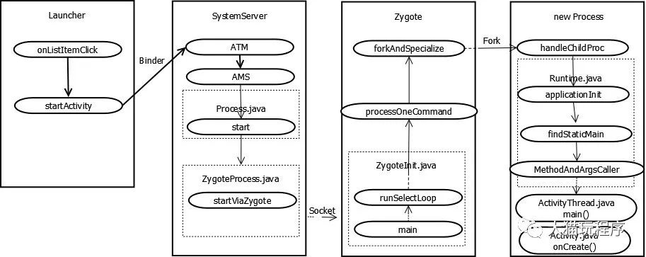
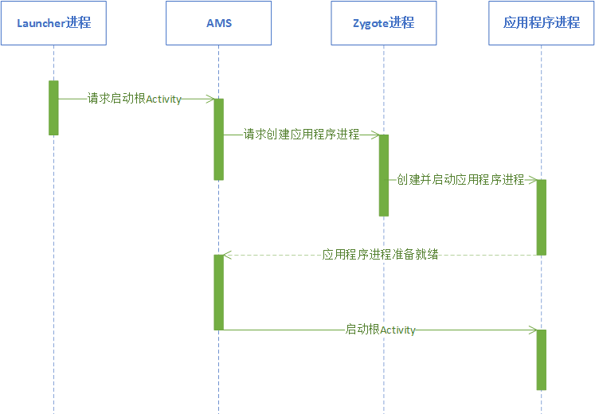

# 桌面应用启动流程
点击桌面的图标，Launcher调用系统的startActivity进行启动Activity，此时的动作在Launcher进程中

通过Binder向SystemServer进行发送消息，让ATM\\AMS 进行Activity的处理，组装message，通过socket发送给Socket，此时动作在SystemServer进程中

Zygote收到SystemServer发来的消息，进行消息拆分，再调用系统的fork()函数，进行进行孵化操作，此时动作在Zygote进程中

进入ActivityThread的main()，完成最终应用进程的的onCreate操作，该步动作处于新创建的应用进程中

```
在Android中通过Logcat抓取log时，存在PID和TID两个概念。
PID：Process ID，进程ID
TID: Thread ID，线程ID

```
```
App发起进程：点击一个桌面应用(例如微信)，Launcher 加载应用， LauncherActivity收到触发事件，组装Intent，
通过binder发送消息给SystemServer进程，调用Activity的startActivity()来启动进程，启动Activity时，
受ActivityManagerService-AMS的服务控制，AMS属于SystemServer进程。

Zygote有一个无限循环，一直在等待Socket请求，收到SystemServer发来新的Socket请求后，
Zygote调用系统的fork函数来孵化一个新的进程，
比如这里的微信。再把启动的入口交给ActivityThread，进入微信的进程中，进行详细的UI展示。

```


都是在进程fork完成后，便会在新进程中执行onZygoteInit()的过程中，启动binder线程池，存放在ProcessState中。


##### 消息循环
ActivityThread 中创建消息循环





```
应用的启动共分以下四个步骤完成：
1. 点击桌面的图标，Launcher调用系统的startActivity进行启动Activity，此时的动作在Launcher进程中
2. 通过Binder向SystemServer进行发送消息，让ATM\AMS 进行Activity的处理，组装message，
通过socket发送给Zytgote，此时动作在SystemServer进程中
3. Zygote收到SystemServer发来的消息，进行消息拆分，再调用系统的fork()函数，进行进行孵化操作，此时动作在Zygote进程中
4. 进入ActivityThread的main()，完成最终应用进程的的onCreate操作，该步动作处于新创建的应用进程中
```
