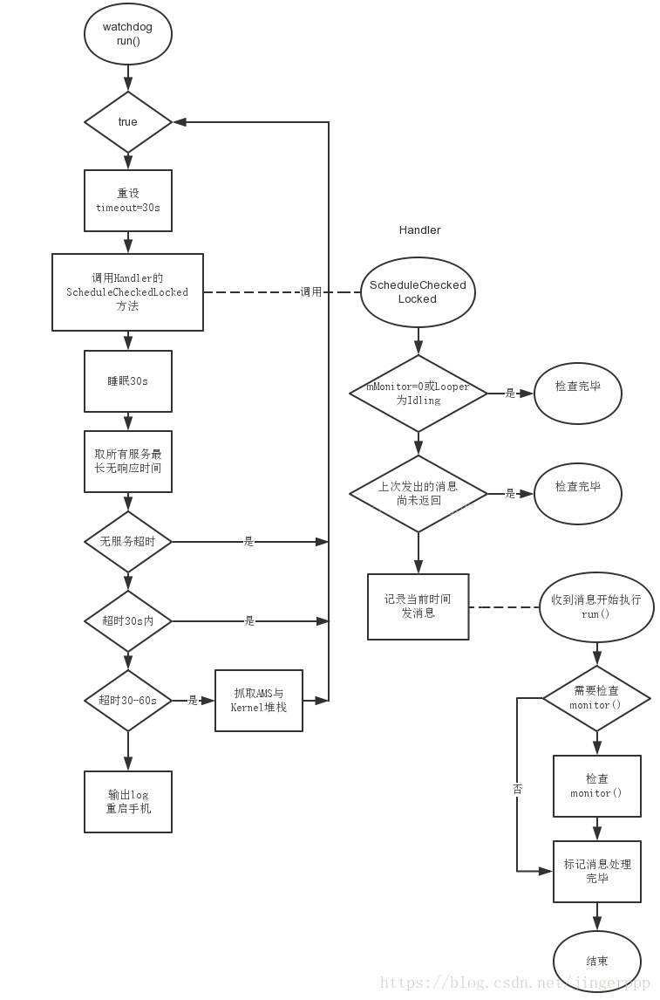

Watchdog字面上是“看门狗”的意思，有做过嵌入式低层的朋友应该知道，
为了防止嵌入式系统MCU里的程序因为干扰而跑飞，专门在MCU里设计了一个定时器电路，叫做看门狗。
当MCU正常工作的，每隔一段时间会输出一个信号给看门狗，也就是所谓的喂狗。
如果程序跑飞，MCU在规定的时间内没法喂狗，这时看门狗就会直接触发一个reset信号，让CPU重新启动。

在Android系统的framework中，设计了一个系统服务Watchdog，它类似于一个软件看门狗，
用来保护重要的系统服务。它的源代码位于：frameworks/base/services/core/java/com/android/server/Watchdog.java

WatchDog 主要就是确保上述的服务发生死锁之后，退出SystemServer 进程，让init 进程重启它，让系统回到可用状态。 

