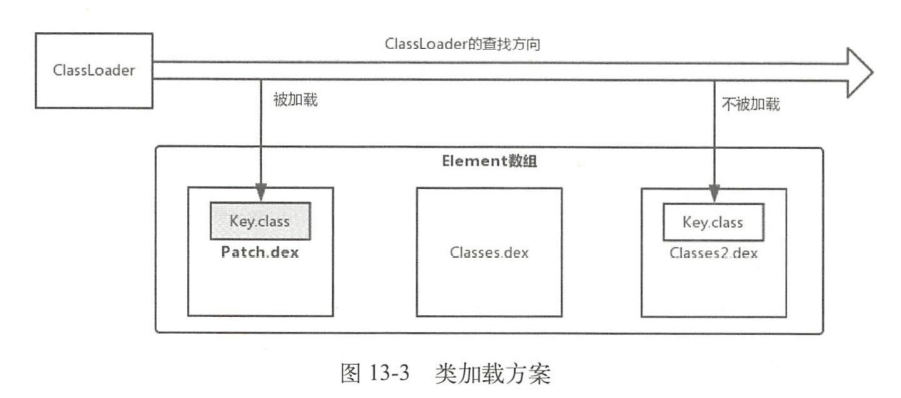
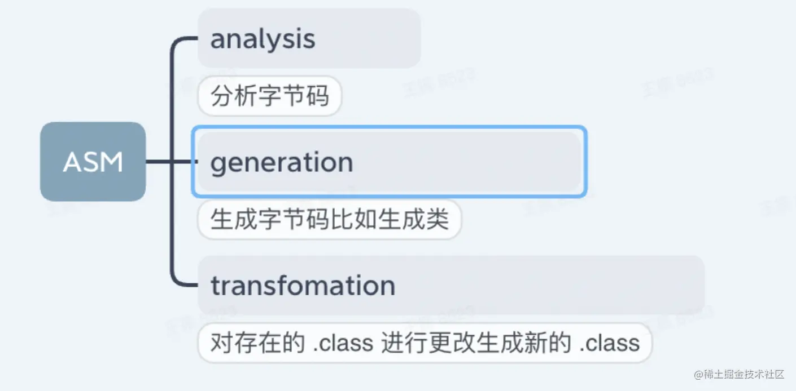

# 代码修复
底层替换方案，类加载方案和instant run方案

#### 类加载方案
基于 Dex 分包方案，而 Dex 分包方案主要是为了解决以下两个问题：

1. 65536 限制

DVM Bytecode 的限制，DVM 指令集中的方法调用的指令 invoke-kind 索引为 16 bits，因此最多只能引用 65535 个方法。

2. LinearAlloc 限制

DVM 中的 LinearAlloc 是一个固定的缓存区，当方法数超出了缓存区的大小时会报错。

代码修复中的类加载器方案主要是在新的 Dex 中放入补丁包代码，然后再 ClassLoader 中，
将新的文件对应的 Element 放到 Element 数组第一个位置，更由于双亲委派机制，旧的类将不会被加载。

先找到新的 dex ，然后先加载，这样原本的加载过程就会被跳过。

此方案需要重启 App 生效，因为类是不允许卸载的，原本已经加载的原本的类无法卸载。

#### 底层替换方案
ART 虚拟机中会存所有 java 方法信息的 ArtMethod 结构体，包括执行入库、访问权限、所属类和执行地址等。
通过直接在运行时替换该结构体，可以坐待代码热修复，将原本的方法调用定向到新的方法调用。

AndFix 采用的是替换 ArtMethod 结构体中的字段，这样会有兼容问题，因为厂商可能会修改 ArtMethod 结构体，
导致方法替换失败。 Sophix 采用的是替换整个 ArtMethod 结构体 ，这样不会存在兼容问题。

这种方式可以直接生效，不需要重启。

#### Instant Run方案
主要是使用 ASM 实现，在每个方法中插入代码，根据是否需要替换来实现方法调用的替换。

使用该方案的热修复框架有 Robust 和 Aceso。

ASM 就是个对字节码文件进行增删改查的工具包，主要用它来做下面三件事情：

ASM 是在编译期处理字节码的，可以认为是一种编译期的 AOP 技术，很多大厂都用来来做 APM、hook 代码、无侵入埋点等功能。