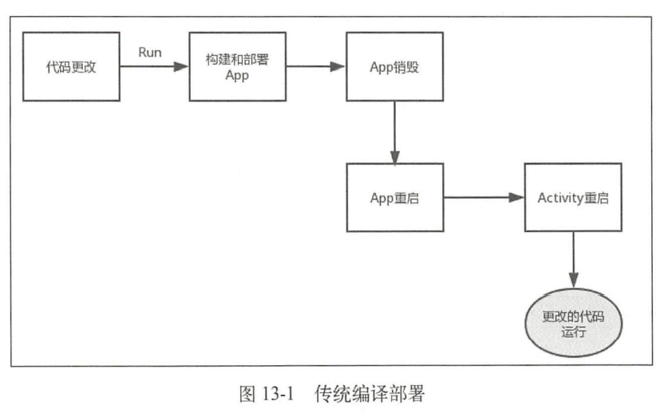
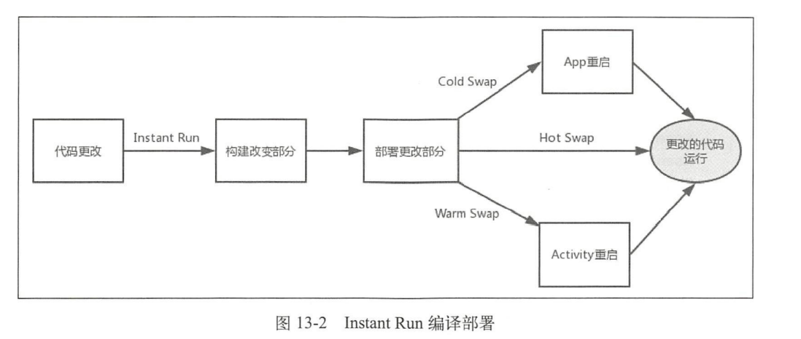

# 资源修复
Instant run是 Android Studio 2.0 以后新增的一个运行机制，能够减少开发人员第二次及以后的构建和部署时间。

传统编译部署过程：

Instant Run 的部署过程：

* Hot swap：效率最高的部署方式，不用重启 Activity
* Warm Swap：效率次之，需要重启 Activity。修改或删除资源时需要使用。
* Cold Swap：App 需要重启，但是不要重新安装。当添加、删除或修改一个字段和方法或者添加一个类等时候需要。

### 
### 13.3.2 Instant Run 的资源修复
该过程不是 Android 的源码，是 Android Studio 中执行的过程，过程为两个步骤：

1. 创建新的 AssetManager，通过反射调用 addAssetPath 方法加载外部资源。
2. 将 AssetManager 类型的 mAssets 字段的引用全部替换为新的 AssetManager。