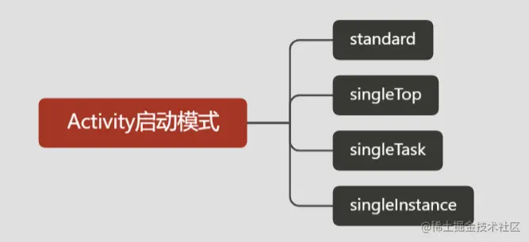

# activity
##### 启动模式


#### 启动流程
主要参考/Users/nicole317/demo_project/androider/src/android/framework/android重要流程/Activity启动流程变化.md

##### scheme跳转协议
```Plain Text
<activity android:name="com.scc.demo.actvitiy.RedActivity"
   >
    <intent-filter>
        <action android:name="android.intent.action.VIEW" />
        <category android:name="android.intent.category.DEFAULT" />
        <category android:name="android.intent.category.BROWSABLE" />
        <data
            android:host="scc"
            android:path="/redActivity"
            android:port="2021"
            android:scheme="sccdemo" />
    </intent-filter>
</activity>
```
```Plain Text
<a href="sccdemo://scc:2021/redActivity?color=0000&ad=10086">打开源生应用指定的RedActivity</a>
```
多个activity应用退出

记录，迭代退出

