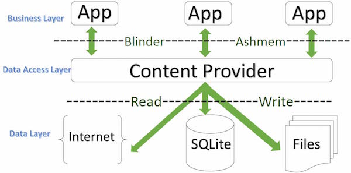

# contentprovider
**ContentProvider(数据提供者)是应用程序之间共享数据的一种接口机制，是一种更为高级的数据共享方法。**

数据层，可以是SQL，可以是文件

## ContentResolver
* ContentResolver是数据调用者，ContentProvider将数据发布出来，通过ContentResolver对象结合Uri进行调用。
* 一般来说ContentProvider是单例模式，多个应用可通过ContentResolver调用ContentProvider的增删改查操作数据，
ContentResolver调用的数据操作会让同一个ContentProvider处理。
