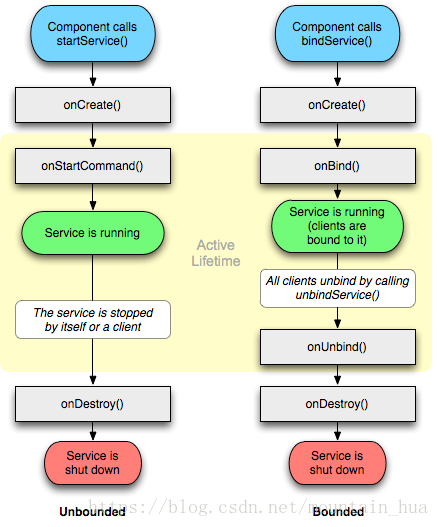

# Service
生命周期不同

bindService，绑定的client停止释放，client会和service解除绑定，自动destroy service。

service混合启动
**既使用startService又使用bindService的情况**

如果一个Service又被启动又被绑定，则该Service会一直在后台运行。首先不管如何调用，onCreate始终只会调用一次。
对应startService调用多少次，Service的onStart方法便会调用多少次。
Service的终止，需要unbindService和stopService同时调用才行。不管startService与bindService的调用顺序，
如果先调用unbindService，此时服务不会自动终止，再调用stopService之后，服务才会终止；
如果先调用stopService，此时服务也不会终止，而再调用unbindService或者之前调用bindService的Context不存在了
（如Activity被finish的时候）之后，服务才会自动停止。

