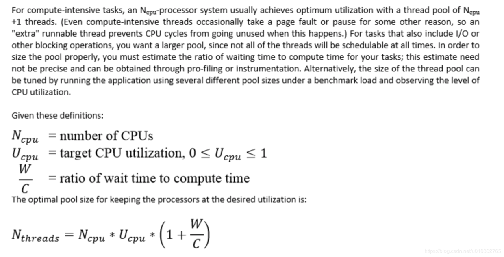

# 2.异步优化与拓扑排序
## 1.简介
通过上期的学习 卡顿定位，我们学会了 定位及获取程序的耗费时间 并找到卡顿的地方。错过的小伙伴可以关注我在我的主页查看，
这期我们来谈谈具体的优化方案，首先是 异步优化

## 2.异步优化
> 异步优化的核心思想：子线程来分担主线程的任务，并减少运行时间

接着上期的内容，通过卡顿定位，找到我们卡顿处的代码

```Plain Text
public class MyApplication extends Application {

    @Override
    public void onCreate() {
        super.onCreate();

//        Debug.startMethodTracing("MyApplication");
          initBugly();

          initBaiduMap();

          initJPushInterface();

          initShareSDK();
//        Debug.stopMethodTracing();
    }

    private void initBugly() throws InterruptedException {

        initBaiduMap();
        Thread.sleep(1000);
    }

    private void initBaiduMap()  throws InterruptedException {

        Thread.sleep(2000);
    }

    private void initJPushInterface() throws InterruptedException {

        Thread.sleep(3000);
    }

    private void initShareSDK() throws InterruptedException {

        Thread.sleep(500);
    }
}
复制代码

```
执行完毕打开页面大约是 5.5秒，太慢了，需要优化！

> 启动优化是一个大型软件开发中要做的第一步优化，因为无论你的APP做的内容有多么丰富，如果启动比较慢的话，那么给用户的第一印象就会非常不好。

想到异步首先想到的就是开线程，但是需要注意的是不要直接就去开线程，因为线程缺乏统一管理，可能无限制新建线程，
相互之间竞争，及可能占用过多系统资源导致死机或oom，所以我们使用线程池的方式去执行异步。

对线程池不了解的就去看  [大话线程池原理](https://juejin.im/post/5da050c5f265da5b9e0d429c)

## 3.第一次改造（FixedThreadPool）
这里我们采用 FixedThreadPool 来解决卡顿。但是问题来了，  这个线程池需要指定多少个线程合适尼？

> 有人会说，有几个方法就指定几个呗。。（突然想吐槽下，阿里里面曾经有个项目，就是这么做的，开的线程池就是按心情随便指定了个数字。。。其实是不对的，但咱人小势微的也不敢说啊）

为了更高效的利用CPU，尽量线程池数量不要写死，因为不同的手机厂商的CPU核数也是不一样的，
设置的线程数过小的话，有的CPU是浪费的，设置过多的话，均抢占CUP，也会增加负担。所以正确的写法是：

```Plain Text
// 获得当前CPU的核心数
private static final int CPU_COUNT = Runtime.getRuntime().availableProcessors();

// 设置线程池的核心线程数2-4之间,但是取决于CPU核数
private static final int CORE_POOL_SIZE = Math.max(2, Math.min(CPU_COUNT - 1, 4));

// 创建线程池
ExecutorService executorService = Executors.newFixedThreadPool(CORE_POOL_SIZE);
复制代码

```
实验证明，根据这个公式来算出的线程数是最合理的，至于为什么是这样算，不是全占用了CPU数是最好的吗?

表示不信作者的同学你就自己看下面的公式，欢迎来怼作者!



好了我们用线程池改造下

```Plain Text
   @Override
   public void onCreate() {
        super.onCreate();

//      Debug.startMethodTracing("MyApplication");
        ExecutorService executorService = Executors.newFixedThreadPool(CORE_POOL_SIZE);

        executorService.submit(new Runnable() {

            @Override
            public void run() {

                initBugly();
            }
        });

        executorService.submit(new Runnable() {

            @Override
            public void run() {

                initBaiduMap();
            }
        });

         executorService.submit(new Runnable() {

            @Override
            public void run() {

                initJPushInterface();
            }
        });

        executorService.submit(new Runnable() {

            @Override
            public void run() {

                initShareSDK();
            }
        });
//      Debug.stopMethodTracing();
    }
复制代码

```
经过测试，现在打开页面基本是秒开的。

但是又出现了问题，比如有的是必须要先执行完毕才能进入页面的。也就是说，得先让它执行完毕，才能进入主页。

## 4.第二次改造（CountDownLatch）
很简单-加锁就行，关于锁的介绍就不在这里赘述了，有很多，但是作者用的是CountDownLatch,  
又称之为门栓，构造函数就是指定门栓的个数，  latch.countDown();  
每次调用都减少一个门栓数，  latch.await();  就是开启等待，当门栓数为0时，就放开去执行下面的逻辑。

```Plain Text
    @Override
    public void onCreate() {
        super.onCreate();

//        Debug.startMethodTracing("MyApplication");
        final CountDownLatch latch = new CountDownLatch(1);
        ExecutorService executorService = Executors.newFixedThreadPool(CORE_POOL_SIZE);

        executorService.submit(new Runnable() {

            @Override
            public void run() {

                initBugly();
                latch.countDown();
            }
        });

        executorService.submit(new Runnable() {

            @Override
            public void run() {

                initBaiduMap();
            }
        });

        executorService.submit(new Runnable() {

            @Override
            public void run() {

                initJPushInterface();
            }
        });

        executorService.submit(new Runnable() {

            @Override
            public void run() {

                initShareSDK();
            }
        });

        try {
            latch.await();
        } catch (InterruptedException e) {
            e.printStackTrace();
        }
//            Debug.stopMethodTracing();
    }
复制代码

```
> 这样就行了，只有当initBugly执行完毕才能继续跳转页面，当然值得补充的是，
> 之所以要加门栓，是因为在onCreate方法里面，可能还有其他必须在主线程才能初始化的其他耗时任务，
> 而initBugly可以不需要在主线程里面初始化，但是又必须得初始化完毕才能跳转页面。所以为了不再增加时间，才启动线程池+门栓去初始化

好了，既加快了速度，又可以保证一些不需要在主线程优化而又启动之前必须初始化完成的任务不出问题，

但是尼，这么写，有点Low，而且如果有的耗时方法存在关联，比如必须先执行完A，根据A的返回值，再执行B，
然后根据B的返回再执行C，那么必须串联的话，我们该如何优化尼？

## 5.第三次改造（启动器）
先看图，目的就是进行任务分类


看了图，是不是略微明白了？我们的任务基本就是这样的，有的必须要在所以任务之前初始化，有的必须要在主线程初始化，
有的可以有空在初始化，有的必须要在有的任务执行完毕再初始化，比如激光推送需要设备ID，
那么就必须要在获取设备ID这个方法执行完才能执行，所以我们要对耗时任务先分类。

于是有了上图

* head task : 我们会把一些必须先启动的task放到这里
* 主线程：将必须要在主线程中初始化的task放入这里
* 并发：将非必须在主线程中初始化的task放入这里
* tall task: 一些在所有任务执行完毕之后才去初始化的放入这里，比如一些log打印等
* ilde task: 通过字面就知道了将一些可以有空再初始化的task放入这里

好了分好类了之后，我们发现如果用常规的方式去做，比如线程池+门栓就很麻烦了，而且效率不高，为了极致的性能体验，我们会自己做一个启动器

先看下我们完善后的代码

```Plain Text
// 使用启动器的方式
TaskDispatcher.init(this);
TaskDispatcher instance = TaskDispatcher.createInstance();
instance.addTask(new initBuglyTask()) // 默认添加，并发处理
instance.addTask(new initBaiduMapTask())  // 在这里需要先处理了另外一个耗时任务initShareSDK，才能再处理它
instance.addTask(new initJPushInterface())  // 等待主线程处理完毕，再进行执行
                .start();

instance.await();
复制代码

```
看无语伦比的简单，无论是需要别的任务执行完再执行的继承关系，还是必须主线程执行完的等待，还是可以并发的执行，在定义task里面，只需要一个方法即可。

### 5.1 启动器
什么是启动器？为啥用它？

> 在应用启动的时候，我们通常会有很多工作需要做，为了提高启动速度，我们会尽可能让这些工作并发进行。
> 但这些工作之间可能存在前后依赖的关系，所以我们又需要想办法保证他们执行顺序的正确性，很麻烦。

虽然阿里也出了个启动器  [alibaba / alpha](https://github.com/alibaba/alpha)

但是尼，在狗东用阿里的框架总感觉怪怪的，接下来的时间就带领大家去打造一款属于自己的启动器。

要想做启动器，首先是要解决一些依赖关系，比如，我们传入的任务是A，B，C但是尼，如果A依赖于B，那么就需要先初始化B，同时处理C，然后再处理A。

怎么排序尼，这个有个专业的名称，叫做了 任务的有向无环图的拓扑排序

不知道的去看这里  [有向无环图的拓扑排序](https://www.cnblogs.com/en-heng/p/5085690.html)

好了，我先贴出算法的代码，有个简单的认识便可，下期带领大家一步一步的打架自己的启动器。

TaskSortUtil.java

```Plain Text
public class TaskSortUtil {

    private static List<Task> sNewTasksHigh = new ArrayList<>();// 高优先级的Task

    /**
     * 任务的有向无环图的拓扑排序
     *
     * @return
     */
    public static synchronized List<Task> getSortResult(List<Task> originTasks,
                                                        List<Class<? extends Task>> clsLaunchTasks) {
        long makeTime = System.currentTimeMillis();

        Set<Integer> dependSet = new ArraySet<>();
        Graph graph = new Graph(originTasks.size());
        for (int i = 0; i < originTasks.size(); i++) {
            Task task = originTasks.get(i);
            if (task.isSend() || task.dependsOn() == null || task.dependsOn().size() == 0) {
                continue;
            }
            for (Class cls : task.dependsOn()) {
                int indexOfDepend = getIndexOfTask(originTasks, clsLaunchTasks, cls);
                if (indexOfDepend < 0) {
                    throw new IllegalStateException(task.getClass().getSimpleName() +
                            " depends on " + cls.getSimpleName() + " can not be found in task list ");
                }
                dependSet.add(indexOfDepend);
                graph.addEdge(indexOfDepend, i);
            }
        }
        List<Integer> indexList = graph.topologicalSort();
        List<Task> newTasksAll = getResultTasks(originTasks, dependSet, indexList);

        DispatcherLog.i("task analyse cost makeTime " + (System.currentTimeMillis() - makeTime));
        printAllTaskName(newTasksAll);
        return newTasksAll;
    }

    @NonNull
    private static List<Task> getResultTasks(List<Task> originTasks,
                                             Set<Integer> dependSet, List<Integer> indexList) {
        List<Task> newTasksAll = new ArrayList<>(originTasks.size());
        List<Task> newTasksDepended = new ArrayList<>();// 被别人依赖的
        List<Task> newTasksWithOutDepend = new ArrayList<>();// 没有依赖的
        List<Task> newTasksRunAsSoon = new ArrayList<>();// 需要提升自己优先级的，先执行（这个先是相对于没有依赖的先）
        for (int index : indexList) {
            if (dependSet.contains(index)) {
                newTasksDepended.add(originTasks.get(index));
            } else {
                Task task = originTasks.get(index);
                if (task.needRunAsSoon()) {
                    newTasksRunAsSoon.add(task);
                } else {
                    newTasksWithOutDepend.add(task);
                }
            }
        }
        // 顺序：被别人依赖的—》需要提升自己优先级的—》需要被等待的—》没有依赖的
        sNewTasksHigh.addAll(newTasksDepended);
        sNewTasksHigh.addAll(newTasksRunAsSoon);
        newTasksAll.addAll(sNewTasksHigh);
        newTasksAll.addAll(newTasksWithOutDepend);
        return newTasksAll;
    }

    private static void printAllTaskName(List<Task> newTasksAll) {
        if (true) {
            return;
        }
        for (Task task : newTasksAll) {
            DispatcherLog.i(task.getClass().getSimpleName());
        }
    }

    public static List<Task> getTasksHigh() {
        return sNewTasksHigh;
    }

    /**
     * 获取任务在任务列表中的index
     *
     * @return
     */
    private static int getIndexOfTask(List<Task> originTasks,
                                      List<Class<? extends Task>> clsLaunchTasks, Class cls) {
        int index = clsLaunchTasks.indexOf(cls);
        if (index >= 0) {
            return index;
        }

        // 仅仅是保护性代码
        final int size = originTasks.size();
        for (int i = 0; i < size; i++) {
            if (cls.getSimpleName().equals(originTasks.get(i).getClass().getSimpleName())) {
                return i;
            }
        }
        return index;
    }
}

复制代码

```
Graph.java

```Plain Text
/**
 * 有向无环图的拓扑排序算法
 */
public class Graph {
    //顶点数
    private int mVerticeCount;
    //邻接表
    private List<Integer>[] mAdj;

    public Graph(int verticeCount) {
        this.mVerticeCount = verticeCount;
        mAdj = new ArrayList[mVerticeCount];
        for (int i = 0; i < mVerticeCount; i++) {
            mAdj[i] = new ArrayList<Integer>();
        }
    }

    /**
     * 添加边
     *
     */
    public void addEdge(int u, int v) {
        mAdj[u].add(v);
    }

    /**
     * 拓扑排序
     */
    public Vector<Integer> topologicalSort() {
        int indegree[] = new int[mVerticeCount];
        for (int i = 0; i < mVerticeCount; i++) {//初始化所有点的入度数量
            ArrayList<Integer> temp = (ArrayList<Integer>) mAdj[i];
            for (int node : temp) {
                indegree[node]++;
            }
        }
        Queue<Integer> queue = new LinkedList<Integer>();
        for (int i = 0; i < mVerticeCount; i++) {//找出所有入度为0的点
            if (indegree[i] == 0) {
                queue.add(i);
            }
        }
        int cnt = 0;
        Vector<Integer> topOrder = new Vector<Integer>();
        while (!queue.isEmpty()) {
            int u = queue.poll();
            topOrder.add(u);
            for (int node : mAdj[u]) {//找到该点（入度为0）的所有邻接点
                if (--indegree[node] == 0) {//把这个点的入度减一，如果入度变成了0，那么添加到入度0的队列里
                    queue.add(node);
                }
            }
            cnt++;
        }
        if (cnt != mVerticeCount) {//检查是否有环，理论上拿出来的点的次数和点的数量应该一致，如果不一致，说明有环
            throw new IllegalStateException("Exists a cycle in the graph");
        }
        return topOrder;
    }
}
复制代码

```
网上有很多这种类型的代码，百度即可

## 6. 后记
好了，本来打算想把启动器全写在这一章节里面，但是，休息时间太少了，只能把一章的内容拆为2章，
有兴趣的小伙伴记得点赞加关注，下期关于自定义启动器的章节，大概3天后，如果不忙的话，更新出来。  
这章基本就是认识下不要写死线程池，那并不是最优解，而且Application里面或者Activity的启动项，
是可以按照上面的图片进行分别分类的。但是普通方法执行起来实在太麻烦。关注下一期的启动器章节，end!

