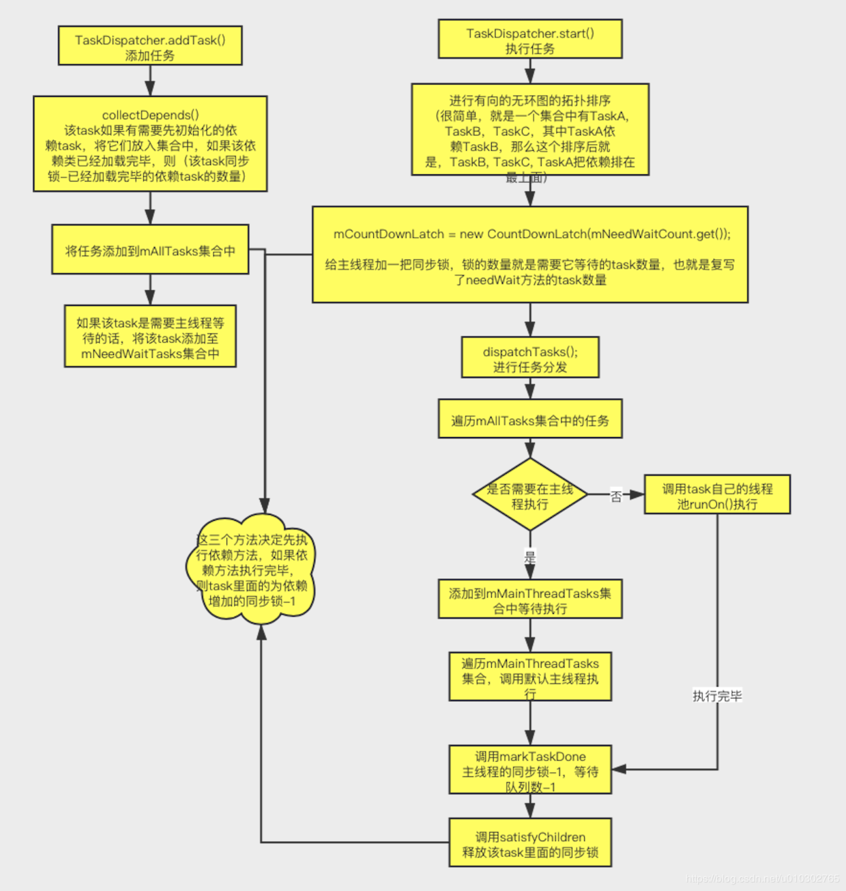

# 3.自定义启动器
## 1.为什么要用启动器
为什么要做启动器？直接写它不香吗？来先回顾下恶心的代码结构

```Plain Text
public class MyApplication extends Application {

    @Override
    public void onCreate() {
        super.onCreate();

        // 一堆耗时方法，严重影响启动
        initBugly();
        initBaiduMap();
        initJPushInterface();
        initShareSDK();
    }
}

```
面对这些比较恶心的启动方法，为了加快启动，我们一般会采用线程池的方式启动
，[一线大厂资深APP性能优化系列-异步优化与拓扑排序（二）](https://juejin.im/post/5eb7b6a1f265da7c0750a9a8)，

但是如果有的方法自己需要依赖的方法执行完毕才能执行，比如 initJPushInterface()  
可能需要先执行完毕 GetDeviceID()  执行完毕才能进行再执行，
那么把它们都放入线程池里面并行执行就会产生问题，另外有的方法比如initBugly();  
必须先执行完它之后，主线程才能执行完毕，再跳转页面。那么因为这些问题，如果只是用线程池来并行，就会导致代码写起来过于复杂。

这也就是为什么要推出启动器的原因，当然阿里做的还是不错的，但是狗东用阿里做的启动器感觉怪怪的，所以跟着作者一起从零搭建一个启动器吧。

## 1.定义task接口
首先，我们要定义自己的一些task,  就是用来执行耗时方法的。先定义个接口吧。

```Plain Text
/**
 * @author: lybj
 * @date: 2020/5/14
 * @Description:
 */
public interface ITask {

    void run();

    /**
     * Task执行时所在的线程池，可以指定，一般使用默认
     */
    Executor runOn();

    /**
     * 存放需要先执行的task任务集合
     */
    List<Class<? extends Task>> dependsOn();

    /**
     * 该task如果是异步任务，是否需要先等待自己完成后，
     * 主线程在继续，也就是是否需要在主线程调用await的时候等待
     */
    boolean needWait();

    /**
     * 是否在主线程执行
     */
    boolean runOnMainThread();

    /**
     * 只能在主进程执行
     */
    boolean onlyOnMainProcess();

    /**
     * Task主任务执行完成之后需要执行的任务
     */
    Runnable getTailRunnable();

    /**
     * Task执行过程中的回调
     */
    void setTaskCallBack(TaskCallBack callBack);
}

```
好了，这些基本够用了。

## 2.实现task接口
```Plain Text
public abstract class Task implements ITask {

    private volatile boolean mIsWaiting; // 是否正在等待
    private volatile boolean mIsRunning; // 是否正在执行
    private volatile boolean mIsFinished; // Task是否执行完成
    private volatile boolean mIsSend; // Task是否已经被分发

    // 当前Task依赖的Task数量（需要等待被依赖的Task执行完毕才能执行自己），默认没有依赖
    private CountDownLatch mDepends = new CountDownLatch(dependsOn() == null ? 0 : dependsOn().size());

    /**
     * 依赖的Task执行完一个
     */
    public void satisfy() {
        mDepends.countDown();
    }

     /**
     * 当前Task等待，让依赖的Task先执行
     */
    public void waitToSatisfy() {
        try {
            mDepends.await();
        } catch (InterruptedException e) {
            e.printStackTrace();
        }
    }

    /**
     * 异步线程执行的Task是否需要在被调用await的时候等待（也就是是否需要主线程等你执行完再执行），默认不需要
     *
     * @return
     */
    @Override
    public boolean needWait() {
        return false;
    }

    /**
     * 当前Task依赖的Task集合（需要等待被依赖的Task执行完毕才能执行自己），默认没有依赖
     *
     * @return
     */
    @Override
    public List<Class<? extends Task>> dependsOn() {
        return null;
    }
}

```
很简单，主要做的是：  1.根据dependsOn()  定义一个栅栏

> 很好理解，传入的task(我们的耗时任务)，因为需要依赖，比如TaskA，必须得等TaskB,TaskC加载完毕才能加载TaskA，那么dependsOn()返回的就是TaskB，TaskC，也就是在TaskA中加了几个同步锁（锁的数量就是TaskA所需要依赖的Task数量），每次执行satisfy()就减少一把锁。

## 3.实现启动器
外部调用

```Plain Text
 TaskDispatcher instance = TaskDispatcher.createInstance();
        instance.addTask(new InitBuglyTask()) // 默认添加，并发处理
                .addTask(new InitBaiduMapTask())  // 在这里需要先处理了另外一个耗时任务initShareSDK，才能再处理它
                .addTask(new InitJPushTask())  // 等待主线程处理完毕，再进行执行
                .start();
        instance.await();

```
构建启动器

```Plain Text
public class TaskDispatcher {

    private static Context mContext;
    private static boolean sHasInit;
    private static boolean sIsMainProcess;

    // 存放依赖
    private HashMap<Class<? extends Task>, ArrayList<Task>> mDependedHashMap = new HashMap<>();

    // 存放所有的task
    private List<Task> mAllTasks = new ArrayList<>();
    private List<Class<? extends Task>> mClsAllTasks = new ArrayList<>();

    // 调用了await的时候还没结束的且需要等待的Task队列
    private List<Task> mNeedWaitTasks = new ArrayList<>();

    // 已经结束了的Task队列
    private volatile List<Class<? extends Task>> mFinishedTasks = new ArrayList<>(100);

    // 需要在主线程中执行的Task队列
    private volatile List<Task> mMainThreadTasks = new ArrayList<>();

    // 保存需要Wait的Task的数量
    private AtomicInteger mNeedWaitCount = new AtomicInteger();
    private CountDownLatch mCountDownLatch;

    /**
     * 注意：每次获取的都是新对象
     */
    public static TaskDispatcher getInstance(Context context) {

        if (context != null) {
            mContext = context;
            sHasInit = true;
            sIsMainProcess = Utils.isMainProcess(mContext);
        }
        return new TaskDispatcher();
    }

    /**
     * 添加任务
     */
    public TaskDispatcher addTask(Task task) {

        if (task != null) {

            // ->> 1
            collectDepends(task);

            // ->> 2
            mAllTasks.add(task);
            mClsAllTasks.add(task.getClass());
            // ->> 3
            if (ifNeedWait(task)) {
                mNeedWaitTasks.add(task);
                mNeedWaitCount.getAndIncrement();
            }
        }
        return this;
    }

    /**
     * 存放相关依赖信息
     * */
    private void collectDepends(Task task) {

        // 如果存在依赖
        if (task.dependsOn() != null && task.dependsOn().size() > 0) {

            // 获取依赖
            for (Class<? extends Task> cls : task.dependsOn()) {
                if (mDependedHashMap.get(cls) == null) {
                    mDependedHashMap.put(cls, new ArrayList<Task>());
                }
                mDependedHashMap.get(cls).add(task);
                if (mFinishedTasks.contains(cls)) {
                    task.satisfy();
                }
            }
        }
    }

    /**
     * task 是否需要主线程等其完成再执行
     * */
    private boolean ifNeedWait(Task task) {
        return !task.runOnMainThread() && task.needWait();
    }

    @UiThread
    public void start() {

        if (Looper.getMainLooper() != Looper.myLooper()) {
            throw new RuntimeException("小子，启动器必须要在主线程启动");
        }
        if (mAllTasks.size() > 0) {

            // 4.->> 查看被依赖的信息
            printDependedMsg();

            // 5.->> 拓扑排序并返回
            mAllTasks = TaskSortUtil.getSortResult(mAllTasks, mClsAllTasks);

            // 6.->> 构建同步锁
            mCountDownLatch = new CountDownLatch(mNeedWaitCount.get());

            // 7.->> 分发task
            dispatchTasks();
            executeTaskMain();
        }
    }

    /**
     * 查看被依赖的信息
     */
    private void printDependedMsg() {
        DispatcherLog.i("needWait size : " + (mNeedWaitCount.get()));
        if (false) {
            for (Class<? extends Task> cls : mDependedHashMap.keySet()) {
                DispatcherLog.i("cls " + cls.getSimpleName() + "   " + mDependedHashMap.get(cls).size());
                for (Task task : mDependedHashMap.get(cls)) {
                    DispatcherLog.i("cls       " + task.getClass().getSimpleName());
                }
            }
        }
    }

    /**
     * task分发，根据设定的不同规则，分发到不同的线程
     */
    private void dispatchTasks() {
        for (Task task : mAllTasks) {

            if (task.runOnMainThread()) {
                mMainThreadTasks.add(task);

                if (task.needCall()) {
                    task.setTaskCallBack(new TaskCallBack() {
                        @Override
                        public void call() {

                            TaskStat.markTaskDone();
                            task.setFinished(true);
                            satisfyChildren(task);
                            markTaskDone(task);
                    }
                });
            }
        } else {
            // 异步线程中执行，是否执行取决于具体线程池
            Future future = task.runOn().submit(new DispatchRunnable(task,this));
            mFutures.add(future);
        }
    }

    /**
     * 从等待队列中移除，添加进结束队列
     */
    public void markTaskDone(Task task) {

        // 8 ->>
        if (ifNeedWait(task)) {
            mFinishedTasks.add(task.getClass());
            mNeedWaitTasks.remove(task);
            mCountDownLatch.countDown();
            mNeedWaitCount.getAndDecrement();
        }
    }

    private void executeTaskMain() {
        mStartTime = System.currentTimeMillis();
        for (Task task : mMainThreadTasks) {
            long time = System.currentTimeMillis();
            new DispatchRunnable(task,this).run();
        }
    }

```
首先是通过getInstance（）构造了一个实例对象，然后通过addTask()  添加我们的Task,  如果它不为空的话

根据上面的角标，逐一介绍

1. 调用collectDepends（），遍历该task所依赖的全部task，并且以它所依赖的task为Key, 
本身为Value中集合元素的一员添加进去，然后判断，该task中的依赖是否已经加载过了，
如果加载过了，调用该task的satisfy（）方法减该task的一把锁。
2. 然后将这个task和它的class文件添加到2个集合中，方便后面使用。
3. 如果该Task需要主线程等其完成再执行的话，则添加到等待队列中，等待队列计数器+1
4. 打印该task所依赖的信息
5. 拓扑排序，经典的算法，用于描述依赖关系的排序，在上一章节有过介绍也给出过源码，这里就不再赘述
6. 这里实际上就是构建一把锁，这个锁注意并不在Task里面，Task里面的锁，
注意是为了先执行依赖的Task，执行完毕，再执行自己，而这里的锁是在启动器上，其作用是让主线程等待，
优先执行那些必须要先执行完毕才能让主线程继续执行完毕，再跳转页面的task
7. 根据需要分发不同的线程去执行，如果是需要在主线程中执行，那就先存储起来，如果是需要在一部现场中执行，
那就直接调用task.runOn()方法来异步执行耗时task，runOn()可复写，不写为默认线程池
8. 如果该线程需要在主线程中执行，将它从等待队列中移除，添加进结束队列，如果该task需要主线程等待的话，主线程的同步锁-1，等待队列数-1

## 4.DispatchRunnable的实现
好了如何执行任务尼？

```Plain Text
public class DispatchRunnable implements Runnable {
    private Task mTask;
    private TaskDispatcher mTaskDispatcher;

    public DispatchRunnable(Task task) {
        this.mTask = task;
    }
    public DispatchRunnable(Task task,TaskDispatcher dispatcher) {
        this.mTask = task;
        this.mTaskDispatcher = dispatcher;
    }

    @Override
    public void run() {

        Process.setThreadPriority(mTask.priority());

        long startTime = System.currentTimeMillis();

        mTask.setWaiting(true);
        mTask.waitToSatisfy();

        long waitTime = System.currentTimeMillis() - startTime;
        startTime = System.currentTimeMillis();

        // 执行Task
        mTask.setRunning(true);
        mTask.run();

        // 执行Task的尾部任务
        Runnable tailRunnable = mTask.getTailRunnable();
        if (tailRunnable != null) {
            tailRunnable.run();
        }

        if (!mTask.needCall() || !mTask.runOnMainThread()) {
            printTaskLog(startTime, waitTime);

            TaskStat.markTaskDone();
            mTask.setFinished(true);
            if(mTaskDispatcher != null){
                mTaskDispatcher.satisfyChildren(mTask);

                // --> 8
                mTaskDispatcher.markTaskDone(mTask);
            }
        }
        TraceCompat.endSection();
    }
}
复制代码

```
好了，是不是很简单？  优先执行需要依赖的Task,  然后再执行自己，等都执行完毕后，调用mTaskDispatcher.markTaskDone(mTask);  
将该task从等待队列中移除，添加进结束队列，如果该task需要主线程等待的话，主线程的同步锁-1，等待队列数-1

再看下我们自己的task

```Plain Text
public class InitJPushTask extends Task {

    @Override
    public boolean needWait() {
        return true;
    }

    @Override
    public List<Class<? extends Task>> dependsOn() {
        List<Class<? extends Task>> tasks = new ArrayList<>();
        tasks.add(GetDeviceIdTask.class);
        return tasks;
    }

    @Override
    public void run() {
        // 模拟InitJPush初始化
        try {
            Thread.sleep(1500);
        } catch (InterruptedException ex) {
            ex.printStackTrace();
        }
    }
}
复制代码

```
我们自己的这个Task就写完看，这是一个需要先执行完毕GetDeviceIdTask，  然后需要执行完毕自己，才能允许Application去加载页面的任务，看是不是非常简单，看下Application的改造

```Plain Text
 TaskDispatcher instance = TaskDispatcher.createInstance();
        instance.addTask(new InitBuglyTask()) // 默认添加，并发处理
                .addTask(new InitBaiduMapTask())  // 在这里需要先处理了另外一个耗时任务initShareSDK，才能再处理它
                .addTask(new InitJPushTask())  // 等待主线程处理完毕，再进行执行
                .addTask(new GetDeviceIdTask())
                .start();
        instance.await();

```
## 5.总结
