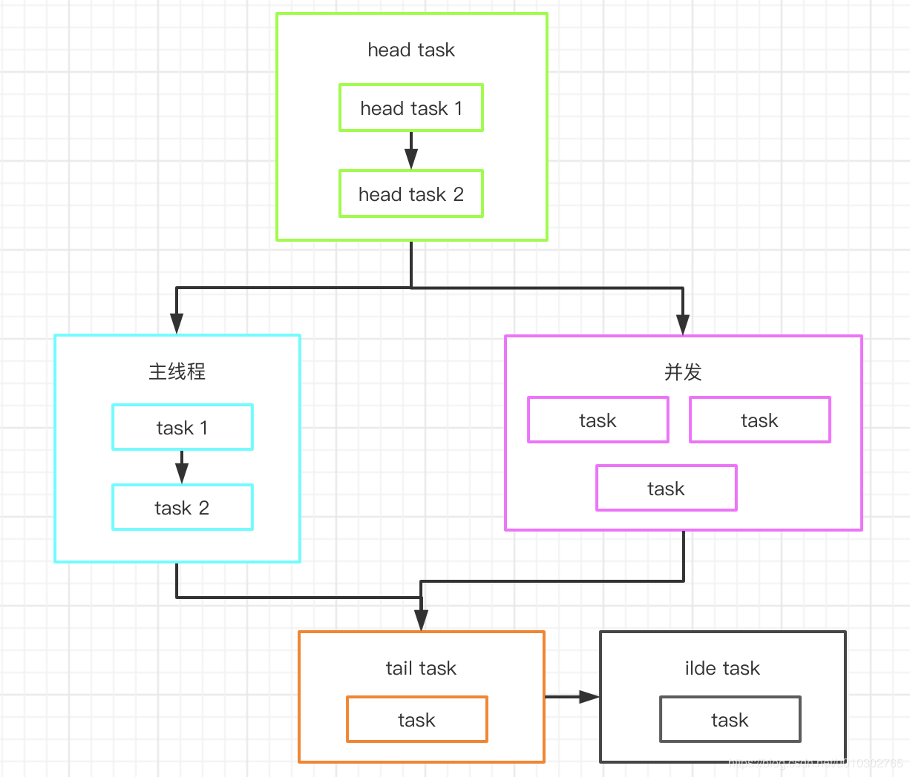

# 4.更优雅的延迟方案
## 1.前言
通过前几章的学习，大家已经掌握了在APP启动时，如何对一些第三方初始化的内容 使用启动器进行异步、同步及 
使用有向无环图的拓扑排序处理继承关系等处理。这一章我们继续来探讨下在空闲期需要处理的Task。

还记得这张图吗？Application里面的各种第三方的初始化的分类。



我们通过第三章的学习  [一线大厂大型APP性能优化系列-自定义启动器（三）](https://juejin.im/post/5ebe51daf265da7b910ab9bc)  
已经处理前4个，今天我们学习最后一个ilde task（延迟加载，空闲期处理方案）。

## 2.聊一聊假的延迟方案
> （还是想吐槽，简历上都写着会APP的性能优化，一问，什么sendMessageDelayed，
> 什么IldeHandler的定义使用背的都很熟练，再一问项目中怎么用的，基本都哑火了，
> 就1个诚实的，直接回答，就那么用啊。。。emmmm。。。。所以不建议你们刷面经，至少高级岗位不建议，会露馅的）

在我们日常处理一些耗时任务的时候，有很多的方案，比如

#### 1.可以通过Handler().sendMessageDelayed() 达到延迟加载。
原理：将消息加入队列中，然后MessageQueue会根据延时的时间进行队列的排序，
时间最短的在前，如果没有要执行的，就进行阻塞，阻塞的时间为最先要执行的任务的等待时间，
如果不再添加新任务，则等时间到了会自动执行，如果添加了新任务，则重新排序，然后唤醒当前线程，
将排序后，最先要执行的等待时间进行阻塞或者直接执行。

缺点：但是项目中是不建议这样用的，因为会强占CPU，性能会进行耗损，
比如一个页面的一些第三方服务进行初始化操作，虽然说是可以延迟一段时间再去初始化，
但是如果该页面一直在执行，比如有个定时器或者轮询请求接口等，那么到了时间，
依然是要强占CPU来执行我们的第三方服务的初始化操作。所以不能直接这么用

> 不知道会不会有杠精，“我们平时也是这么用的呀，也没问题呀”。但是你要记住，我聊的是大型项目，
> 比如中石油终端，一个APP中，不光要作为主设备接收其他设备传递的数据，保持的长链接，还通过自定义的一些协议，
> 比如FTFS协议，与硬件进行连接，如加油机，前庭控制器，液位仪等，你直接来个延迟初始化，一开始没什么，等延迟时间到了，
> 如果人员也在操作，油机也在实时上报数据，直接卡死你。

#### 2.IldeHandler
这个的确能解决我们之前尴尬的问题，它的主张是在CPU空闲时再进行操作，不抢占CPU

> 同学们，面经是不是就只写到这呀，那你们考虑过，如果请求过多尼，如果并发尼？
> 如果空闲执行中执行的任务还必须有先后执行的顺序尼。
> 比如A页面，B页面都把自己耗时的方法加入到了空闲执行队列里面，但是要想执行B页面耗时方法，必须得先执行页面A中的方法，你该怎么做？

## 3.聊一聊IdleHandler的优化及封装
不知道task是啥的，就去看第三章内容。

```Plain Text
/**
 * @author: lybj
 * @date: 2020/5/26
 * @Description: 空闲队列
 */
public class IldeTaskDispatcher {

    private Queue<Task> mIldeQueue = new LinkedList<>();

    private MessageQueue.IdleHandler messageQueue = new MessageQueue.IdleHandler(){

        @Override
        public boolean queueIdle() {

            if(mIldeQueue.size() > 0){

                // 如果CPU空闲了，
                Task IldeTask = mIldeQueue.poll();
                new DispatchRunnable(IldeTask).run();
            }
            // 如果返回false，则移除该 IldeHandler
            return !mIldeQueue.isEmpty();
        }
    };

    public IldeTaskDispatcher addTask(Task task){

        mIldeQueue.add(task);
        return this;
    }

    /**
     * 执行空闲方法，因为用了DispatchRunnable，所以会优先处理需要依赖的task，再处理本次需要处理的task，顺序执行
     * */
    public void start(){
        Looper.myQueue().addIdleHandler(idleHandler);
    }
}
复制代码

```
调用的话也很简单

```Plain Text
  new IldeTaskDispatcher()
                .addTask(new InitBaiduMapTask())
                .addTask(new InitBuglyTask())
                .start();
复制代码

```
## 4.其他代码
不明白的，去看上一章的讲解，这章本来就是在上一章内容上增加的拓展

DispatchRunnable

```Plain Text
public class DispatchRunnable implements Runnable {
    private Task mTask;
    private TaskDispatcher mTaskDispatcher;

    public DispatchRunnable(Task task) {
        this.mTask = task;
    }
    public DispatchRunnable(Task task,TaskDispatcher dispatcher) {
        this.mTask = task;
        this.mTaskDispatcher = dispatcher;
    }

    @Override
    public void run() {

        Process.setThreadPriority(mTask.priority());

        long startTime = System.currentTimeMillis();

        mTask.setWaiting(true);
        mTask.waitToSatisfy();

        long waitTime = System.currentTimeMillis() - startTime;
        startTime = System.currentTimeMillis();

        // 执行Task
        mTask.setRunning(true);
        mTask.run();

        // 执行Task的尾部任务
        Runnable tailRunnable = mTask.getTailRunnable();
        if (tailRunnable != null) {
            tailRunnable.run();
        }

        if (!mTask.needCall() || !mTask.runOnMainThread()) {
            printTaskLog(startTime, waitTime);

            TaskStat.markTaskDone();
            mTask.setFinished(true);
            if(mTaskDispatcher != null){
                mTaskDispatcher.satisfyChildren(mTask);

                // --> 8
                mTaskDispatcher.markTaskDone(mTask);
            }
        }
        TraceCompat.endSection();
    }
}
复制代码

```
task

```Plain Text
public abstract class Task implements ITask {

    private volatile boolean mIsWaiting; // 是否正在等待
    private volatile boolean mIsRunning; // 是否正在执行
    private volatile boolean mIsFinished; // Task是否执行完成
    private volatile boolean mIsSend; // Task是否已经被分发

    // 当前Task依赖的Task数量（需要等待被依赖的Task执行完毕才能执行自己），默认没有依赖
    private CountDownLatch mDepends = new CountDownLatch(dependsOn() == null ? 0 : dependsOn().size());

    /**
     * 依赖的Task执行完一个
     */
    public void satisfy() {
        mDepends.countDown();
    }

     /**
     * 当前Task等待，让依赖的Task先执行
     */
    public void waitToSatisfy() {
        try {
            mDepends.await();
        } catch (InterruptedException e) {
            e.printStackTrace();
        }
    }

    /**
     * 异步线程执行的Task是否需要在被调用await的时候等待，默认不需要
     *
     * @return
     */
    @Override
    public boolean needWait() {
        return false;
    }

    /**
     * 当前Task依赖的Task集合（需要等待被依赖的Task执行完毕才能执行自己），默认没有依赖
     *
     * @return
     */
    @Override
    public List<Class<? extends Task>> dependsOn() {
        return null;
    }
}
复制代码

```
自定义的task

```Plain Text
public class InitJPushTask extends Task {

    @Override
    public boolean needWait() {
        return true;
    }

    @Override
    public List<Class<? extends Task>> dependsOn() {

        // 先执行GetDeviceIdTask，再执行自己
        List<Class<? extends Task>> tasks = new ArrayList<>();
        tasks.add(GetDeviceIdTask.class);
        return tasks;
    }

    @Override
    public void run() {
        // 模拟InitJPush初始化
        try {
            Thread.sleep(1500);
        } catch (InterruptedException ex) {
            ex.printStackTrace();
        }
    }
}
复制代码

```
## 5.End
已经写了4篇了，感谢大家一直以来的支持，还差2篇，优化启动这个章节就算完事了，接下来就是一些瘦身，容灾，卡顿，网络等优化方面的内容了。
距离全部结束还差15篇文章。我会继续更新完毕的。

另外需要重点说明的是，这个系列的内容，不光是为了教学，均是可以在大型项目中直接使用的，
稳定性已经验证过了，不用担心出现问题，另外大家真的是一直在学吗？
特意没上传代码，竟然没有一个向我要的，只能说大家还是很厉害的。

Android的形势越来越严峻了，大家为了提升自己均开始了多面的发展，比如kotlin，比如flutter的学习，
但是作者其实并不太看好它们，因为总感觉只有一些小型的项目或者是练习项目，更或者是外包项目，才会考虑它们，
作者做java大概有7年了，各种底层源码，代码设计，大型的项目经验均具备，也分析了很多很多开源框架的设计方案，
但是对于Java，我还是不能说自己就懂了。

在日常开发中，一些模块的开发，也是先画各种草图，设计图，生怕哪里现在写死了，以后拓展会出问题，
再会动手去写，比如说flutter，在使用的时候真的具备解决所有问题的能力吗？
真的具备哪怕是迭代了几十个版本的项目也能依然维护？具体的源码是否已经研究过？是否可用满足日常所需？
总不能都写了1年了，突然一个需求，告诉产品做不了，不然要重构吧！

所以对于一个架构岗的程序员来说，学习kotlin也好，flutter也好，应该是了解其语法，功能的设计，
更好的用到自己的项目中来，学习要深入，而不仅仅是懂语法。

程序员真正要学会的是一些语言的设计思想，而并不是语言的本身，任何语言，设计的初衷永远都是共同的，
语言总有更替，而我们要学其设计的核心及技巧，这些东西，任何语言都通用，永远要有一个信念  “任语言千千万，我永远是最强”

