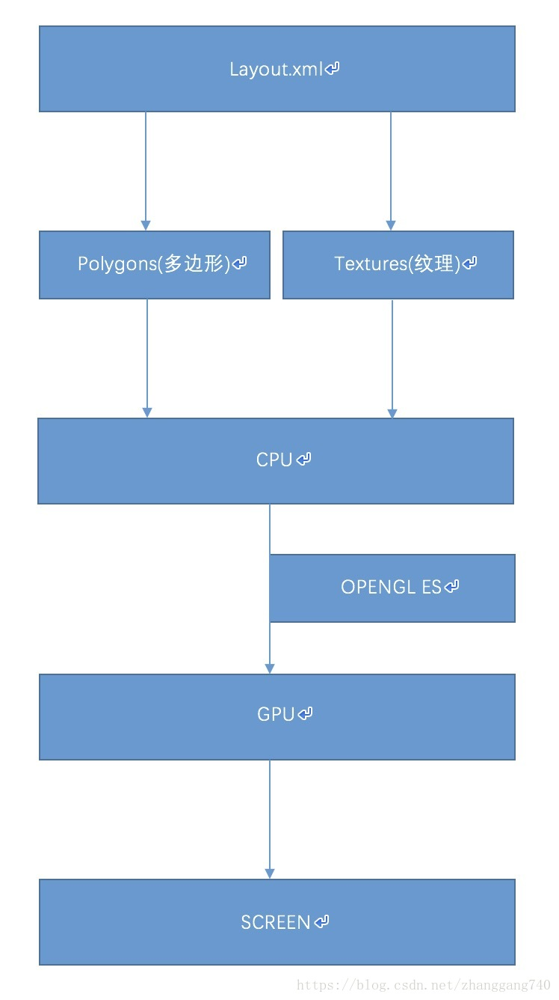

# 启动速度与执行效率优化1
# 一、冷启动和热启动解析
## 1.1 启动方式
通常来说，在安卓中应用的启动方式分为两种：冷启动和热启动。

> 1、冷启动：当启动应用时。后台没有该应用的进程，这时系统会又一次创建一个新的进程分配给该应用，这个启动方式就是冷启动。

> 2、热启动：当启动应用时，后台已有该应用的进程（例：按back键、home键，应用尽管会退出，
> 可是该应用的进程是依旧会保留在后台，可进入任务列表查看）。
> 所以在已有进程的情况下。这样的启动会从已有的进程中来启动应用。这个方式叫热启动。

## 1.2 特点
1、冷启动：冷启动由于系统会又一次创建一个新的进程分配给它。所以会先创建和初始化Application类，
再创建和初始化MainActivity类（包含一系列的測量、布局、绘制），最后显示在界面上。

2、热启动：热启动由于会从已有的进程中来启动，所以热启动就不会走Application这步了，
而是直接走MainActivity（包含一系列的測量、布局、绘制）。
所以热启动的过程仅仅须要创建和初始化一个MainActivity即可了。
而不必创建和初始化Application，由于一个应用从新进程的创建到进程的销毁。Application仅仅会初始化一次。

上面说的启动是点击app的启动图标来启动的。而第二种方式是进入近期使用的列表界面来启动应用，这样的不应该叫启动，应该叫恢复。

## 1.3 应用启动的流程
在安卓系统上，应用在没有进程的情况下，应用的启动都是这样一个流程：当点击app的启动图标时。
安卓系统会从Zygote进程中fork创建出一个新的进程分配给该应用。
之后会依次创建和初始化Application类、创建MainActivity类、
载入主题样式Theme中的windowBackground等属性设置给MainActivity以及配置Activity层级上的一些属性、
再inflate布局、当onCreate/onStart/onResume方法都走完了后最后才进行contentView的measure/layout/draw显示在界面上，
所以直到这里，应用的第一次启动才算完毕，这时候我们看到的界面也就是所说的第一帧。

所以，总结一下，应用的启动流程例如以下：

> Application的构造器方法——>attachBaseContext()——>onCreate()——>
> Activity的构造方法——>onCreate()——>配置主题中背景等属性——>onStart()——>onResume()——>測量布局绘制显示在界面上。

## 1.4 測量应用启动的时间
在上面这个启动流程中，不论什么一个地方有耗时操作都会拖慢我们应用的启动速度，而应用启动时间是用毫秒度量的。
对于毫秒级别的快慢度量我们还是须要去精确的測量到究竟应用启动花了多少时间。而依据这个时间来做衡量。

## 1.5 什么才是应用的启动时间
从点击应用的启动图标開始创建出一个新的进程直到我们看到了界面的第一帧，这段时间就是应用的启动时间。

我们要測量的也就是这段时间。測量这段时间能够通过adb shell命令的方式进行測量，这样的方法測量的最为精确。命令为：

```Plain Text
adb shell am start -W [packageName]/[packageName.MainActivity]
```
运行成功后将返回三个測量到的时间：  1、ThisTime:一般和TotalTime时间一样。
除非在应用启动时开了一个透明的Activity预先处理一些事再显示出主Activity，这样将比TotalTime小。  
2、TotalTime:应用的启动时间。包含创建进程+Application初始化+Activity初始化到界面显示。

3、WaitTime:一般比TotalTime大点，包含系统影响的耗时。

以下是測量一个应用冷启动和热启动的时间：  冷启动：


热启动：


能够看到在进程已经存在的情况下。仅仅须要又一次初始化MainActivity。这样的启动比較快。只是大多数情况下应用的启动都是冷启动。由于用户都会在任务列表中手动关闭遗留的应用进程。

## 1.6 降低应用启动时的耗时
针对冷启动时候的一些耗时，如上測得这个应用算是中型的app，在冷启动的时候耗时已经快700ms了，假设项目再大点在Application中配置了很多其它的初始化操作，这样将可能达到1s，这样每次启动都明显感觉延迟。所以在进行应用初始化的时候採取以下策略：  1、在Application的构造器方法、attachBaseContext()、onCreate()方法中不要进行耗时操作的初始化，一些数据预取放在异步线程中，能够採取Callable实现。  2、对于sp的初始化，由于sp的特性在初始化时候会对数据所有读出来存在内存中，所以这个初始化放在主线程中不合适，反而会延迟应用的启动速度，对于这个还是须要放在异步线程中处理。

3、对于MainActivity，由于在获取到第一帧前。须要对contentView进行測量布局绘制操作，尽量降低布局的层次。考虑StubView的延迟载入策略。当然在onCreate、onStart、onResume方法中避免做耗时操作。

遵循上面三种策略可明显提高app启动速度。

## 1.7 优化应用启动时的体验
对于应用的启动时间，仅仅能是尽量的避免一些耗时的、非必要的操作在主线程中，这样相对能够缩减一部分启动的耗时，另外一方面在等待第一帧显示的时间里，能够增加一些配置以增加体验，比方增加Activity的background，这个背景会在显示第一帧前提前显示在界面上。

1、先为主界面单独写一个主题style，设置一张待显示的图片，这里我设置了一个颜色，然后在manifest中设置给MainActivity：

```Plain Text
<style name="AppTheme.Launcher">
    <item name="android:windowBackground">@drawable/bule</item>
</style>
//...
        <activity
            android:name=".MainActivity"
            android:label="@string/app_name"
            android:theme="@style/AppTheme.Launcher">
            <intent-filter>
                <action android:name="android.intent.action.MAIN" />
                <category android:name="android.intent.category.LAUNCHER" />
            </intent-filter>
        </activity>


```
2、然后在MainActivity中载入布局前把AppTheme又一次设置给MainActivity：

```Plain Text
@Override
    protected void onCreate(Bundle savedInstanceState) {

        setTheme(R.style.AppTheme);
        super.onCreate(savedInstanceState);
        setContentView(R.layout.activity_main);
}        


```
这样在启动时会先显示background，然后待界面绘制完毕再显示主界面


# 二、APP启动黑白屏解决办法
## 2.1解决方法1
把启动白屏的背景换成一张图片

```Plain Text
<item name="android:windowBackground">@color/background_material_light</item>

```
换成

```Plain Text
<item name="android:windowBackground">@drawable/xx.png</item>

```
这种是伪优化，并没有解决加载速度。

## 2.2 解决方法2
把启动白屏背景变透明

```Plain Text
<item name="android:windowIsTranslucent">true</item>

```
style下面加上一句，意思是把启动背景变透明，这种

这两种方法最好新建一个样式，只在引导页中引用，如果在application节点中引用，会导致所有的页面启动都会有这种效果。

## 2.3 举例
```Plain Text
<style name="AppTheme.Launcher">

<item name="android:windowBackground">@drawable/xx</item>

</style>

<Activity Theme="AppTheme.Launcher"">...</Activity>

```
如何在引导页启动后恢复样式呢？  在引导页的onCreate(...)

```Plain Text
{
      setTheme(R.style.AppTheme);
      super.onCreate(...);
}

```
# 三、APP 卡顿问题分析及解决方案
用户对卡顿的感知,主要来源于界面的刷新.而界面的性能主要是依赖于设备的UI渲染性能.  
如果我们的UI设计过于复杂,或是实现不够友好，计算绘制算法不够优化,设备又不给力,界面就会像卡住了一样,给用户卡顿的感觉.

如果你的应用界面出现卡顿不流畅的情况，不用怀疑，这很大原因是你没有在16ms完成你的工作。
没错，16ms要完成你的工作，再慢点，用户就会感觉到卡顿，也许就会在屏幕对面开始吐槽你的APP，
然后狠心把你辛辛苦苦开发出来的APP给卸载掉，打住，跑偏了！

## 3.1、16ms原则
Android 在不同的版本都会优化“UI的流畅性”问题，但是直到在android 4.1版本中做了有效的优化，这就是Project Butter。  
Project Butter 加入了三个核心元素:  VSYNC、Triple Buffer 和 Choreographer。其中，VSYNC 是理解Project Buffer的核心。
(这部分知识点在，android显示机制中，详细说明了)

VSYNC：产生一个中断信号  
Triple Buffer：当双 Buffer 不够使用时，该系统可分配第三块 Buffer  
Choreographer：这个用来接受一个 VSYNC 信号来统一协调UI更新

接下来我们就逐个去解析这3个核心元素：  在了解VSYNC之前，
我们首先来了解一下我们在 xml 写的一个布局是如何加载到Acitivty/Fragment中并最终 display 呢？
我相信这个过程大部分程序猿也并不是很关心,因为 Android 底层都为为我们搞定这一部分的处理。
但是如果要了解16ms原则，我们简单了解下这个过程是非常有必要的。先看我简单画的一个图：  



从上面的图可以看出，CPU 会先把 Layout 中的 UI 组件计算成 polygons（多边形）和 textures（纹理），
然后经过 OpenGL ES 处理（这个处理过程非常复杂，感兴趣的童鞋可以继续耕耘）。
OpenGL ES处理完后再交给 GPU 进行栅格化渲染，渲染后 GPU 再将数据传送给屏幕，由屏幕进行绘制显示。

Activity 的界面之所以可以被绘制到屏幕上其中有一个很重要的过程就是 栅格化（Resterization），
栅格化简单来说就是将向量图转化为机器可以识别的位图的一个过程。
其中很复杂也比较很耗时，GPU 就是用来加快栅格化的速度。了解了这个过程后，我们在来理解 VSYNC

#### 3.1.1 关于VSYNC
VSYNC 这个概念出来很久了，Vertical Synchronization，就是所谓的“垂直同步”。
在 Android 中也沿用了这个概念，我们也可以把它理解为“帧同步”。
这个用来干嘛的呢，就是为了保证 CPU、GPU 生成帧的速度和 Display 刷新的速度保持一致。

Android 系统每 16ms（更准确的是大概16.6ms）  就会发出一次 VSYNC信号触发 UI 渲染更新。
大约屏幕一秒刷新60次，也就是说要求 CPU 和 GPU 每秒要有处理 60 帧的能力，一帧花费的时间在 16ms 内。

这个方案的原理主要是通过 Choreographer 类设置它的 FrameCallback 函数，
当每一帧被渲染时会触发回调 FrameCallback，  FrameCallback 回调 void doFrame  (long frameTimeNanos)  函数。
一次界面渲染会回调 doFrame 方法，如果两次 doFrame 之间的间隔大于 16.6ms 说明发生了卡顿。

如果你平时注意卡顿的日志信息，那么下面这个段log就不会陌生了

```Plain Text
if (skippedFrames >= SKIPPED_FRAME_WARNING_LIMIT) {
     Log.i(TAG, "Skipped " + skippedFrames + " frames!  "
                           + "The application may be doing too much work on its main thread.");

SKIPPED_FRAME_WARNING_LIMIT 的默认值是 30，也就说当我们的程序卡顿大于 30 时会打印这条 log 信息

```
那么在 Android系统中，是如何利用 VSYNC 工作的呢？

一句话总结：在 VSYNC 开始发出信号时，CPU和GPU已经就开始准备下一帧的数据了，赶在下个 VSYNC 信号到来时，
GPU 渲染完成，及时传送数据给屏幕，Display 绘制显示完成。不出什么意外的话，每一帧都会这么井然有序进行着，
在这种理想状态下，用户就会体验到如丝般顺滑的感觉了。当然你也不会看到这篇博客了，囧！

上面总结的一句话，如果用更专业的术语来说就是一个名词，双缓冲机制

#### 3.1.2 双缓冲机制
双缓冲技术一直贯穿整个 Android 系统。因为实际上帧的数据就是保存在两个 Buffer 缓冲区中，A 缓冲用来显示当前帧，
那么 B 缓冲就用来缓存下一帧的数据，同理，B显示时，A就用来缓冲！这样就可以做到一边显示一边处理下一帧的数据。

这样看起来貌似没什么问题，一切都是我们的掌控中。
但是，由于某些原因，比如我们应用代码上逻辑处理过于负责或者过于复杂的布局，过度绘制(Overdraw)，
UI线程的复杂运算，频繁的GC等，导致下一帧绘制的时间超过了16ms，那么问题就来了，这时候用户就不爽了，
因为用户很明显感知到了卡顿的出现，也就是所谓的丢帧情况。如下图所示：  


ok，下面我们来认真分析一下为什么会出现丢帧的情况：

1、当 Display 显示第 0 帧数据时，此时 CPU 和 GPU 已经开始渲染第 1 帧画面，并将数据缓存在缓冲 B 中。
但是由于某些原因，就好像上面说的，导致系统处理该帧数据耗时过长或者未能及时处理该帧数据。

2、当 VSYNC 信号来时，Display 向 B 缓冲要数据，这时候 B 就蓝瘦香菇了，因为缓冲 B 的数据还没准备好，
B缓冲区这时候是被锁定的，Display 表示你没准备好，我咋办呢，无奈，只能继续显示之前缓冲 A 的那一帧，
此时缓冲 A 的数据也不能被清空和交换数据。这种情况就是所谓的“丢帧”，也被称作“废帧”；
当第 1 帧数据（即缓冲 B 数据）准备完成后，它并不会马上被显示，而是要等待下一个 VSYNC，Display 刷新后，
这时用户才看到画面的更新。

3、当某一处丢帧后，大概率会影响后面的绘制也出现丢帧，最走给用户感觉就是卡顿了。最严重的直接造成ANR。

## 3.2、Triple Buffer
既然丢帧的情况不可避免，Android 团队从未放弃对这块的优化处理，于是便出现了Triple Buffer（三缓冲机制）

在三倍缓冲机制中，系统这个时候会创建一个缓冲 C，用来缓冲下一帧的数据。
也就是说在显示完缓冲B中那一帧后，下一帧就是显示缓冲 C 中的了。
这样虽然还是不能避免会出现卡顿的情况，但是 Android 系统还是尽力去弥补这种缺陷，最终尽可能给用平滑的动效体验。

## 3.3、卡顿处理
下面我们就以下几种情况导致卡顿问题进行分析处理。

#### 3.3.1 过于复杂的布局
界面性能取决于 UI 渲染性能.  我们可以理解为 UI 渲染的整个过程是由 CPU 和 GPU 两个部分协同完成的。

其中,  CPU 负责UI布局元素的 Measure,  Layout,  Draw 等相关运算执行.  GPU 负责栅格化(rasterization),  将UI元素绘制到屏幕上。

如果我们的 UI 布局层次太深,  或是自定义控件的 onDraw 中有复杂运算,  CPU 的相关运算就可能大于16ms,  导致卡顿。

**解决方案：**  我们需要借助 Hierarchy Viewer 这个工具来帮我们分析布局了.  
Hierarchy Viewer 不仅可以以图形化树状结构的形式展示出UI层级,  还对每个节点给出了三个小圆点,  
以指示该元素 Measure,  Layout,  Draw 的耗时及性能。

#### 3.3.2 过度绘制( Overdraw )
Overdraw:  用来描述一个像素在屏幕上多少次被重绘在一帧上.

通俗的说:  理想情况下,  每屏每帧上,  每个像素点应该只被绘制一次,  如果有多次绘制,  就是 Overdraw,  过度绘制了。  
常见的就是:绘制了多重背景或者绘制了不可见的UI元素.

**解决方案：**  Android系统提供了可视化的方案来让我们很方便的查看overdraw的现象:  
在”系统设置”–>”开发者选项”–>”调试GPU过度绘制”中开启调试:  此时界面可能会有五种颜色标识:

overdraw indicator

原色:  没有overdraw  蓝色:  1次overdraw  绿色:  2次overdraw  粉色:  3次overdraw  红色:  4次及4次以上的overdraw  一般来说,  蓝色是可接受的,  是性能优的.

#### 3.3.3 UI 线程的复杂运算
UI线程的复杂运算会造成UI无响应,  当然更多的是造成UI响应停滞,  卡顿。产生ANR已经是卡顿的极致了。

**解决方案：**  关于运算阻塞导致的卡顿的分析,  可以使用 Traceview 这个工具。

#### 3.3.4 频繁的 GC
上面说的都是处理上的CPU,  GPU 相关的.  实际上内存原因也可能会造成应用不流畅,  卡顿的。

为什么说频繁的 GC 会导致卡顿呢?  简而言之,  就是执行 GC 操作的时候，任何线程的任何操作都会需要暂停，
等待 GC 操作完成之后，其他操作才能够继续运行,  故而如果程序频繁 GC,  自然会导致界面卡顿。

**导致频繁GC有两个原因:**

内存抖动(Memory Churn),  即大量的对象被创建又在短时间内马上被释放。  
瞬间产生大量的对象会严重占用 Young Generation 的内存区域,  当达到阀值,  剩余空间不够的时候, 
也会触发 GC。即使每次分配的对象需要占用很少的内存，但是他们叠加在一起会增加 Heap 的压力,从而触发更多的 GC。 

解决方案：  一般来说瞬间大量产生对象一般是因为我们在代码的循环中 new 对象,  或是在 onDraw 中创建对象等。  
还是是尽量不要在循环中大量的使用局部变量。所以说这些地方是我们尤其需要注意的。


