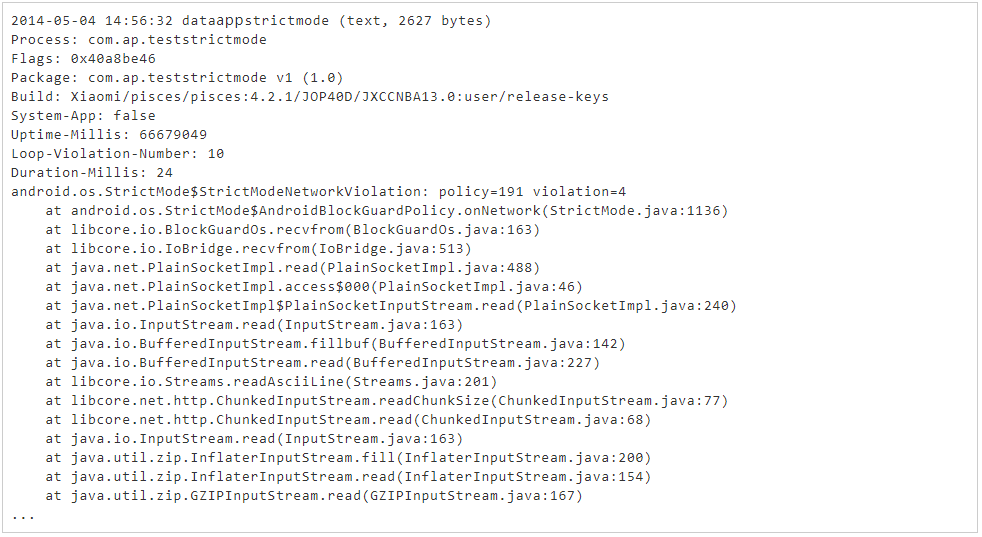
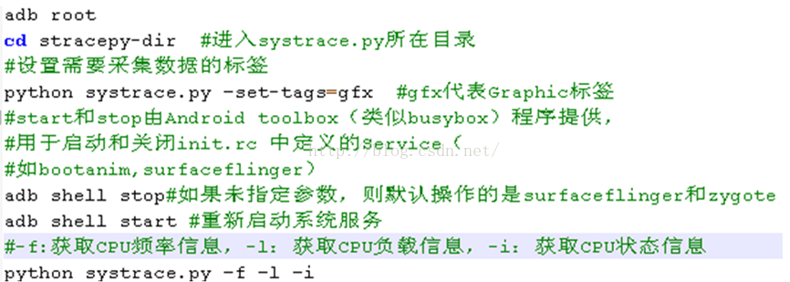
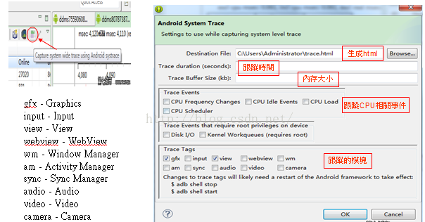
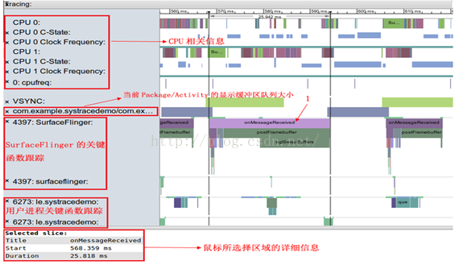
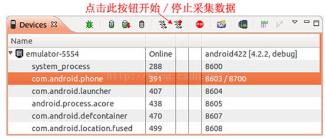

这篇文章有个概念即可，工作中涉及做优化，可以参考，当个工具辅助。

# 启动速度与执行效率优化2
# 一 StrictMode 详解
## 1.1 如何启用 StrictMode
我们通常在 Activity 或者自定义的Application类中启动 StrictMode，代码如下：

```Plain Text
 public void onCreate() {     
if (DEVELOPER_MODE) {         
StrictMode.setThreadPolicy(new StrictMode.ThreadPolicy.Builder()                 
.detectDiskReads()                 
.detectDiskWrites()                 
.detectNetwork()   // or .detectAll() for all detectable problems                 
.penaltyLog()                 
.build());         
StrictMode.setVmPolicy(new StrictMode.VmPolicy.Builder()                 
.detectLeakedSqlLiteObjects()                 
.detectLeakedClosableObjects()                 
.penaltyLog()                 
.penaltyDeath()                 
.build());     
}     
super.onCreate(); 
}

```
注意：我们只需要在app的开发版本下使用 StrictMode，线上版本避免使用 StrictMode，
随意需要通过 诸如 DEVELOPER_MODE 这样的配置变量来进行控制。

下面我们举几个例子来说明 StrictMode 是如何发挥作用的。  **代码1：**

```Plain Text
public class ActivitySimple extends Activity {     
@Override    
protected void onCreate(Bundle savedInstanceState) {        
super.onCreate(savedInstanceState);        
setContentView(R.layout.activity_main);         
StrictMode.setThreadPolicy(new ThreadPolicy.Builder()                
.detectAll()                
.penaltyDialog() //弹出违规提示对话框                
.penaltyLog() //在Logcat 中打印违规异常信息                
.build());                
this.testNetwork();    
}         
private void testNetwork() {        
try {            
URL url = new URL("http://www.baidu.com");            
HttpURLConnection conn = (HttpURLConnection) url.openConnection();            
conn.connect();            
BufferedReader reader = new BufferedReader(new InputStreamReader(                    conn.getInputStream()));            
String lines = null;            
StringBuffer sb = new StringBuffer();            
while ((lines = reader.readLine()) != null) {                
sb.append(lines);            
}        
} catch (Exception e) {            
e.printStackTrace();        
}    
}
}

```
在这里例子中，我们在主线程（UI线程）中执行了网络请求，ThreadPolicy 策略中的  `detectAll()`方法 
包含而来对这类违规操作的检查，同时我们通过`penaltyDialog()`  和  `penaltyLog()`  两个方法将违规信息提示给开发者。 
在运行这段代码是，我们会看到下图中的对话框提示：  在LogCat 中我们会看到这样的日志信息：  


## 1.2 StrictMode 详解
StrictMode 通过策略方式来让你自定义需要检查哪方面的问题。  主要有两中策略，一个时线程方策略（[ThreadPolicy](http://developer.android.com/reference/android/os/StrictMode.ThreadPolicy.html)），
一个是VM方面的策略（[VmPolicy](http://developer.android.com/reference/android/os/StrictMode.VmPolicy.html)）。

* ThreadPolicy 主要用于发现在UI线程中是否有读写磁盘的操作，是否有网络操作，以及检查UI线程中调用的自定义代码是否执行得比较慢。
* VmPolicy，主要用于发现内存问题，比如 Activity内存泄露， SQL 对象内存泄露， 资源未释放，能够限定某个类的最大对象数。

## 1.3 ThreadPolicy 详解
[StrictMode.ThreadPolicy.Builder](http://developer.android.com/reference/android/os/StrictMode.ThreadPolicy.Builder.html)  主要方法如下：

* detectNetwork() 用于检查UI线程中是否有网络请求操作，上面的代码的就是网络请求违规的问题。
* detectDiskReads() 和 detectDiskReads() 是磁盘读写检查，触发时会打印出如下日志（以 detectDiskReads() 为例）：


* detectCustomSlowCalls() 主要用于帮助开发者发现UI线程调用的那些方法执行得比较慢，
* 要和  `StrictMode.noteSlowCall`  配合使用，`StrictMode.noteSlowCall`  
* 只有通过  `StrictMode.noteSlowCall`用来标记“可能会”执行比较慢的方法，只有标记过的方法才能被检测到，
* 日志中会记录方法的执行时间（比如 \~duration=2019 ms）。看下面的例子：   代码2：

```Plain Text
 public class ActivityTestDetectCustomSlowCalls extends Activity {

 private  TextView  textView  =  null;

 private  static  boolean  isStrictMode  =  false;

@Override  protected  void  onCreate(Bundle  savedInstanceState)  {  
super.onCreate(savedInstanceState);setContentView(R.layout.activitymain);  
this.textView  =  (TextView)  findViewById(R.id.textview);
this.textView.setText("In ActivityTestDetectCustomSlowCalls");  
    if(!  isStrictMode){
        StrictMode.setThreadPolicy(new  ThreadPolicy.Builder().detectCustomSlowCalls().penaltyLog().build());
        isStrictMode  =  true;  
    }  
    this.slowCall1();  
    this.slowCall2();  
}

 /*  * 没有标记的方法  */  private  void  slowCall_1(){  //用来标记潜在执行比较慢的方法  SystemClock.sleep(1000  2);  }

 /  * 标记过的方法  /  private  void  slowCall_2(){  
 //用来标记潜在执行比较慢的方法  StrictMode.noteSlowCall("slowCall 2");  
 SystemClock.sleep(1000  2);  }  }

```
在logcat 中我们只能看到和方法  `slowCall_2()`（因为通过`StrictMode.noteSlowCall()`标记过）相关的日志：


当然你也可以在其他线程中使用 detectCustomSlowCalls()，但是没有什么实际意义，也看不到方法执行时间，比如：

```Plain Text
public class ActivityTestDetectCustomSlowCalls extends Activity {        
private TextView textView = null;        
@Override    
protected void onCreate(Bundle savedInstanceState) {        
super.onCreate(savedInstanceState);        
setContentView(R.layout.activity_main);         
this.textView = (TextView) findViewById(R.id.text_view);                
this.textView.setText("In ActivityTestDetectCustomSlowCalls");                
new Thread(){            
public void run() {                
StrictMode.setThreadPolicy(new ThreadPolicy.Builder()                    
.detectCustomSlowCalls()                    
.penaltyLog()                    
.build());                                
this.slowCallInCustomThread();            
};                        
private void slowCallInCustomThread(){                
//用来标记潜在执行比较慢的方法                
StrictMode.noteSlowCall("slowCallInCustomThread");                
SystemClock.sleep(1000 * 2);            
}                    
}.start();;    
}
}

```
日志输出如下：


* penaltyDeath()，当触发违规条件时，直接Crash掉当前应用程序。
* penaltyDeathOnNetwork()，当触发网络违规时，Crash掉当前应用程序。
* penaltyDialog()，触发违规时，显示对违规信息对话框。
* penaltyFlashScreen()，会造成屏幕闪烁，不过一般的设备可能没有这个功能。
* penaltyDropBox()，将违规信息记录到 dropbox 系统日志目录中（/data/system/dropbox），你可以通过如下命令进行插件：


会得到如下的信息：



* permitCustomSlowCalls()、permitDiskReads ()、permitDiskWrites()、permitNetwork：
* 如果你想关闭某一项检测，可以使用对应的permit*方法。

##1.4 VMPolicy 详解

* detectActivityLeaks() 用户检查 Activity 的内存泄露情况，比如下面的代码：

```Plain Text
public class ActivityTestActivityLeaks extends Activity {        
private static boolean isStrictMode = false;        
@Override    
protected void onCreate(Bundle savedInstanceState) {        
super.onCreate(savedInstanceState);        
setContentView(R.layout.activity_main);         
if(! isStrictMode){                        
StrictMode.setVmPolicy(new VmPolicy.Builder()            
.detectActivityLeaks()            
.penaltyLog()            
.build());            
isStrictMode = true;        
}                
new Thread() {              
@Override              
public void run() {                
while (true) {                                      
SystemClock.sleep(1000);                
}              
}        
}.start();    
}
}

```
我们反复旋转屏幕就会输出如下信息（重点在 instances=4;  limit=1 这一行）：


这时因为，我们在Activity中创建了一个Thread匿名内部类，而匿名内部类隐式持有外部类的引用。
而每次旋转屏幕是，Android会新创建一个Activity，而原来的Activity实例又被我们启动的匿名内部类线程持有，
所以不会释放，从日志上看，当先系统中该Activty有4个实例，而限制是只能创建1各实例。我们不断翻转屏幕，instances 的个数还会持续增加。

* detectLeakedClosableObjects() 和 detectLeakedSqlLiteObjects()，资源没有正确关闭时回触发，比如下面的代码：

```Plain Text
 public class MainActivityTestDetectLeakedClosableObjects extends Activity {        
private static boolean isStrictMode = false;        
@Override    
protected void onCreate(Bundle savedInstanceState) {        
super.onCreate(savedInstanceState);        
setContentView(R.layout.activity_main);                 
if(! isStrictMode){            
StrictMode.setVmPolicy(new VmPolicy.Builder()            
.detectLeakedClosableObjects()            
.penaltyLog()            
.build());            
isStrictMode = true;        
}                
File newxmlfile = new File(Environment.getExternalStorageDirectory(), "aaa.txt");        
try {            
newxmlfile.createNewFile();            
FileWriter fw = new FileWriter(newxmlfile);            
fw.write("aaaaaaaaaaa");            
//fw.close(); 我们在这里故意没有关闭 fw        
} catch (IOException e) {            
e.printStackTrace();        
}     
}
}

```
会产生如下异常信息：  


  detectLeakedSqlLiteObjects()  和 detectLeakedClosableObjects()的用法类似，
  只不过是用来检查 SQLiteCursor 或者 其他 SQLite 对象是否被正确关闭。

* detectLeakedRegistrationObjects() 用来检查 BroadcastReceiver 或者 ServiceConnection 注册类对象是否被正确释放，看下面的代码

```Plain Text
public class ActivityTestLeakedRegistrationObjects extends Activity {    
private TextView textView = null;    
private static boolean isStrictMode = false;    
private MyReceiver receiver = null;        
@Override    
protected void onCreate(Bundle savedInstanceState) {        
super.onCreate(savedInstanceState);        
setContentView(R.layout.activity_main);         
this.textView = (TextView) findViewById(R.id.text_view);                
this.textView.setText("In ActivityTestLeakedRegistrationObjects");                 
if(! isStrictMode){            
StrictMode.setVmPolicy(new VmPolicy.Builder()            
.detectLeakedRegistrationObjects()            
.penaltyLog()            
.build());           
 isStrictMode = true;        
}                
this.receiver = new MyReceiver();          
IntentFilter filter = new IntentFilter();          
filter.addAction("android.intent.action.MY_BROADCAST");         
registerReceiver(this.receiver, filter);     
}        
@Override    
protected void onDestroy() {        
super.onDestroy();    
}
}

```
输入信息如下：  


  正确做法应该是在 onDestroy()  方法中将 receiver 释放掉：

```Plain Text
 @Override    
protected void onDestroy() {        
unregisterReceiver(this.receiver);        
super.onDestroy();    
}

```
* setClassInstanceLimit()，设置某个类的同时处于内存中的实例上限，可以协助检查内存泄露。比如下面的代码：

```Plain Text
public class ActivityTestObjectLimit extends Activity {    
private static class MyClass{}        
private static boolean isStrictMode = false;        
private static List<MyClass> classList = new ArrayList<ActivityTestObjectLimit.MyClass>();        
@Override    protected void onCreate(Bundle savedInstanceState) {        super.onCreate(savedInstanceState);        
setContentView(R.layout.activity_main);         
if(! isStrictMode){            
StrictMode.setVmPolicy(new VmPolicy.Builder()            
.setClassInstanceLimit(MyClass.class, 2)            
.penaltyLog()            
.build());            
isStrictMode = true;        
}                
classList.add(new MyClass());        
classList.add(new MyClass());        
classList.add(new MyClass());        
classList.add(new MyClass());        
classList.add(new MyClass());        
classList.add(new MyClass());        
classList.add(new MyClass());        
classList.add(new MyClass());    
}
}

```
日志信息如下：  


注意：上面的异常一般都在GC之后抛出，如果测试的时候没有现象，可以多翻转几次屏幕，或者通过DDMS工具手动触发一下。

# 二、Systrace和TraceView
## 2.1.Systrace的介绍
Systrace是Android4.1中新增的性能数据采样和分析工具。
它可帮助开发者收集Android关键子系统（如Surfaceflinger、WindowManagerService等Framework部分关键模块、服务）
的运行信息，从而帮助开发者更直观的分析系统瓶颈，改进性能。    
Systrace的功能包括跟踪系统的I/O操作、内核工作队列、CPU负载以及Android各个子系统的运行状况等。
在Android平台中，它主要由3部分组成：    

1.内核部分：Systrace利用了Linux Kernel中的ftrace功能。所以，
如果要使用Systrace的话，必须开启kernel中和ftrace相关的模块。

2.数据采集部分：Android定义了一个Trace类。应用程序可利用该类把统计信息输出给ftrace。
同时，Android还有一个atrace程序，它可以从ftrace中读取统计信息然后交给数据分析工具来处理。

3.数据分析工具：Android提供一个systrace.py（python脚本文件，位于Android SDK目录/tools/systrace中，
其内部将调用atrace程序）用来配置数据采集的方式（如采集数据的标签、输出文件名等）
和收集 ftrace统计数据并生成一个结果网页文件供用户查看。

从本质上说，Systrace是对Linux Kernel中ftrace的封装。应用进程需要利用Android提供的Trace类来使用Systrace。    

# 2.2.Systrace跟蹤代碼
(1).应用层代码添加systrace跟踪方式:        Trace.beginSection(“TEST”);Trace.endSection();  
(2).framework的java层代码添加systrace跟踪方式:Trace.traceBegin(Trace.TRACE_TAG_VIEW,  “performTraversals”);   
Trace.traceEnd(Trace.TRACE_TAG_VIEW);      也可以使用：      ATRACE_BEGIN(“TEST”);      ATRACE_END();  
(3).framework的native代码添加systrace跟踪方式:      ATRACE_INIT();      ATRACE_CALL();    

## 2.3.Systrace的运行方式
sdk包下手動运行：  
$>  cd android-sdk/tools/systrace  
$>  python systrace.py  --set-tags gfx,view,wm  
$>  adb shell stop  
$>  adb shell start  
$>  python systrace.py  --disk  --time=10  -o mynewtrace.html  



  用ADT工具在Eclipse里运行：  點擊下圖紅圈的啟動按鈕，就會彈出右邊的Android System Trace設置面板。  



## 2.4.Systrace數據分析
當Systrace运行之後，將記錄系統預定的跟蹤數據，生成一個html文件，如图：  



## 2.5.Systrace使用示例
Android流畅程度性能分析：   
(1).將幾台鏈接Eclipse之後，按照上頁所述，打開Android System Trace設置面板。   
(2).如果要測試介面流暢度，我们一般只关注图形性能。因此必須选择Graphics和View（
还有其他很多选项，如果是在做音频处理或者视频播放的分析测试话，可以选择其他选项）。    
(3).确认运行之后，滚滑要测试的介面，记录跟蹤時間，之后我们會得到一个html页面。   
(4).打开html页面后，页面中显示了系统运行情况的概述圖；欲查看具體數據可以通过WASD快捷鍵来完成，W/S 放大/缩小 A/D 左移/右移。  
(5).在页面中有一个surfaceFlinger模塊，  此模塊是负责绘制Android应用程序UI的服务，此區域如果出现空档，
一种情況是没有操作或者滑动到头，没东西需要绘制，这种属于正常；另一种情況就是有问题存在，有其他操作引起时间过长。  
(6).在分析局域，放大后就能看到具体的函數執行情况，点击后能看到每个部分所使用的时间。
比如deliverInputEvent是系统提供的触摸事件；performTraversals是开始布局并且绘画显示画面的过程；
draw是绘画的过程；对于一个 listview，如果deliverInputEvent过长，很有可能是在adapter中的getView方法中处理时间过长导致。
所以通过Systrace的数据，可以大体上的发现是否存在性能问题。但如果要知道具体情况，就需要用到另外一个工具。      

## 2.6.TraceView的介绍
通过Systrace分析数据，可以大体上发现是否存在性能问题。但如果要知道具体情况，
就需要用到另外一个工具  TraceView是android的一个可视化的调试工具。
借助它，你可以具体了解你的代码在运行时的性能表现。它能帮你更好了解到代码运行过程的效率，进而改善代码，提高你应用的体验。  
同時TraceView是Android平台特有的数据采集和分析工具，它主要用于分析Android中应用程序的hotspot。
让我们了解我们要跟踪的程序的性能，并且能具体到method .
Traceview的作用：   
(1).  查看跟踪代码的执行时间，分析哪些是耗时操作。   
(2).  可以用于跟踪方法的调用，尤其是Android Framework层的方法调用关系。   
(3).  可以方便的查看线程的执行情况，某个方法执行时间、调用次数、在总体中的占比等，从而定位性能点。    

## 2.7.TraceView的運行方式
手動運行：   
在开始调试的地方，如Activity的onCreate函数，  添加Debug.startMethodTracing("tracefilename");   
结束调试的地方，如Activity的onStop函数，  添加Debug.stopMethodTracing();   
之后运行你的app一段时间并退出，会在sd卡根目录生成tracefilename.trace这个log文件，记录这段时间内的运行信息。   
将日志文件pull到PC端，cmd到android sdk tools文件夹内(或绑定sdk tools目录到系统path内)，
运行traceview tracefilename.trace即可打开TraceView分析界面。 
使用DDMS:    打开devices窗口，选择某个进程，点击右上角的start method profilingddms trace，运行app一段时间后，
再点击已变成stop method profiling的该按钮。eclipse会自动弹出debug的标签（可通过菜单File->save as保存数据）。界面如下：  



  注：这种方式不需要修改代码，所以对于没有源码的程序同样可以进行排查。同时可以方便的进行全局性能排查。    

## 2.8.TraceView的數據分析
Timeline Panel(时间线面板)  ：  


  Timeline Panel又可细分为左右两个Pane： 
  (1).左边Pane显示的是测试数据中所采集的线程信息。如圖，本次测试数据采集了main线程，
  两个Binder线程和其它系统辅助线程（例如GC线程等）的信息。 
  (2).右边Pane所示为时间线，时间线上是每个线程测试时间段内所涉及的函数调用信息。这些信息包括函数名、函数执行时间等。
  如圖，main线程对应行的的内容非常丰富，而其他线程在这段时间内干得工作则要少得多。  
  (3).开发者可以在时间线Pane中移动时间线纵轴。纵轴上边将显示当前时间点中某线程正在执行的函数信息。  Profile Panel(分析面板)：  


  分析面板主要展示了某个线程（先在Timeline Panel中选择线程）中各个函数调用的情况，包括CPU使用时间、调用次数等信息。
  而这些信息正是查找hotspot的关键依据。点击某个方法可以查看在对应线程上的执行时间区域，并会显示其父方法及子方法。      
  Profile Panel各列信息作用说明 如下：  


## 2.9.TraceView使用示例
通常，查找hotspot包括两种类型的函数：    第一类是调用次数不多，但每次调用却需要花费很长时间的函数。

方法：在Profile Panel中，选择按Cpu Time/Call进行降序排序（从上之下排列，每项的耗费时间由高到低），
如上圖所示。展開函數，我們发现getStringsToShow在 Incl Cpu Time  %一列中占据了63.3%，
它是onCreate子函数耗费时间最长的，而且Calls+Recur Calls/Total列显示其调用次数为1，即它仅仅被调用一次了。
这个函数是应用程序实现的，所以极有可能是一个潜在的Hotspot。  
通常，查找hotspot包括两种类型的函数：    第二类是那些自身占用时间不长，但调用却非常频繁的函数。

方法：点击Call/Recur Calls/Total列头，使之按降序排列。关注点放在那些调用频繁并且占用资源较多的函数。
如上 圖所示。红框处有两个重载的MyMD5.getHashString函数调用，它们各运行了368次，
而且占用的CPU时间百分比达到了31.8%和53.2%。很显然，这2处调用就是hotspot，有优化的余地 。

## 2.10.结论 
如今Android系统日趋稳定，存储容量也越来越大，对源码质量的要求也不断降低。
但是很多开发工程师在开发的过程中不注重代码质量，不考虑系统性能和用户体验，因此开发出的产品往往性能低下，用户体验机差。 
为了很好的验证产品的性能，目前有很多工具可以用来分析测试Android的性能，
比如：dumpsys、Systrace、TraceView、Update Threads（更新线程）、Update Heap（更新堆）、
Allocation Tracker（分配跟踪器）等工具，这裡我们仅仅介绍了其中两个。