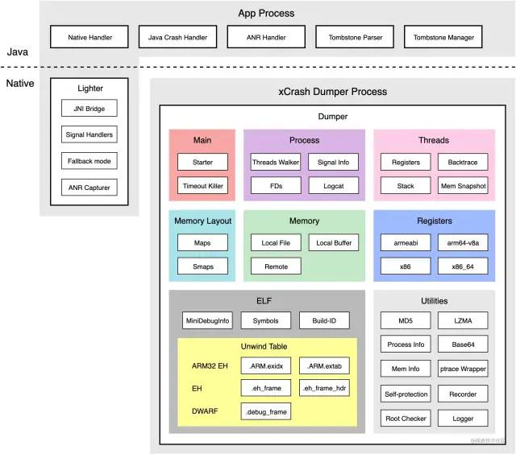

# xcrash

##### java crash
Java层的崩溃可以直接交给JVM的崩溃捕获机制去处理

UncaughtExceptionHandler

##### Native crash
Native崩溃处理步骤总结：

* 注册信号处理函数（signal handler）。
* 崩溃发生时创建子进程收集信息（避免在崩溃进程调用函数的系统限制）。
* suspend崩溃进程中所有的线程，暂停logcat输出，收集logcat。
* 收集backtrace等信息。
* 收集内存数据。
* 完成后恢复线程。