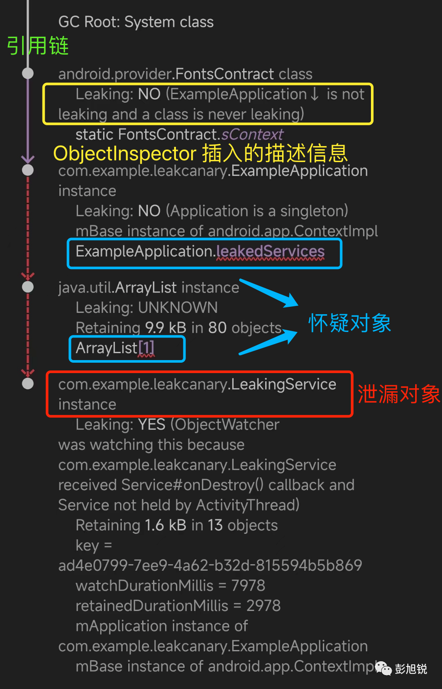

# Leakcanary学习
原文：[https://mp.weixin.qq.com/s/puC-kZGD9tAzXt-pNRGKSA](https://mp.weixin.qq.com/s/puC-kZGD9tAzXt-pNRGKSA)

##### 为什么要使用 LeakCanary?
LeakCanary 的特点或优势在于提前预判出 Android 应用中最常见且影响较大的内存泄漏场景，并对此做针对性的监测手段。
这使得 LeakCanary 相比于其他排查内存泄漏的方案（如分析 OOM 异常时的堆栈日志、MAT 分析工具）更加高效。

##### LeakCanary 怎么实现内存泄漏监控？
LeakCanary 通过以下 2 点实现内存泄漏监控：

* 1、在 Android Framework 中注册无用对象监听：通过全局监听器或者 Hook 的方式，
在 Android Framework 上监听 Activity 和 Service 等对象进入无用状态的时机（例如在 Activity#onDestroy() 后，产生一个无用 Activity 对象）;
* 2、利用引用对象可感知对象垃圾回收的机制判定内存泄漏：为无用对象包装弱引用，并在一段时间后（默认为五秒）
观察弱引用是否如期进入关联的引用队列，是则说明未发生泄漏，否则说明发生泄漏（无用对象被强引用持有，导致无法回收，即泄漏）。

##### LeakCanary 如何判定对象泄漏？
这里使用到了ReferenceQueue配合弱引用的机制，ReferenceQueue是专门用来存放引用的, 
当软引用,弱引用,虚引用对应的那个对象被回收后的同时,该引用会自动加入到你所定义的ReferenceQueue中.

* 第 1 步：为被监控对象 `watchedObject` 创建一个 `KeyedWeakReference` 弱引用，并存储到 <UUID, KeyedWeakReference> 的映射表中；
* 第 2 步：postDelay 五秒后检查引用对象是否出现在引用队列中，出现在队列则说明被监控对象未发生泄漏。
随后，移除映射表中未泄露的记录，更新泄漏的引用对象的 `retainedUptimeMillis` 字段以标记为泄漏；
* 第 3 步：通过回调 `onObjectRetained` 告知 LeakCanary 内部发生新的内存泄漏。

##### LeakCanary 发现泄漏对象后就会触发分析吗？
ObjectWatcher 判定被监控对象发生泄漏后，会通过接口方法 `OnObjectRetainedListener#onObjectRetained()` 
回调到 LeakCanary 内部的管理器 InternalLeakCanary 处理（在前文 AppWatcher 初始化中提到过）。
LeakCanary 不会每次发现内存泄漏对象都进行分析工作，而会进行两个拦截：

* **拦截 1：泄漏对象计数未达到阈值，或者进入后台时间未达到阈值；**
* **拦截 2：计算距离上一次 HeapDump 未超过 60s。**

##### LeakCanary 如何分析堆快照？
堆快照文件就是hprof文件。

Shark 是为 **LeakCanary 2 提供支持的堆分析器**，它是 Kotlin 独立堆分析库，可在低内存占用情况下高速运行

