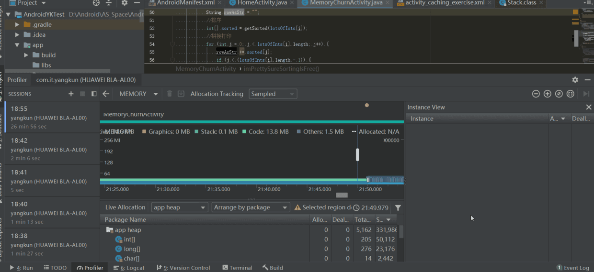

# 内存抖动
短时间内大量的对象被创建，导致可用内存不足，从而引起频繁gc回收对象，这种已用内存忽高忽低的现象就叫内存抖动。

实际开发中如果在 LogCat 中发现有这些 Log 说明也发生了 内存抖动(Log 中出现 concurrent copying GC freed....)


**那么我们找出代码中具体那一块出现问题了勒，请看下面一段录屏**

```Plain Text

mButton.setOnClickListener(new View.OnClickListener() {
            @Override
            public void onClick(View v) {
                imPrettySureSortingIsFree();
            }
        });

/**
     *排序后打印二维数组，一行行打印
     */
    public void imPrettySureSortingIsFree() {
        int dimension = 300;
        int[][] lotsOfInts = new int[dimension][dimension];
        Random randomGenerator = new Random();
        for (int i = 0; i < lotsOfInts.length; i++) {
            for (int j = 0; j < lotsOfInts[i].length; j++) {
                lotsOfInts[i][j] = randomGenerator.nextInt();
            }
        }

        for (int i = 0; i < lotsOfInts.length; i++) {
            String rowAsStr = "";
            //排序
            int[] sorted = getSorted(lotsOfInts[i]);
            //拼接打印
            for (int j = 0; j < lotsOfInts[i].length; j++) {
                rowAsStr += sorted[j];
                if (j < (lotsOfInts[i].length - 1)) {
                    rowAsStr += ", ";
                }
            }
            Log.i("ricky", "Row " + i + ": " + rowAsStr);
        }
    }


```


最后我们之后是 onClick 中的 imPrettySureSortingIsFree() 函数里面的 rowAsStr += sorted\[j\]; 字符串拼接造成的 内存抖动 ，、
因为每次拼 接一个 String 都会申请一块新的堆内存，那么怎么解决这个频繁开辟内存的问题了。
其实在 Java 中有 2 个更好的 API 对 String 的操作很友好，相信应该有人猜到了吧。
没错就是将 此处的 String 换成 StringBuffer 或者 StringBuilder，就能很完美的解决字符串拼接造成的内存抖动问题。

**修改后**

```Plain Text
        /**
         *打印二维数组，一行行打印
         */
        public void imPrettySureSortingIsFree() {
            int dimension = 300;
            int[][] lotsOfInts = new int[dimension][dimension];
            Random randomGenerator = new Random();
            for(int i = 0; i < lotsOfInts.length; i++) {
                for (int j = 0; j < lotsOfInts[i].length; j++) {
                    lotsOfInts[i][j] = randomGenerator.nextInt();
                }
            }

            // 使用StringBuilder完成输出，我们只需要创建一个字符串即可，                不需要浪费过多的内存
            StringBuilder sb = new StringBuilder();
            String rowAsStr = "";
            for(int i = 0; i < lotsOfInts.length; i++) {
                // 清除上一行
                sb.delete(0, rowAsStr.length());
                //排序
                int[] sorted = getSorted(lotsOfInts[i]);
                //拼接打印
                for (int j = 0; j < lotsOfInts[i].length; j++) {
                    sb.append(sorted[j]);
                    if(j < (lotsOfInts[i].length - 1)){
                        sb.append(", ");
                    }
                }
                rowAsStr = sb.toString();
                Log.i("jason", "Row " + i + ": " + rowAsStr);
            }
        }

```
