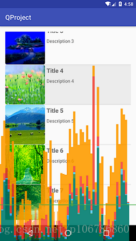
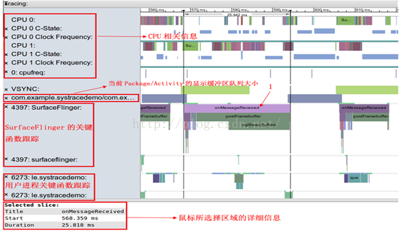

# 性能工具

在使用的工具Systrace，Layout Inspector，Android Profiler，App Inspection。

# Android Device Monitor
Android Device Monitor 已在Android Studio 3.1 中弃用，并已从 Android Studio 3.2 中移除。
您可以通过 Android Device Monitor 使用的功能已被新功能所取代。下表可帮助您确定应使用哪些功能代替这些已弃用和已移除的功能。

|Android Device Monitor 组件|应采用的功能|
| ----- | ----- |
|**Dalvik 调试监控服务器 (DDMS)**|此工具已弃用。请改为使用 Android Studio 3.0 及更高版本中的 **Android Profiler** 分析应用的 CPU、内存和网络使用情况。 如需执行其他调试任务（例如向连接的设备发送命令以设置端口转发、传输文件或截取屏幕截图），请使用 **Android 调试桥 (****adb****)**、**Android 模拟器**、**设备文件浏览器**或 **Debugger 窗口**。|
|**Traceview**|此工具已弃用。如需检查通过使用 `[Debug](https://developer.android.google.cn/reference/android/os/Debug?hl=zh-cn)` 类[检测您的应用](https://developer.android.google.cn/studio/profile/generate-trace-logs?hl=zh-cn)而捕获的 `.trace` 文件、记录新方法跟踪、导出 `.trace` 文件以及检查应用进程的实时 CPU 使用情况，请使用 Android Studio **CPU 性能剖析器**。|
|**Systrace**|如需检查原生系统进程并解决帧丢失导致的界面卡顿问题，请在命令行中使用 **systrace ** 或在 **CPU 性能剖析器**中使用经过简化的**系统跟踪**。**CPU 性能剖析器**提供了许多用于分析应用进程的功能。|
|**OpenGL ES 跟踪器**|使用 [Android GPU 检查器](https://developer.android.google.cn/agi?hl=zh-cn)。|
|**Hierarchy Viewer**|如需在运行时检查应用的视图层次结构，请使用**布局检查器**。**Layout Inspector** 如需分析应用布局的渲染速度，请使用 [Window.OnFrameMetricsAvailableListener](https://developer.android.google.cn/reference/android/view/Window.OnFrameMetricsAvailableListener?hl=zh-cn)，如[此博文](https://android-developers.googleblog.com/2017/08/understanding-performance-benefits-of.html)中所述。|
|**Pixel Perfect**|使用[布局检查器](https://developer.android.google.cn/studio/debug/layout-inspector?hl=zh-cn)。**Layout Inspector**|
|**网络流量工具**|如需查看应用通过网络传输数据的方式和时间，请使用**网络性能剖析器**。|

##### GPU Rendering Profile

对于每个可视化的应用程序，它显示了一个图表，横坐标是时间轴，纵坐标是每帧渲染毫秒时间：

1. 当你使用你的应用时，在你的屏幕上从左到右显示竖直条，绘制帧性能随时间的变化；

2. 每个直条代表一帧的渲染，条的长短代表它渲染消耗的时间

3. 这条绿线表示16毫秒每帧目标，任何时候一帧超过绿线，你的app将会丢掉一帧； 

##### Systrace
Systrace是Android4.1中新增的性能数据[采样](https://so.csdn.net/so/search?q=%E9%87%87%E6%A0%B7&spm=1001.2101.3001.7020)和分析工具。
它可帮助开发者收集Android关键子系统（如Surfaceflinger、WindowManagerService等Framework部分关键模块、服务）的运行信息，
从而帮助开发者更直观的分析系统瓶颈，改进性能。
Systrace的功能包括跟踪系统的I/O操作、内核工作[队列](https://so.csdn.net/so/search?q=%E9%98%9F%E5%88%97&spm=1001.2101.3001.7020)、
CPU负载以及Android各个子系统的运行状况等。

##### TraceView
通过Systrace分析数据，可以大体上发现是否存在性能问题。

但如果要知道具体情况，就需要用到另外一个工具TraceView是android的一个可视化的调试工具。

Traceview的作用：
(1). 查看跟踪代码的执行时间，分析哪些是耗时操作。

(2). 可以用于跟踪方法的调用，尤其是Android Framework层的方法调用关系。

(3). 可以方便的查看线程的执行情况，某个方法执行时间、调用次数、在总体中的占比等，从而定位性能点。

##### Hierarchy Viewer
Hierarchy Viewer 已被弃用。如果您使用的是 Android Studio 3.1 或更高版本，
则应在运行时改用布局检查器以检查应用的视图层次结构。如需分析应用布局的渲染速度，请使用Window.OnFrameMetricsAvailableListener