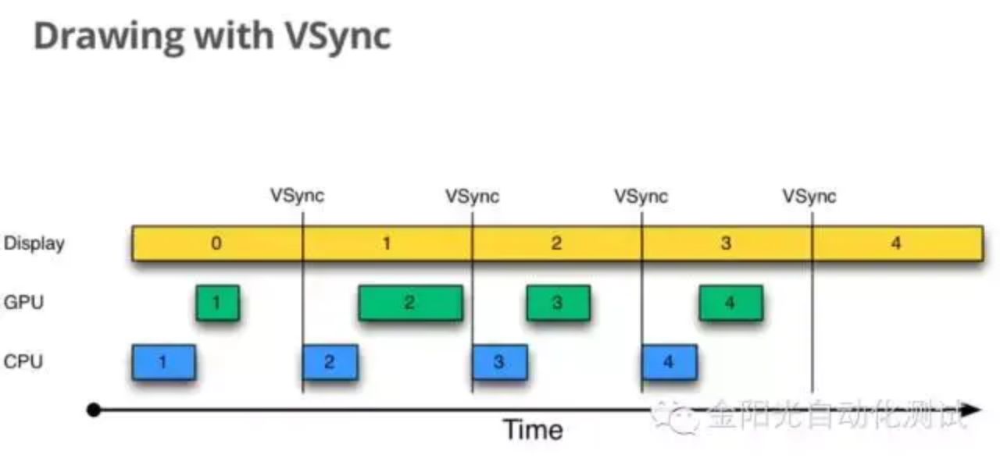

# 绘制优化
##### 绘制原理
View绘制流程分为三个步骤：measure、layout、draw ，主要运行在系统应用层。
真正将数据渲染到屏幕上是系统Native层的SurfaceFlinger服务。

绘制过程主要由CPU来进行measure、layout、Record、Execute的数据计算工作，GPU负责栅格化、渲染。
CPU和GPU是通过图形驱动层连接。图形驱动层维护一个队列，CPU将display list添加到该队列中，GPU从这个队列中取出数据进行绘制。

##### 帧率
在App层面，就是UI界面每秒可重绘的次数，它的上限是运行手机的屏幕刷新率，也就是屏幕每秒刷新的次数。

如图Android系统每隔16ms（1s/60fps计算结果）发出VSYNC信号，触发对UI进行渲染，如果每次渲染都成功，
这样就能够达到流畅的画面所需要的60fps，为了能够实现60fps，这意味着用户的大多数操作都必须在16ms内完成。

