# 布局检测1
* [布局层级优化]
* [过度渲染]

# 一、布局层级优化
程序的每个组件和 Layout 都需要经过初始化、计算、布局和绘制，如果布局嵌套层次过深，
就会导致加载操作更为耗时，更严重的话还可能导致内存溢出。本节我们学习使用两个工具来检查和优化 Layout。

### HierarchyViewer
Hierarchy Viewer 已被弃用。如果您使用的是 Android Studio 3.1 或更高版本，则应在运行时改用布局检查器以检查应用的视图层次结构。

### Lint
Android Lint是在 ADT 16 提供的新工具，它是一个代码扫描工具，
Lint已经替代了Layoutopt tool成为重要的提示工具，它具有更多更高级的功能 ，能够帮助我们识别代码结构存在的问题。Lint 包含的一些检测规则有：

* 缺少翻译（和未使用的翻译）
* 布局性能问题（所有以前实用 layoutopt 工具用来查找的问题，等等）
* 数组大小不一致
* 可访问性和国际化问题（硬编码字符串，缺少 contentDescription 等）
* 图标问题（例如缺少密度，重复的图标，错误的尺寸等）
* 可用性问题（如未在文本字段中指定输入类型）
* Manifest 错误

##### 从命令行运行 lint
如果你使用的是 Android Studio 或 Gradle，你可以在项目的根目录下输入以下某个命令，使用 Gradle 封装容器对项目调用 lint 任务：

在 Windows 上：

```Plain Text
 gradlew lint
```
在 Linux 或 Mac 上：

```Plain Text
 ./gradlew lint

```
lint 工具完成其检查后，会提供 XML 和 HTML 版 lint 报告的路径。然后，我们可以转到 HTML 报告并在浏览器中将其打开


# 二、过度渲染
## 一、androidUI过度渲染概述
**1、从android卡顿说起**

通常我们可以从各种渠道听到用户反馈app卡顿，究竟是什么用户觉得卡顿呢？因为大多数手机的屏幕刷新频率是60hz，
如果在1000/60=16.67ms内没有办法把这一帧的任务执行完毕，就会发生丢帧的现象。丢帧越多，用户感受到的卡顿情况就越严重。

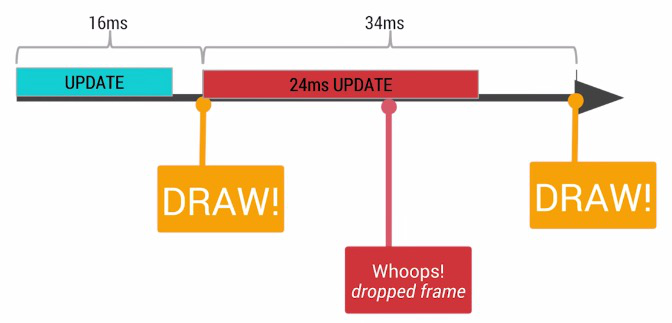

所以，可以看出更新每一帧耗时至关重要，说道每一帧图像的更新过程不得不提到[GPU](https://cloud.tencent.com/product/gpu?from=10680)和CPU。
CPU负责包括Measure，Layout，Record，Execute的计算操作，GPU负责Rasterization(栅格化)操作。
例如显示图片的时候，需要先经过CPU的计算加载到内存中，然后传递给GPU进行渲染。
一旦GPU或者CPU的工作超过了规定时间，就会出现app卡顿现象。比如：

（1）GPU耗时导致卡顿原因：通常与画面的渲染有关，比如界面存在严重的过度渲染，
渲染高清大图等，与UI View的渲染方法如draw()、onDraw()、dispatchDraw()等关联。

（2）CPU的耗时导致卡顿原因：主要是由于UI线程有耗时较久的操作，比如处理大图片、进行耗时的IPC通信等，
自然会拖长UI线程处理的时间。UI线程通常会运行以下方法： 渲染相关方法； UI布局相关方法：

onMeasure()，onLayout()；

Handler： handleMessage()；

post(Runnable)；

Activity相关方法， 如：

onCreate()，onResume()，onStar()，onStop()等。

**2、再谈过度渲染**

Overdraw(过度渲染)是指的手机屏幕上的一个像素点在一帧更新时间内被绘制了多次，我们就认为试过绘制了。
显然过渡绘制发生时，在UI层次中处于被遮挡的绘制是不可见的，也是对资源的浪费。
用一个简单的例子,好比我们刷墙，刷了一层又一层，最终能看到的墙还是最后一次刷上去的样子。

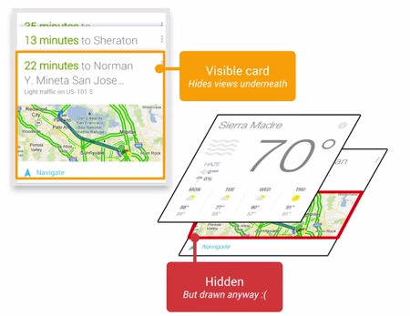

既然过度渲染问题严重，那么如何发现是否有过度渲染存在呢？
google在安卓4.4系统中开发了查看过度渲染计数的入口，在开发者选项中，打开GPU调试，选择过度渲染计数，
屏幕左下方可以看到当前窗口过度渲染计数。如手机管家7.0主页过度渲染计数。

具体的数值代表的意义为：

蓝色：1倍过度绘制，1.X；

绿色：2倍过度绘制，2.X；

淡红色：3倍过度绘制，3.X；

红色：4倍或以上过度绘制， 4.X。

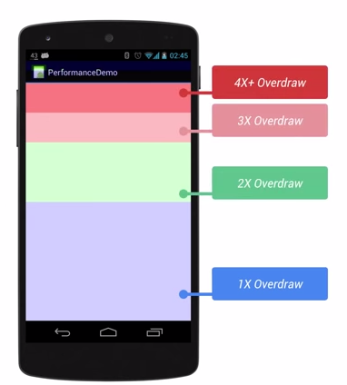

## 二、自动化测试方案
既然能够通过系统设置知道过度渲染次数，测试时候就读取该值，填写报告就完了啊，为何要自动化呢？
因为在对app进行系统的测试时，会发现页面非常多，如管家一二级页面就多大20多个，
且集成包，灰度包，正式包，回归包都要进行一次测试，所以进行自动化过度渲染计数读取是有必要的。

**1、获取页面过度渲染计数**

（1）HOOK系统方法，读取过度渲染计数。

通过查看安卓4.4的源码，可以知道在Framework/base/core/Java/android/view/

HardwareRender.java中有一个叫做GLRenderer的内部类，该类还有一个方法如下：

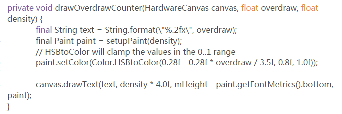

我们能够hook该方法，抓取入参overdraw并打印到日志，就是我们需要的过度渲染计数。

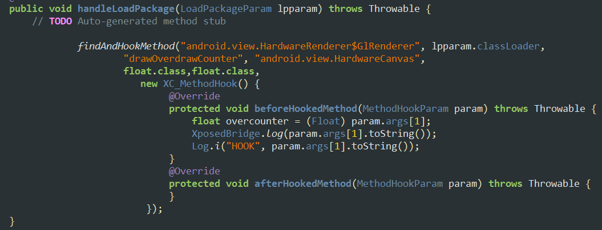

【难点】

1）如何hook内部类的方法：在外部类和内部类之间添加 \$符号定位内部类；

2）如何构造一个隐藏的参数类型，如上述HardWareCanvas：直接使用包名加类名定位该类型。

通过hook的方法输出的过度渲染计数来源于系统调用API，所以什么时候能拿到这个值不受人为控制，
使用者只能等待系统日志输出，这也是hook技术的通病，为此我们引入第二种方法。

（2）反射系统过度渲染计数的类，输出过度渲染计数。

系统在屏幕中绘制过度渲染计数时，是通过drawText绘制到屏幕上（上述（1）方法的源码截图看出），
所以找到调用绘制方法的类，就可以得到过度渲染计数，
同样在HardwareRenderer.java代码中debugOverdraw调用了绘制的方法，该方法也是过度渲染计数获取的方法。

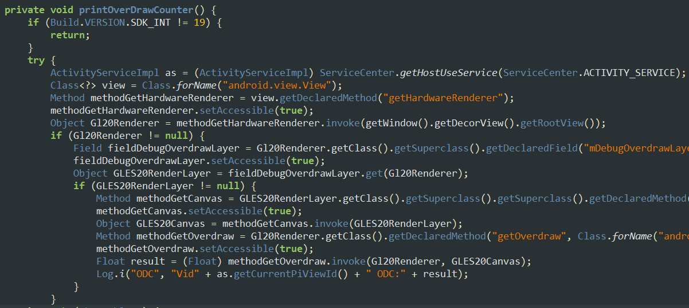

注：以上方法都是通过系统函数获取过度渲染计数，所以测试时，必须打开设置中的过度渲染计数。

2、实现自动化测试

（1）在什么时候读取页面overdrawcounter值？

页面从创建到销毁，什么时候页面才是最绘制最稳定的时候呢？
我们假设页面上有需要下载的资源，需要耗时才能获取的资源等，所以只有在页面消失前一刻，
我们才认为此时页面相对绘制最完整。所以跟进安卓生命周期，我们在onPause()时来读取过度渲染计数。

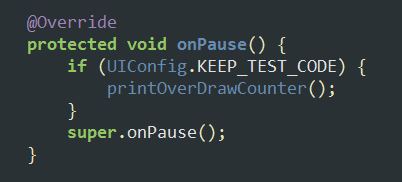

（2）如何实现自动化呢？

因为在调用onPause()时候会自动读取过度渲染值，所以我们要做的自动化仅仅是如何在被测页面之间切换，
搜集各个页面的过度渲染值，输出报告，所以流程可以归纳为：

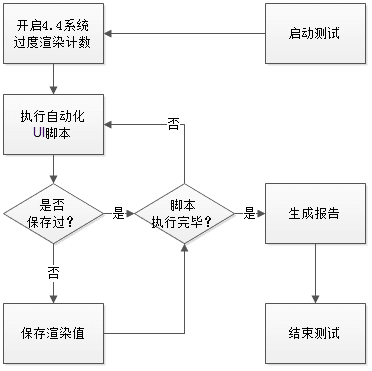

## 三、测试收益  
1、整个测试方案在手机管家7.0中运行起来，对集成包，灰度包，正式包的一二级页面进行了过度渲染测试，
优化后管家正式包一二级页面平均过度渲染计数为2.4X，小于管家标准3.0X。
(这个手机管家，现在找不到了)

报告样例为：

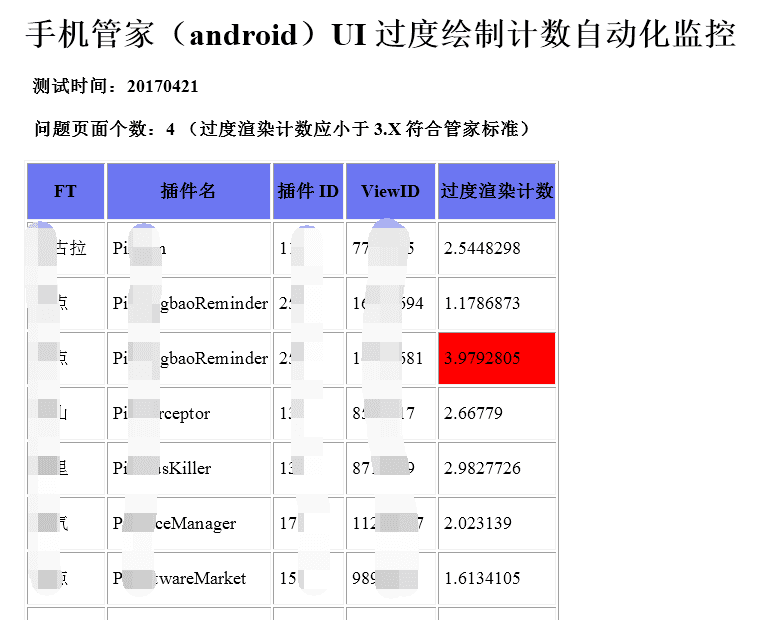

2、对手机管家22个基础页面监控，到正式版发布时全部页面过度渲染计数都小于3.0X。下图为管家部分页面优化前后对比。

管家主界面：

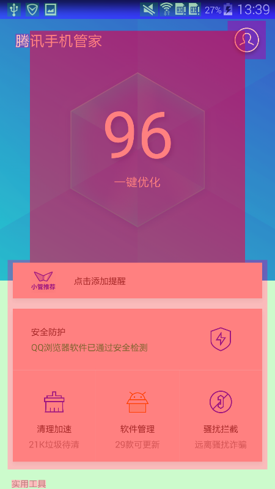


体检优化界面：

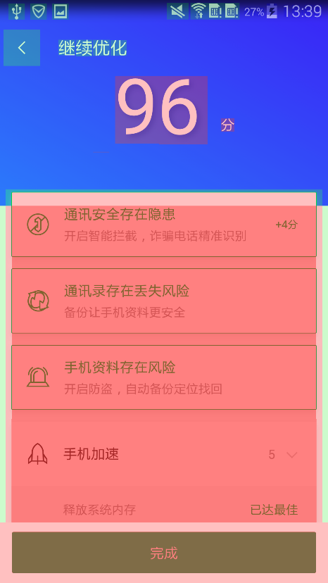

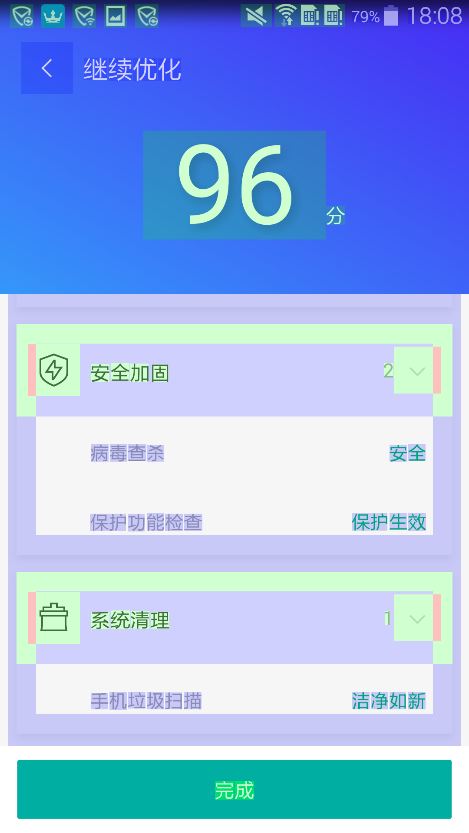

个人中心页面：

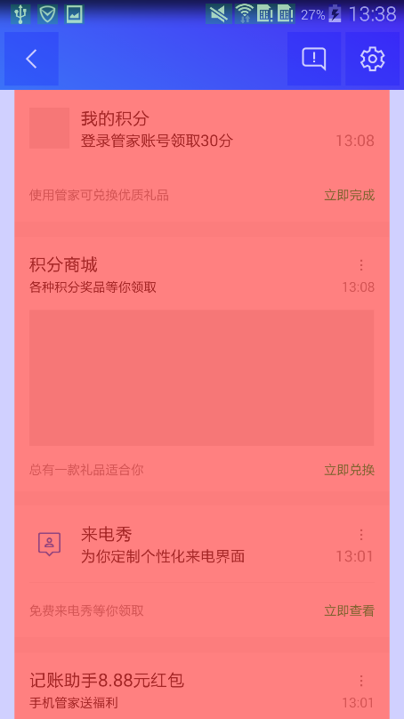


3、问题页面优化前后过度渲染计数对比


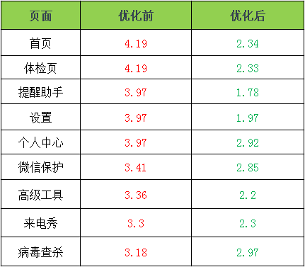

