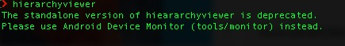
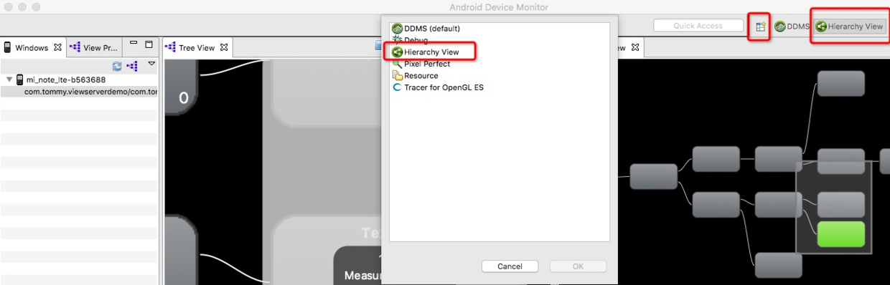
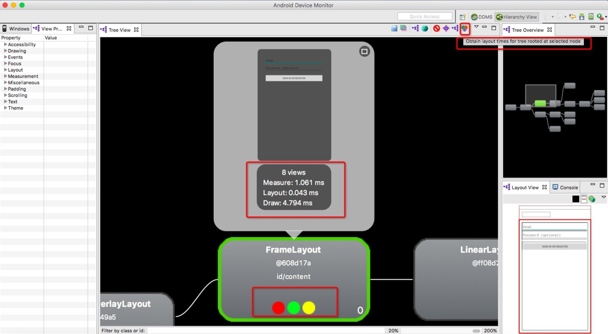
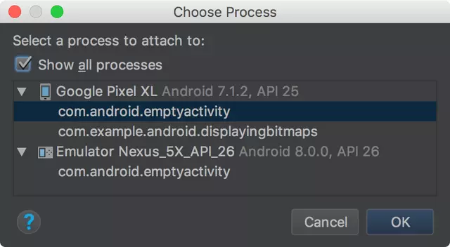
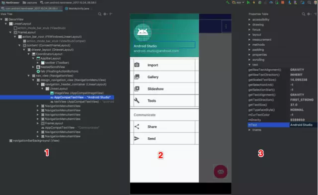

# 布局检测2
* [HierarchyViewer]
* [Layout Inspector]

# 一、Hierarchy Viewer使用详解
## 1.1. 功能
Hierarchy Viewer工具提供了一个可视化界面显示布局的层次结构，让我们可以进行调试，从而优化界面布局结构。

## 1.2. 启动工具
启动方式有两种，一种是通过终端命令，输入hierarchyviewer，进行启动，
第二种是通过打开Android Device Monitor，添加hierarchyviewer视图。
官网提示第一种方式已经过期，建议用第二种方式启动，不过并不影响使用，功能是一样的，
只不过是将hierarchyviewer整合到了Android Device Monitor里面了而已

#### 1.2.1第一种方式：


# ## 1.2.2 第二种方式： 



## 1.3. 设备连接
如果你是用的模拟器或者开发版手机的话则可以直接进行连接调试了，如果不是的话，官方提供了两种方式，进行连接真机调试：

#### 1.3.1 通过第三方库，安装和配置ViewServer,也是目前我在使用的方式，工具地址：[https://github.com/romainguy/ViewServer，配置步骤比较简单，主要分为如下三步：](https://github.com/romainguy/ViewServer%EF%BC%8C%E9%85%8D%E7%BD%AE%E6%AD%A5%E9%AA%A4%E6%AF%94%E8%BE%83%E7%AE%80%E5%8D%95%EF%BC%8C%E4%B8%BB%E8%A6%81%E5%88%86%E4%B8%BA%E5%A6%82%E4%B8%8B%E4%B8%89%E6%AD%A5%EF%BC%9A)
#### 1.3.1.1 添加依赖，外层build.gradle文件，添加工具远程仓库地址；内层build.gradle文件，添加依赖：
```Plain Text
allprojects {
    repositories {
        jcenter()
        maven { url "https://jitpack.io" }
    }
}

dependencies {
    ...................................
    compile 'com.github.romainguy:ViewServer:017c01cd512cac3ec054d9eee05fc48c5a9d2de'
}

```
####1.3.1.2 在manifest文件申请网络权限

```Plain Text
  <uses-permission android:name="android.permission.INTERNET"/>

```
#### 1.3.1.3 在应用中需要调试的Activity中添加如下代码，启动ViewServer, 这样就可以与hierarchy viewer通信了：
```Plain Text
public void onCreate(Bundle savedInstanceState) {
        super.onCreate(savedInstanceState);
        // Set content view, etc.
        ViewServer.get(this).addWindow(this);
    }

    public void onDestroy() {
        super.onDestroy();
        ViewServer.get(this).removeWindow(this);
    }

    public void onResume() {
        super.onResume();
        ViewServer.get(this).setFocusedWindow(this);
    }

```
#### 1.3. 2 第二种方式
通过设置环境变量，export ANDROID_HVPROTO=ddm，我用小米note, 5.0系统的手机，发现并无效果，
简书上有童鞋用Nexus的手机时可以正常使用呢的，目前暂未找到原因。

## 1.4. 分析页面布局性能
#### 1.4.1 选择一个节点，点击右上角的的按钮，就可以获取到布局绘制的时间，如图：


这里我们主要关注下面的三个圆圈，从左到右依次，代表View的Measure, Layout和Draw的性能，不同颜色代表不同的性能等级：

1） 绿: 表示该View的此项性能比该View Tree中超过50%的View都要快；例如,一个绿点的测量时间意味着这个视图的测量时间快于树中的视图对象的50%。

2）黄: 表示该View的此项性能比该View Tree中超过50%的View都要慢；例如,一个黄点布局意味着这种观点有较慢的布局时间超过50%的树视图对象。

3）红: 表示该View的此项性能是View Tree中最慢的；例如,一个红点的绘制时间意味着花费时间最多的这一观点在树上画所有的视图对象。

#### 1.4.2 测量结果分析
红色节点是代表应用性能慢的一个潜在问题，下面是几个例子，如何来分析和解释红点的出现原因？

1）如果在叶节点或者ViewGroup中，只有极少的子节点，这可能反映出一个问题，应用可能在设备上运行并不慢，
但是你需要指导为什么这个节点是红色的，可以借助Systrace或者Traceview工具，获取更多额外的信息；

2）如果一个视图组里面有许多的子节点，并且测量阶段呈现为红色，则需要观察下子节点的绘制情况；

3）如果视图层级结构中的根视图，Messure阶段为红色，Layout阶段为红色，Draw阶段为黄色，这个是比较常见的，因为这个节点是所有其它视图的父类；

4）如果视图结构中的一个叶子节点，有20个视图是红色的Draw阶段，这是有问题的，需要检查代码里面的onDraw方法，不应该在那里调用。

## 1.5. 布局常见问题与优化建议
1）没有用的父布局时指没有背景绘制或者没有大小限制的父布局，这样的布局不会对UI效果产生任何影响。我们可以把没有用的父布局，
通过标签合并来减少UI的层次；

2）使用线性布局LinearLayout排版导致UI层次变深，如果有这类问题，我们就使用相对布局RelativeLayout代替LinearLayout,减少UI的层次；

3）不常用的UI被设置成GONE,比如异常的错误页面，如果有这类问题，我们需要用标签，代替GONE提高UI性能。

# 二、Layout Inspector
## 2.1 打开布局检查器
   1. 在连接的设备或模拟器上[运行您的应用](https://developer.android.com/studio/run/)。

   2. 点击 **Tools > Android > Layout Inspector**。

   3. 在出现的 **Choose Process** 对话框中，选择您想要检查的应用进程，然后点击 **OK**。



> 注意：如果设备上的布局发生变化，布局检查器不会更新。 您必须再次点击 Tools > Android > Layout Inspector，
> 创建一个新的快照。每一个快照都将保存到 project-name/captures/ 内一个单独的 .li 文件中。

## 2.2 调试区域介绍
打开布局检查器后，界面如下：



* 1.**View Tree**：视图在布局中的层次结构。
* 2.**Screenshot**：带每个视图可视边界的设备屏幕截图。
* 3.**Properties Table**：选定视图的布局属性。

屏幕截图中也可以使用鼠标点击选中，但是当存在重叠视图时，在屏幕截图（上图第2部分）中是不能直接选中的。
你需要在 View Tree 中右键点击前面的视图，然后取消选中 Show in preview，这样就能选中后面的视图了。

