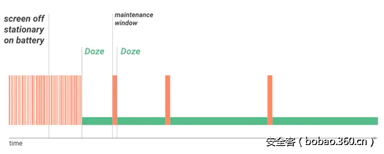

# Doze模式  
## 状态与API版本无关，未适配API23以上的应用只要运行在6.0以上的系统上就会受到Doze模式的影响。
* 在屏幕熄灭30分钟、没有晃动并且在不充电的时候，会进入Doze模式
* 在进入Doze模式后，每间隔一段时间，会进入一段时长为30s的`maintenance window`的窗口期，可以唤醒系统，进行网络交互等等
* 进入Doze模式后，如果没有退出的话，系统唤醒的间隔时长会越来越长

Doze模式

当系统处于Doze模式下，系统和白名单之外的应用将受到以下限制：

* 无法访问网络
* Wake Locks被忽略
* AlarmManager闹铃会被推迟到下一个maintenance window响应
* 使用`setAndAllowWhileIdle`或`SetExactAndAllowWhileIdle`设置闹铃的闹钟则不会受到Doze模式的影响
* `setAlarmClock`设置的闹铃在Doze模式下仍然生效，但系统会在闹铃生效前退出Doze\* 系统不执行Wi-Fi/GPS扫描；
* 系统不允许同步适配器运行；
* 系统不允许JobScheduler运行；

而位于白名单中的应用可以：

* 继续使用网络并保留部分wake lock
* Job和同步仍然会被推迟
* 常规的AlarmManager闹铃也不会被触发

## 应用申请加入白名单
App可以通过`PowerManager.isIgnoringBatteryOptimizations`检查本App是否在系统的白名单列表中。

如果不在，则可以通过在`AndroidManifest.xml`中添加`REQUEST_IGNORE_BATTERY_OPTIMIZATIONS`权限，
并且通过发送`ACTION_IGNORE_BATTERY_OPTIMIZATION_SETTINGS`的Intent来向用户申请该权限

