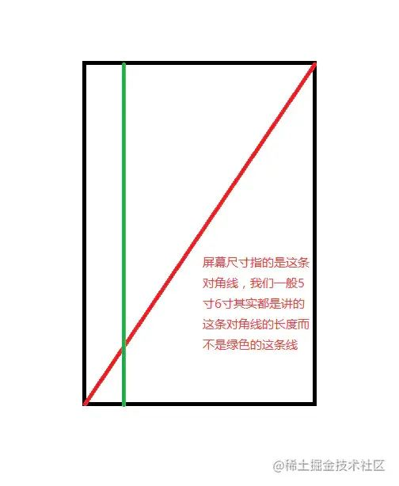
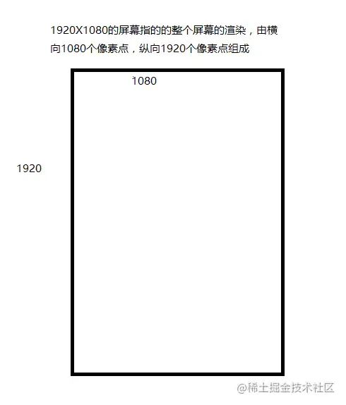
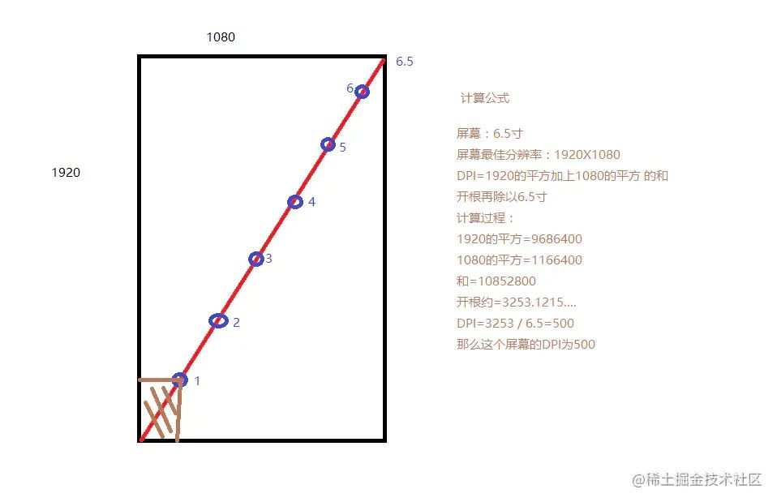

# Android屏幕适配基础概念.md
## **什么是屏幕尺寸,屏幕分辨率,屏幕像素密度**
屏幕尺寸指的是：

分辨率：

屏幕像素密度（DPI）指每一[英寸](https://link.zhihu.com/?target=https%3A//link.juejin.cn/%3Ftarget%3Dhttps%253A%252F%252Fbaike.baidu.com%252Fitem%252F%25E8%258B%25B1%25E5%25AF%25B8)
长度中，可显示输出的像素个数，DPI的数字受屏幕尺寸和分辨率所影响，DPI可以通过计算所得

上述内容在于扫盲..毕竟还是有不清楚的同学，而DPI跟下面内容结合比较密切所以啰嗦了两句

**density = dpi / 160**