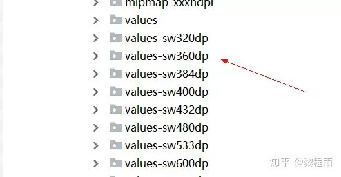

# 适配限定符.md
## **限定符**
我们在做屏幕的适配时在屏幕 尺寸相差不大的情况下，dp可以使不同分辨率的设备上展示效果相似。
但是在屏幕尺寸相差比较大的情况下(平板)，dp就失去了这种效果。所以需要以下的限定符来约束，采用多套布局，数值等方式来适配。

那么其实所谓的限定符就是android在进行资源加载的时候会按照屏幕的相关信息对文件夹对应的名字进行识别，而这些特殊名字就是我们的限定符

```Plain Text
限定符分类：
    屏幕尺寸    
        small    小屏幕
         normal    基准屏幕
         large    大屏幕
         xlarge    超大屏幕
    屏幕密度
          ldpi    <=120dpi
         mdpi    <= 160dpi
         hdpi    <= 240dpi
         xhdpi    <= 320dpi
         xxhdpi    <= 480dpi
         xxhdpi    <= 640dpi(只用来存放icon)
         nodpi    与屏幕密度无关的资源.系统不会针对屏幕密度对其中资源进行压缩或者拉伸
         tvdpi    介于mdpi与hdpi之间,特定针对213dpi,专门为电视准备的,手机应用开发不需要关心这个密度值.
    屏幕方向    
        land    横向
         port    纵向
    屏幕宽高比    
        long    比标准屏幕宽高比明显的高或者宽的这样屏幕
         notlong    和标准屏幕配置一样的屏幕宽高比

```
## smallestWidth适配
smallestWidth适配，或者叫sw限定符适配。
指的是Android会识别屏幕可用高度和宽度的最小尺寸的dp值（其实就是手机的宽度值），
然后根据识别到的结果去资源文件中寻找对应限定符的文件夹下的资源文件。

这种机制和上文提到的宽高限定符适配原理上是一样的，都是系统通过特定的规则来选择对应的文件。

举个例子，小米5的dpi是480,横向像素是1080px，根据px=dp(dpi/160)，
横向的dp值是1080/(480/160),也就是360dp,系统就会去寻找是否存在value-sw360dp的文件夹以及对应的资源文件。



smallestWidth限定符适配和宽高限定符适配最大的区别在于，前者有很好的容错机制，
如果没有value-sw360dp文件夹，系统会向下寻找，比如离360dp最近的只有value-sw350dp，
那么Android就会选择value-sw350dp文件夹下面的资源文件。这个特性就完美的解决了上文提到的宽高限定符的容错问题。

这个适配方案，设计会出多套图，开发会开发多套，但是效果稍好


## 今日头条适配方案
[文章链接](https://link.zhihu.com/?target=https%3A//links.jianshu.com/go%3Fto%3Dhttps%253A%252F%252Fmp.weixin.qq.com%252Fs%252Fd9QCoBP6kV9VSWvVldVVwA)，
之前确实没有接触过，我简单看了一遍，可以说，这也是相对比较完美的方案，
我先简单说一下这个方案的思路，它是通过修改density值，
强行把所有不同尺寸分辨率的手机的宽度dp值改成一个统一的值，这样就解决了所有的适配问题。

比如，设计稿宽度是360px，那么开发这边就会把目标dp值设为360dp，在不同的设备中，
动态修改density值，从而保证(手机像素宽度)px/density这个值始终是360dp,这样的话，就能保证UI在不同的设备上表现一致了。

这个方案侵入性很低，而且也没有涉及私有API，应该也是极不错的方案，
我暂时也想不到强行修改density是否会有其他影响，既然有今日头条的大厂在用，稳定性应当是有保证的。

但是根据我的观察，这套方案**对老项目是不太友好的**，因为修改了系统的density值之后，
整个布局的实际尺寸都会发生改变，如果想要在老项目文件中使用，恐怕整个布局文件中的尺寸都可能要重新按照设计稿修改一遍才行。
因此，如果你是在维护或者改造老项目，使用这套方案就要三思了。

git仓库

[https://github.com/JessYanCoding/AndroidAutoSize](https://github.com/JessYanCoding/AndroidAutoSize)

[https://github.com/JessYanCoding/AndroidAutoSize/issues/13](https://github.com/JessYanCoding/AndroidAutoSize/issues/13)


该方案也会有负面作用，慎用。-----横竖屏切换导致value计算错误，ui变大