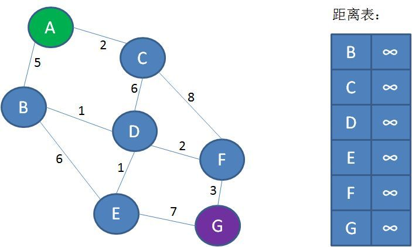
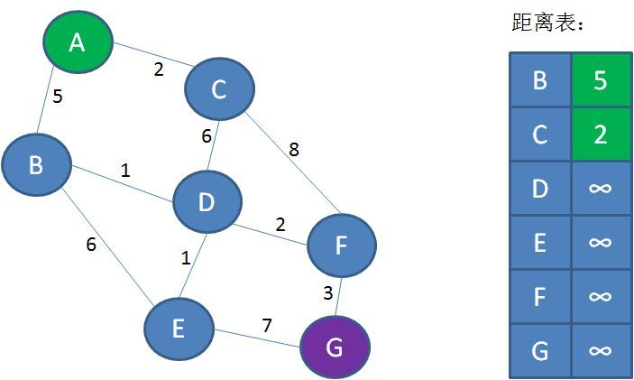
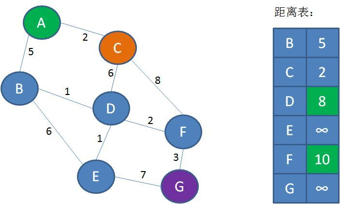
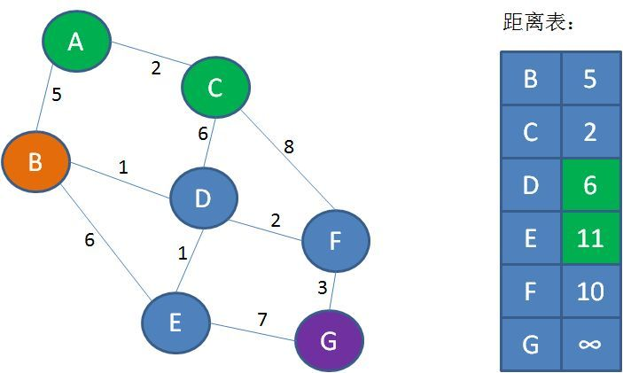
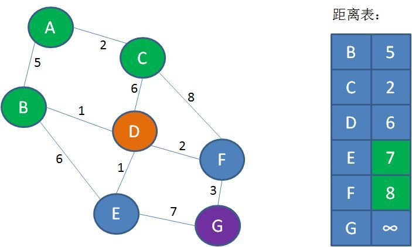
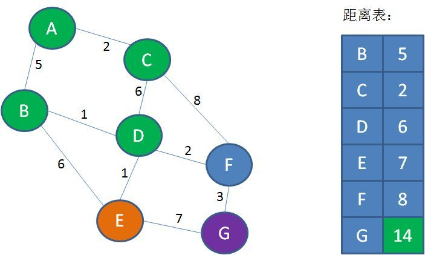
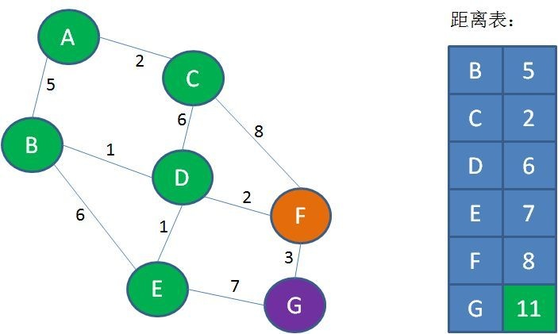

# 图的 “最短路径” 问题
迪杰斯特拉算法，这个算法的本质，是不断刷新起点与其他各个顶点之间的 “距离表”。

第1步，创建距离表。表中的Key是顶点名称，Value是从起点A到对应顶点的已知最短距离。
但是，一开始我们并不知道A到其他顶点的最短距离是多少，Value默认是无限大：

第2步，遍历起点A，找到起点A的邻接顶点B和C。从A到B的距离是5，从A到C的距离是2。把这一信息刷新到距离表当中：

第3步，从距离表中找到从A出发距离最短的点，也就是顶点C。

第4步，遍历顶点C，找到顶点C的邻接顶点D和F（A已经遍历过，不需要考虑）。
从C到D的距离是6，所以A到D的距离是2+6=8；从C到F的距离是8，所以从A到F的距离是2+8=10。把这一信息刷新到表中：

接下来重复第3步、第4步所做的操作：

第5步，也就是第3步的重复，从距离表中找到从A出发距离最短的点（C已经遍历过，不需要考虑），也就是顶点B。

第6步，也就是第4步的重复，遍历顶点B，找到顶点B的邻接顶点D和E（A已经遍历过，不需要考虑）。
从B到D的距离是1，所以A到D的距离是5+1=6，**小于距离表中的8**；从B到E的距离是6，所以从A到E的距离是5+6=11。把这一信息刷新到表中：

（在第6步，A到D的距离从8刷新到6，可以看出距离表所发挥的作用。距离表通过迭代刷新，
用新路径长度取代旧路径长度，最终可以得到从起点到其他顶点的最短距离）

第7步，从距离表中找到从A出发距离最短的点（B和C不用考虑），也就是顶点D。

第8步，遍历顶点D，找到顶点D的邻接顶点E和F。从D到E的距离是1，所以A到E的距离是6+1=7，
**小于距离表中的11**；从D到F的距离是2，所以从A到F的距离是6+2=8，**小于距离表中的10**。把这一信息刷新到表中：

第9步，从距离表中找到从A出发距离最短的点，也就是顶点E。

第10步，遍历顶点E，找到顶点E的邻接顶点G。从E到G的距离是7，所以A到G的距离是7+7=14。把这一信息刷新到表中：

第11步，从距离表中找到从A出发距离最短的点，也就是顶点F。

第10步，遍历顶点F，找到顶点F的邻接顶点G。从F到G的距离是3，所以A到G的距离是8+3=11，**小于距离表中的14**。把这一信息刷新到表中：

就这样，除终点以外的全部顶点都已经遍历完毕，距离表中存储的是从起点A到所有顶点的最短距离。显然，从A到G的最短距离是11。（路径：A-B-D-F-G）