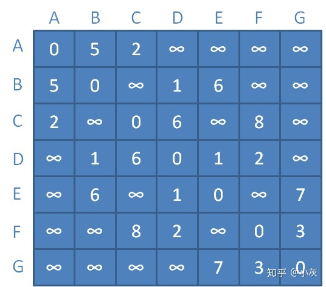
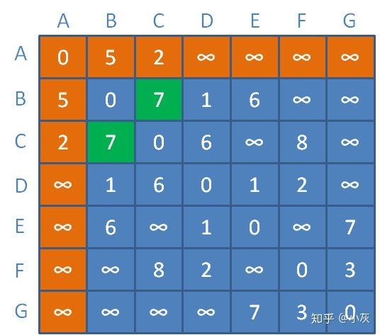
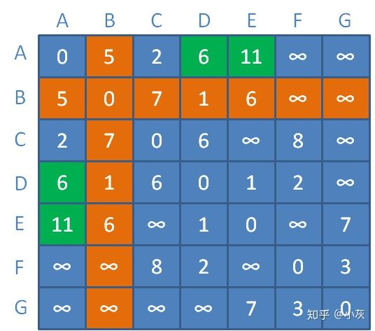
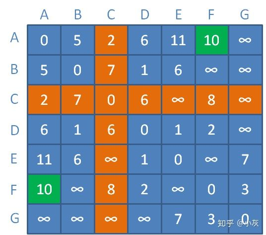
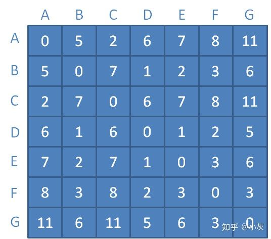

# 图的多源最短路径
弗洛伊德算法：

弗洛伊德算法基于动态规划的思想

下面我们来看一看Floyd算法的详细步骤。

1.要实现Floyd算法，首先需要构建带权图的邻接矩阵：

在邻接矩阵当中，每一个数字代表着从某个顶点到另一个顶点的直接距离，这个距离是没有涉及到任何中继顶点的。

2.此时假定只允许以顶点A作为中继顶点，那么各顶点之间的距离会变成什么样子呢？

B和C之间的距离原本是无穷大，此时以A为中继，距离缩短为AB距离+AC距离=  

5+2=7。

更新对应矩阵元素（橙色区域代表顶点A到其他顶点的临时距离）：

3.接下来以顶点A、B作为中继顶点，那么各顶点之间的距离会变成什么样子呢？

A和D之间的距离原本是无穷大，此时以B为中继，距离缩短为AB距离+BD距离=5+1=6。  

A和E之间的距离原本是无穷大，此时以B为中继，距离缩短为AB距离+BE距离=5+6=11。

更新对应矩阵元素（橙色区域代表顶点B到其他顶点的临时距离）：

4.接下来以顶点A、B、C作为中继顶点，那么各顶点之间的距离会变成什么样子呢？

A和F之间的距离原本是无穷大，此时以C为中继，距离缩短为AC距离+CF距离=2+8=10。

更新对应矩阵元素（橙色区域代表顶点C到其他顶点的临时距离）：

.........
.........

以此类推，我们不断引入新的中继顶点，不断刷新矩阵中的临时距离。

最终，当所有顶点都可以作为中继顶点时，我们的距离矩阵更新如下：

此时，矩阵中每一个元素，都对应着某顶点到另一个顶点的最短距离。