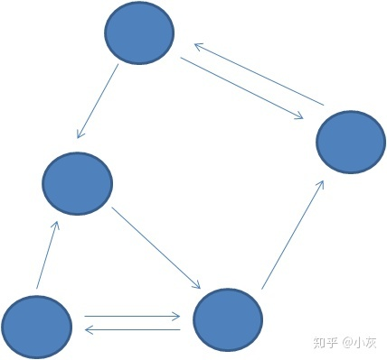

# 图的相关术语

在图中，最基本的单元是**顶点（vertex）**，相当于树中的节点。顶点之间的关联关系，被称为**边（edge）**。

在有些图中，每一条边并不是完全等同的。比如刚才地铁线路的例子，从A站到B站的距离是3公里，
从B站到C站的距离是5公里......这样就引入一个新概念：边的**权重（Weight）**。涉及到权重的图，被称为**带权图（Weighted Graph）**。

还有一种图，顶点之间的关联并不是完全对称的。还拿微信来举例，你的好友列表里有我，但我的好友列表里未必有你。

这样一来，顶点之间的边就有了方向的区分，这种带有方向的图被称为**有向图**。

相应的，在QQ当中，只要我把你从好友里删除，你在自己的好友列表里也就看不到我了。（貌似是这样）

因此，QQ的好友关系可以认为是一个没有方向区分的图，这种图被称为**无向图**。

无向图可以认为是特殊有向图。