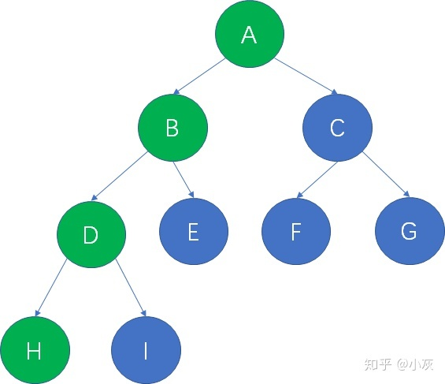
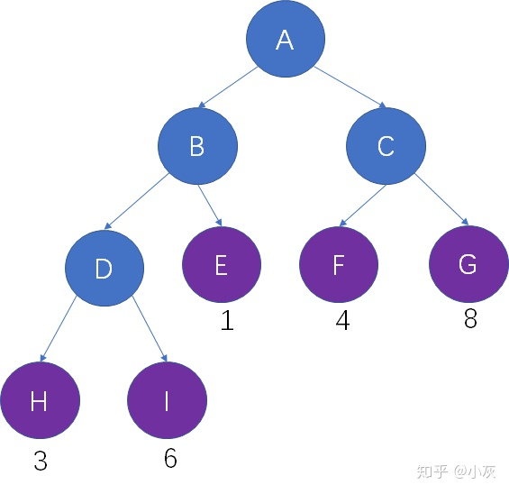

# 哈夫曼树
概念1：什么是路径？

在一棵树中，从一个结点到另一个结点所经过的所有结点，被我们称为两个结点之间的路径。

上面的二叉树当中，从根结点A到叶子结点H的路径，就是A，B，D，H

概念2：什么是路径长度？

在一棵树中，从一个结点到另一个结点所经过的“边”的数量，被我们称为两个结点之间的路径长度。

仍然用刚才的二叉树举例子，从根结点A到叶子结点H，共经过了3条边，因此路径长度是3

概念3：什么是 结点的带权路径长度？

树的每一个结点，都可以拥有自己的“权重”（Weight），权重在不同的算法当中可以起到不同的作用。

结点的带权路径长度，是指树的根结点到该结点的路径长度，和该结点权重的乘积。

假设结点H的权重是3，从根结点到结点H的路径长度也是3，因此结点H的带权路径长度是 3 X 3 = 9 

概念4：什么是 树的带权路径长度？

在一棵树中，所有叶子结点的带权路径长度之和，被称为树的带权路径长度，也被简称为WPL。

仍然以这颗二叉树为例，树的路径长度是 3X3 + 6X3 + 1X2 + 4X2 + 8X2 = 53 
