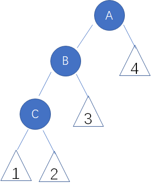
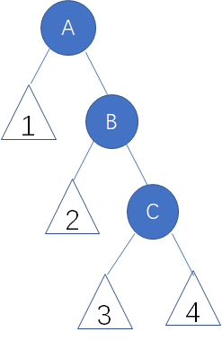
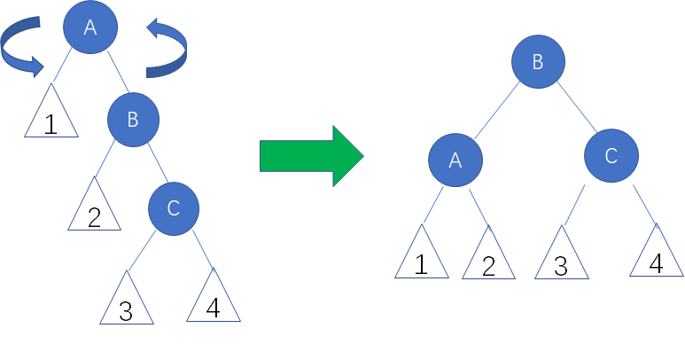
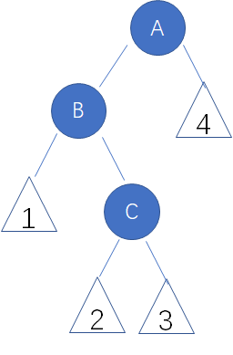
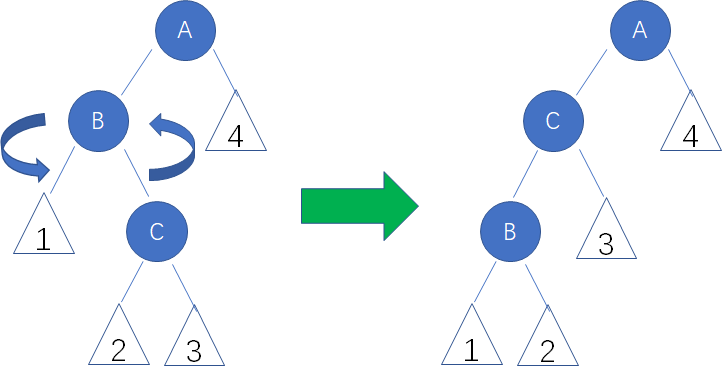
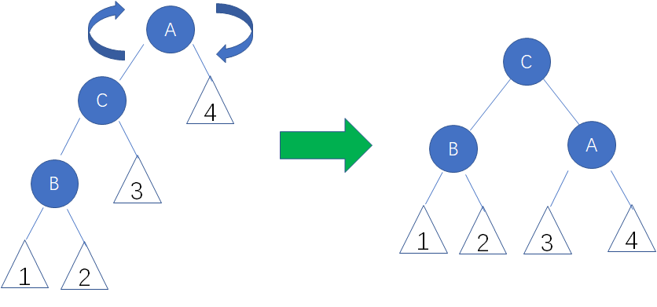
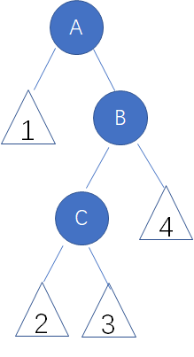
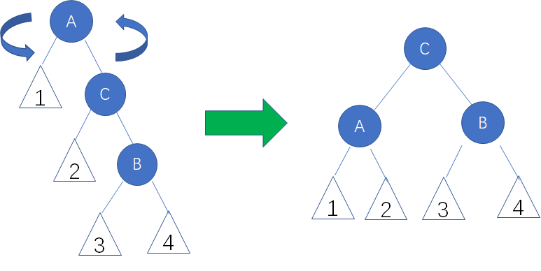

# 平衡二叉树的操作
平衡因子为-1，0，1时，认为树的高度是平衡的

左旋

右旋

4种需要调整的局面

**1\. 左左局面（LL）**

顾名思义，祖父结点A有一个左孩子结点B，而结点B又有一个左孩子结点C。标号1,2,3,4的三角形是各个结点的子树。

在这种局面下，我们以结点A为轴，进行**右旋**操作：

**2\. 右右局面（RR）**

祖父结点A有一个右孩子结点B，而结点B又有一个右孩子结点C。

在这种局面下，我们以结点A为轴，进行**左旋**操作：

**3\. 左右局面（LR）**

祖父结点A有一个左孩子结点B，而结点B又有一个右孩子结点C。

在这种局面下，我们先以结点B为轴，进行**左旋**操作：

这样就转化成了左左局面。我们继续以结点A为轴，进行右旋操作：

**4\. 右左局面（RL）**

祖父结点A有一个右孩子结点B，而结点B又有一个左孩子结点C。

在这种局面下，我们先以结点B为轴，进行**右旋**操作：

这样就转化成了右右局面。我们继续以结点A为轴，进行左旋操作：

