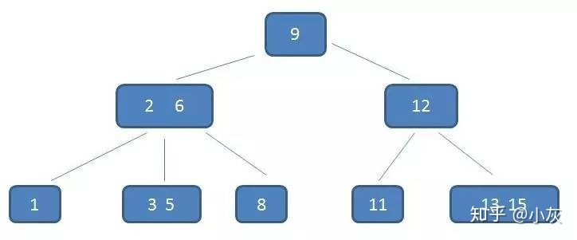
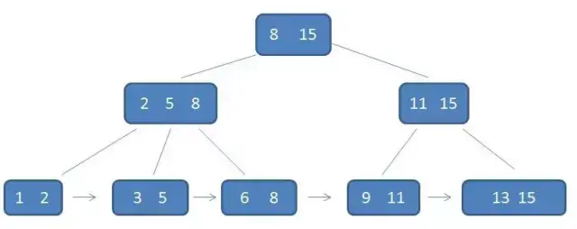

# 树
满二叉树 

完全二叉树 

二叉查找树（二叉排序树，搜索二叉树）：中序遍历升序的树

平衡的二叉查找树（大致两种树）

**平衡二叉树（AVL树）**

通过平衡因子判断，平衡因子为-1，0，1时，认为树的高度是平衡的，AVL树平衡成本更高，查找效率也更高

**红黑树** 
红黑树平衡判断规则，红黑树插入效率更高，

频繁查找时使用AVL树，频繁插入删除时使用红黑树

**B树：是一种多叉树**

降低树高度，范围查找不适用

一定程度的时间换空间

**B+树**

B树与B+树区别

* B-树内部节点是保存数据的;而B+树内部节点是不保存数据的，只作索引作用，它的叶子节点才保存数据。
* B+树相邻的叶子节点之间是通过链表指针连起来的，B-树却不是。
* 查找过程中，B-树在找到具体的数值以后就结束，而B+树则需要通过索引找到叶子结点中的数据才结束
* B-树中任何一个关键字出现且只出现在一个结点中，而B+树可以出现多次。