# 红黑树删除.md

* 如果待删除结点有两个非空的孩子结点，转化成待删除结点只有一个孩子（或没有孩子）的情况。
* 所以问题转换成了待删除结点只有一个右孩子（或没有孩子）的情况。接下来我们进入第二步。
* 显然，这条路径上减少了一个黑色结点，而且结点2再怎么变色也解决不了。这时候我们进入第三步，专门解决父子双黑的情况。

下面我们通过一个例子，来看一看删除红黑树的结点会对规则产生怎样的影响：

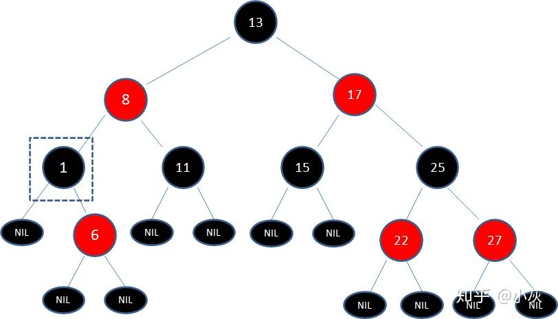

上图的这颗红黑树，待删除的是黑色结点1，有一个右孩子。根据二叉查找树的删除流程，我们让右孩子结点6直接取代结点1：

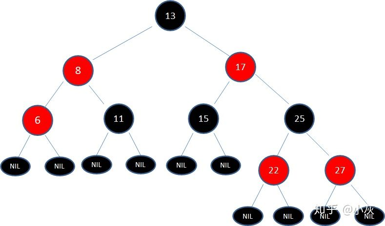

显然，这颗新的二叉树打破了两个规则：

规则4. 每个红色结点的两个子结点都是黑色。

规则5. 从任一结点到其每个叶子的所有路径都包含相同数目的黑色结点。

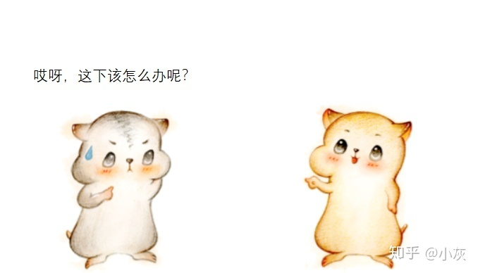

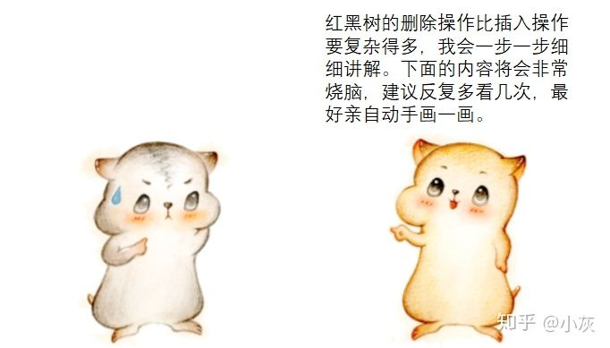

**第一步：如果待删除结点有两个非空的孩子结点，转化成待删除结点只有一个孩子（或没有孩子）的情况。**

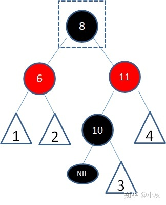

上面例子是一颗红黑树的局部，标数字的三角形代表任意形态的子树，假设结点8是待删除结点。

根据上文讲解的二叉查找树删除流程，由于结点8有两个孩子，我们选择仅大于8的结点10复制到8的位置，结点颜色变成待删除结点的颜色：

接下来我们需要删除红色的结点10：

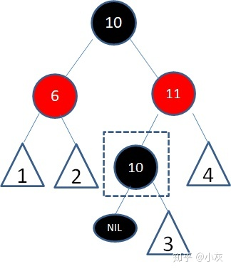

红色结点10能成为仅大于8的结点，必定没有左孩子结点，所以问题转换成了待删除结点只有一个右孩子（或没有孩子）的情况。接下来我们进入第二步。

**第二步：根据待删除结点和其唯一子结点的颜色，分情况处理。**

**情况1**，自身是红色，子结点是黑色：

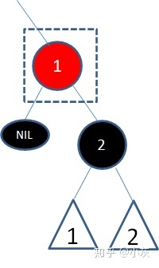

这种情况最简单，按照二叉查找树的删除操作，删除结点1即可：  

**情况2**，自身是黑色，子结点是红色：

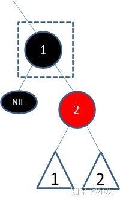

这种情况也很简单，首先按照二叉查找树的删除操作，删除结点1：

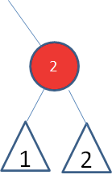

此时，这条路径凭空减少了一个黑色结点，那么我们把结点2变成黑色即可：

**情况3**，自身是黑色，子结点也是黑色，或者子结点是空叶子结点：

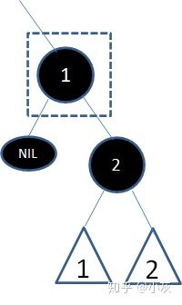

这种情况最复杂，涉及到很多变化。首先我们还是按照二叉查找树的删除操作，删除结点1：

显然，这条路径上减少了一个黑色结点，而且结点2再怎么变色也解决不了。

这时候我们进入第三步，专门解决父子双黑的情况。

**第三步：遇到双黑结点，在子结点顶替父结点之后，分成6种子情况处理。**

**子情况1**，结点2是红黑树的根结点：

此时所有路径都减少了一个黑色结点，并未打破规则，不需要调整。  

**子情况2**，结点2的父亲、兄弟、侄子结点都是黑色：

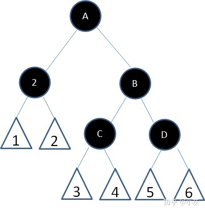

此时，我们直接把结点2的兄弟结点B改为红色：  

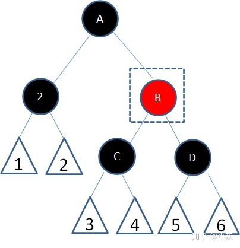

这样一来，原本结点2所在的路径少了一个黑色结点，现在结点B所在的路径也少了一个黑色结点，两边“扯平”了。

可是，结点A以下的每一条路径都减少了一个黑色结点，与结点A之外的其他路径又造成了新的不平衡啊？  

没关系，我们让结点A扮演原先结点2的角色，进行递归操作，重新判断各种情况。

**子情况3**，结点2的兄弟结点是红色：

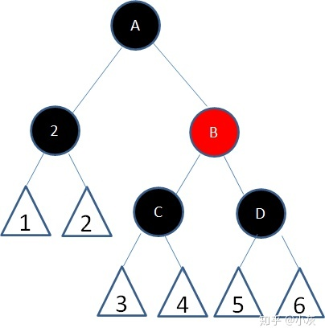

首先以结点2的父结点A为轴，进行左旋：

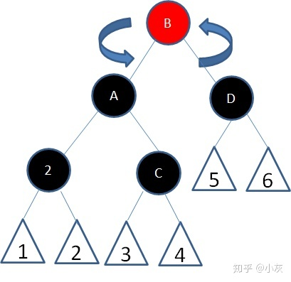

然后结点A变成红色、结点B变成黑色：

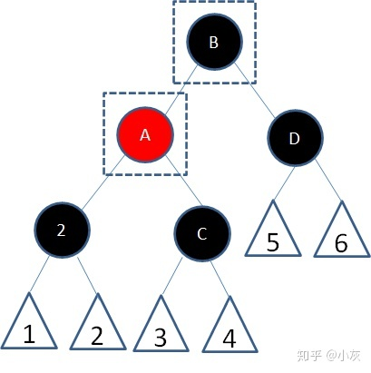

这样的意义是什么呢？结点2所在的路径仍然少一个黑色结点呀？

别急，这样的变化有可能转换成子情况4、5、6中的任意一种，在子情况4、5、6当中会进一步解决。

**子情况4**，结点2的父结点是红色，兄弟和侄子结点是黑色：

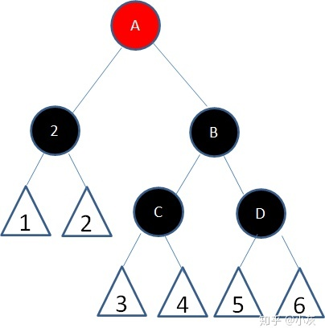

这种情况，我们直接让结点2的父结点A变成黑色，兄弟结点B变成红色：

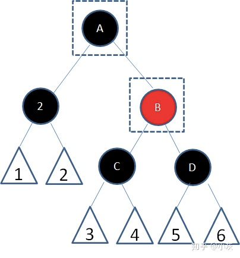

这样一来，结点2的路径补充了黑色结点，而结点B的路径并没有减少黑色结点，重新符合了红黑树的规则。

**子情况5**，结点2的父结点随意，兄弟结点B是黑色右孩子，左侄子结点是红色，右侄子结点是黑色：

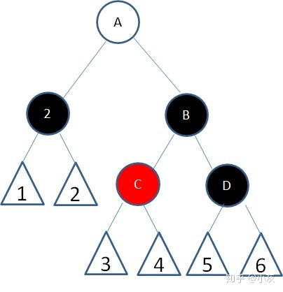

这种情况下，首先以结点2的兄弟结点B为轴进行右旋：

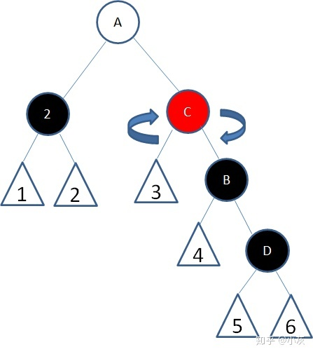

接下来结点B变为红色，结点C变为黑色：  

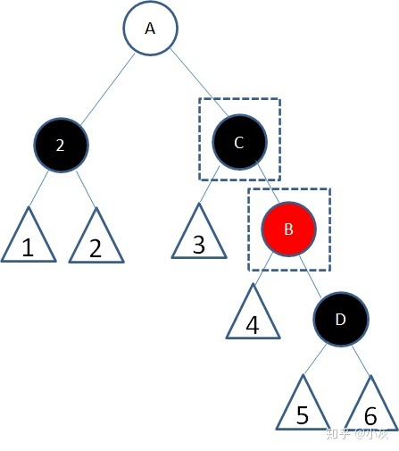

这样的变化转换成了子情况6。

**子情况6**，结点2的父结点随意，兄弟结点B是黑色右孩子，右侄子结点是红色：

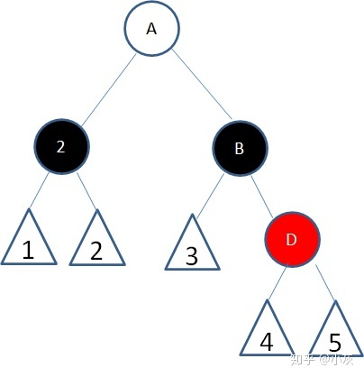

首先以结点2的父结点A为轴左旋：

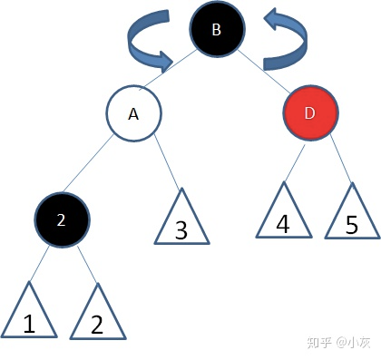

接下来让结点A和结点B的颜色交换，并且结点D变为黑色：

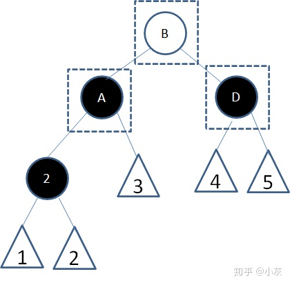

这样是否解决了问题呢？

经过结点2的路径由（随意+黑）变成了（随意+黑+黑），补充了一个黑色结点；

经过结点D的路径由（随意+黑+红）变成了（随意+黑），黑色结点并没有减少。  

所以，这时候重新符合了红黑树的规则。

以上就是红黑树删除的全过程。

