# 红黑树插入.md

**局面1：**新结点（A）位于树根，没有父结点。

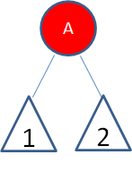

(空心三角形代表结点下面的子树)

这种局面，直接让新结点变色为黑色，规则2得到满足。同时，黑色的根结点使得每条路径上的黑色结点数目都增加了1，所以并没有打破规则5。
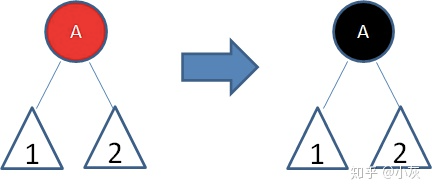

**局面2：**新结点（B）的父结点是黑色。

这种局面，新插入的红色结点B并没有打破红黑树的规则，所以不需要做任何调整。

**局面3：**新结点（D）的父结点和叔叔结点都是红色。

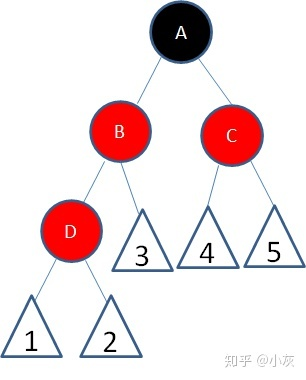

这种局面，两个红色结点B和D连续，违反了规则4。因此我们先让结点B变为黑色：
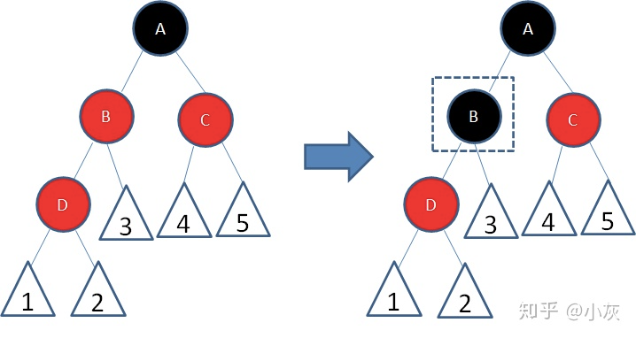

这样一来，结点B所在路径凭空多了一个黑色结点，打破了规则5。因此我们让结点A变为红色：  
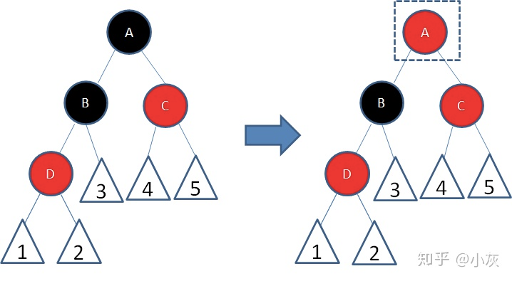
这时候，结点A和C又成为了连续的红色结点，我们再让结点C变为黑色：

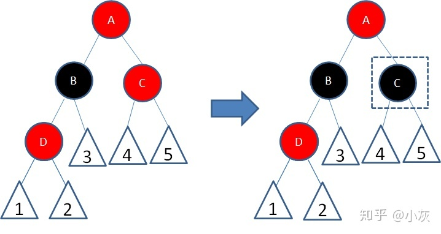

经过上面的调整，这一局部重新符合了红黑树的规则。

**局面4：**新结点（D）的父结点是红色，叔叔结点是黑色或者没有叔叔，且新结点是父结点的右孩子，父结点（B）是祖父结点的左孩子。

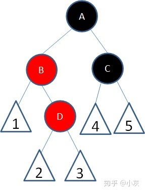

我们以结点B为轴，做一次左旋转，使得新结点D成为父结点，原来的父结点B成为D的左孩子：
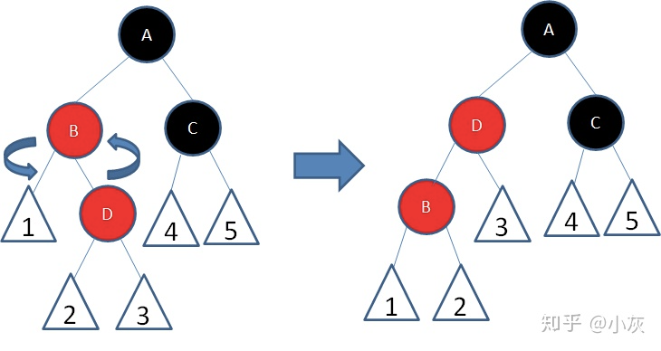

这样一来，进入了局面5。

** 局面5：**新结点（D）的父结点是红色，叔叔结点是黑色或者没有叔叔，且新结点是父结点的左孩子，父结点（B）是祖父结点的左孩子。
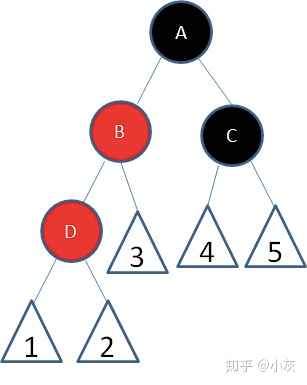

我们以结点A为轴，做一次右旋转，使得结点B成为祖父结点，结点A成为结点B的右孩子：

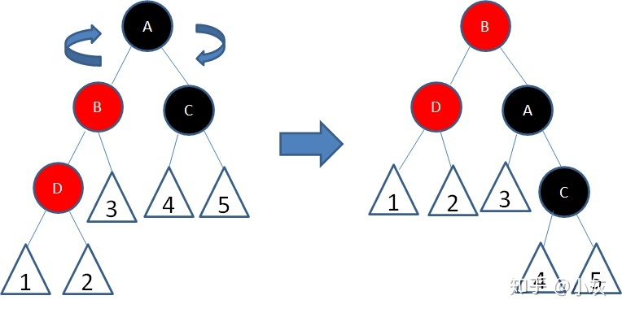

接下来，我们让结点B变为黑色，结点A变为红色：  

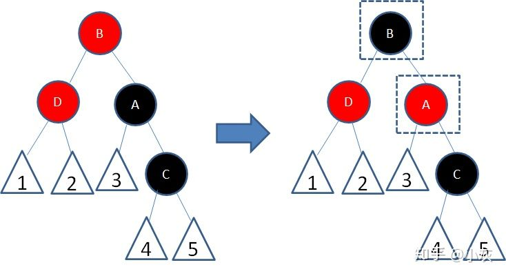

经过上面的调整，这一局部重新符合了红黑树的规则。

以上就是红黑树插入操作所涉及的5种局面。